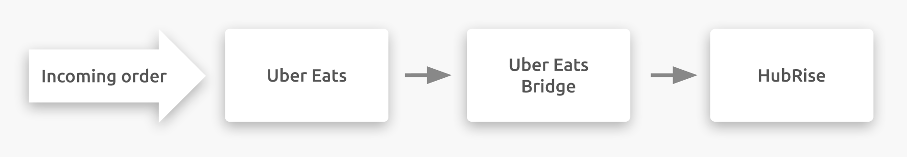

## Description

Uber Eats is an online ordering and food delivery platform part of Uber Technologies, Inc.
It is present in more than 30 countries around the world.

Uber Eats connects to your HubRise account through Uber Eats Bridge, an app developed by HubRise.

## Integration Features

Connecting Uber Eats Bridge allows Uber Eats to:

- Push orders to HubRise, including order status.
- Push delivery information to HubRise, for orders delivered by your team.

---

**IMPORTANT NOTE:** Pulling catalog and inventory from HubRise will soon be supported. Contact us for more information.

---

Uber Eats Bridge can receive orders when Uber Eats tablets are switched off.

Uber Eats Bridge can be connected to HubRise from the HubRise back office.

## Why Connect?

Connecting your Uber Eats online restaurant to HubRise allows you to receive Uber Eats orders directly to your EPOS connected with HubRise.
You will be able to manage Uber Eats orders seamlessly from your existing setup, as you would do with all the other orders.

Via HubRise, synchronise your menu, your customer and order information with online ordering, food delivery platforms (including Deliveroo, Uber Eats and Just Eat), delivery management, delivery services, eMarketing (SMS/emailing), business intelligence, stock management, loyalty systems, and more. The number of compatible applications increases every month. To see which apps you can connect, see our [Apps page](/apps).

## Prerequisites

To establish a connection between Uber Eats and HubRise, your restaurant must be a Uber Eats partner.
