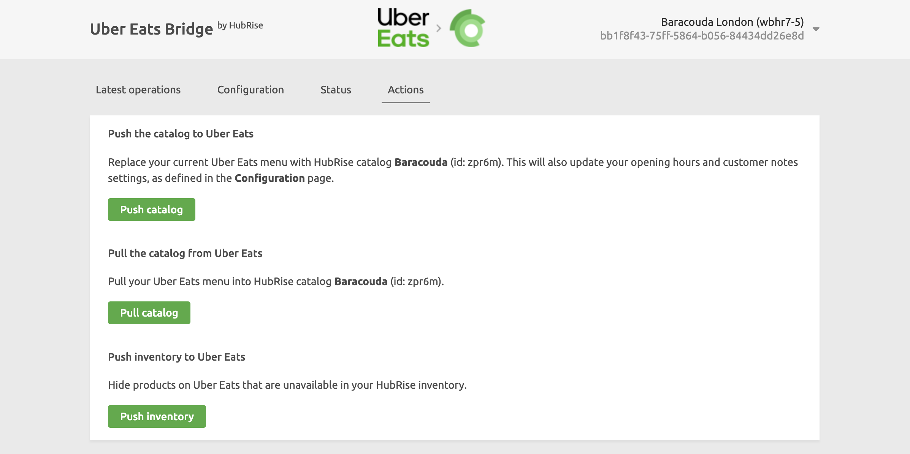

With Uber Eats Bridge, you can pull your Uber Eats menu into a HubRise catalog.

This feature can be useful if you wish to:

- Create a backup of your Uber Eats menu.
- Edit your menu using the HubRise Catalog Manager, to include ref codes, for example. For more information, see [Catalog Manager](/apps/catalog-manager/overview).
- Populate a HubRise catalog that will then be pushed to other apps, including food delivery platforms such as Deliveroo and Just Eat.

## Populate a HubRise Catalog

To pull your Uber Eats menu into a HubRise catalog, follow these steps:

1. Log in to your [HubRise account](https://manager.hubrise.com).
1. If you have access to multiple Accounts, select the **Account** containing the specific Location.
1. Select the Location from the **Location** dropdown.
1. Open the **CONNECTIONS** page.
1. Find **Uber Eats Bridge** from the list of connected apps, and click **Open**. This will open Uber Eats Bridge in a new tab.
1. Click the **Actions** tab
1. In the **Pull the catalog from Uber Eats** section, verify that the correct HubRise catalog is connected, click **Pull catalog**, and confirm the action.
1. Review your populated catalog on HubRise. For more information on HubRise catalogs, see [Catalogs](/docs/catalog).

---

**IMPORTANT NOTE:** This operation will overwrite the HubRise catalog connected to Uber Eats Bridge.

---

## Information Pulled into HubRise

Catalog data sent to Uber Eats is comparable to the data pulled from Uber Eats. For more information, you can therefore refer to [Information Sent to Uber Eats](/apps/uber-eats/push-catalog#information-sent-to-uber-eats).
