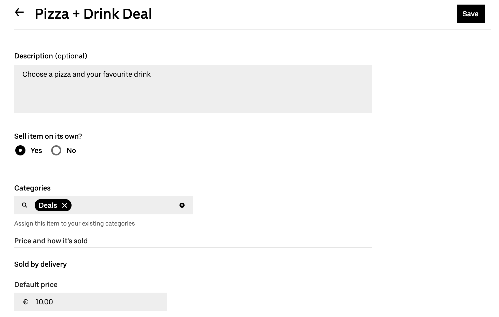
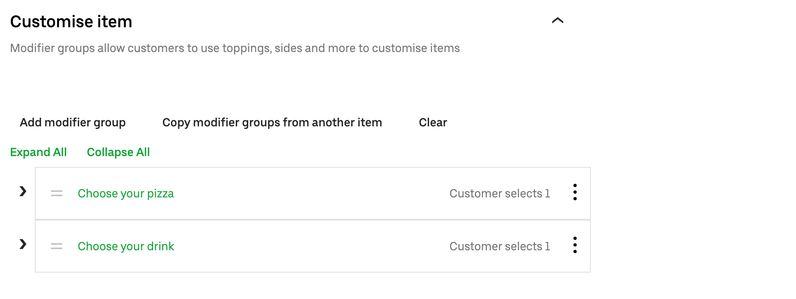

Uber Eats does not natively support deals.
However, you can use Uber Eats items and modifiers to create a product that is sent to HubRise as a deal.

If you [upload your HubRise catalog](/apps/uber-eats/pulling-menu) to Uber Eats with Uber Eats Bridge, deals are automatically created with the correct format on Uber Eats.
This page describes how you can achieve the same results when you manually create your menu with [Menu Maker](https://merchants.ubereats.com/us/en/technology/simplify-operations/menu-management/), the catalog management tool in Uber Eats back office. 

## Basic Product Structure

To create a deal, you need to create the following product structure using items and modifier groups:
- Deal (Item)
  - Deal line 1 (Modifier group)
    - Sku 1 (Item)
    - Sku 2 (Item)
    - ...
  - Deal line 2 (Modifier group)
    - Sku 1 (Item)
    - Sku 2 (Item)
    - ...

For example, if you have a deal with pizzas and drinks, the product's structure will be the following:
- Pizza + Drink Deal
  - Choose your pizza
    - Pizza Margherita
    - Pizza Napoli
    - Pizza Diavola
  - Choose your drink
    - Coca-Cola
    - Pepsi
    - Beer

To be correctly parsed by Uber Eats Bridge, the ref code of the parent product, which represents the deal, must start with `DEAL-`, followed by the ref code of the deal in your EPOS. Skus must have the same ref code they have in your EPOS.

## Step-by-step Guide To Create A Deal

The following sections explains the steps required to create deals.

### 1. Create The Skus

Start by creating the individual skus that are part of every deal line.
Follow these steps:

1. Log in to your [Uber Eats back office](https://restaurant.uber.com/).
1. Select **Menu > Items**, then click **New item**.
1. Fill in the details for your sku.
   - Enter the name of the sku, for example *Pizza Margherita 8"*.
   - Under **Sell item on its own**, select **No**.
     
   - Under **Default price**, if choosing this sku requires a surcharge, enter the surcharge amount. Otherwise, enter 0.
   - Expand **Extra details**, then under **External data**, enter the ref code of the sku.
     
   - Optional: Fill in the other relevant fields in the page.
1. To confirm the sku, click **Save**.
1. Repeat the process for all the other skus that are part of the deal lines. Click **Duplicate** to use the current sku as a starting point for the next ones.

### 2. Create The Modifier Groups

After creating all the skus, the second step is to group them together within a modifier group.
Follow these steps:

1. Select **Menu > Modifier groups**, then click **New group**.
2. Fill in the details of your modifier group.
   - Enter the name of the modifier group, for example *Choose your pizza*.
   - In the **Add item** field, select all the skus that are part of the product, then click **Add**.
     
   - Drag the skus in the order you want them to appear on the list.
   - In the **Rules** section, enter the following values:
     - **Minimum number of options a customer must select**: 1
     - **Maximum number of options a customer can select**: 1
     - **How many times can customers select any single option**: 1
     
1. To confirm the modifiers group, click **Save**.
2. Repeat the process for all the deal lines that are part of the deal. Click **Duplicate** to use the current modifier group as a starting point for the next ones.

### 3. Create The Deal

Finally, create the product that represents the deal and attach the modifier groups to it.
Follow these steps:

1. Select **Menu > Items**, then click **New item**.
1. Fill in the details for the deal.
   - Enter the name of the product, for example *Pizza + Drink Deal*.
   - Under **Sell item on its own**, select **Yes**.
   - Under **Categories**, select the category that contains the deal.
   - Under **Default price**, enter the total price of the deal.
     
   - Expand **Customise item**, then click **Add modifier group**. From the modifier groups list, select the modifier group that contains the skus. Add all the deal lines that are part of the deal, then click **Add**.
     
   - Expand **Extra details**, then under **External data**, enter `DEAL-`, followed by the ref code of the deal.
     
   - Optional: Fill in the other relevant fields in the page.
2. To confirm the deal, click **Save**.
