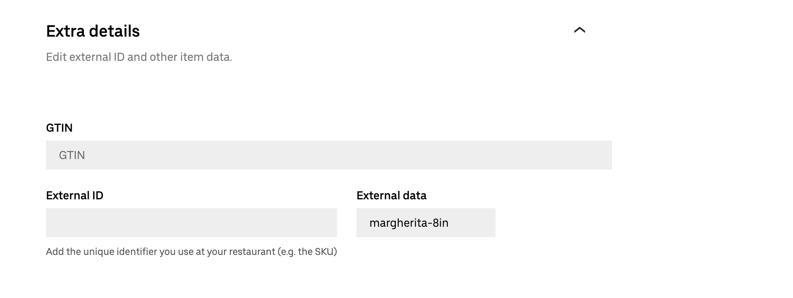
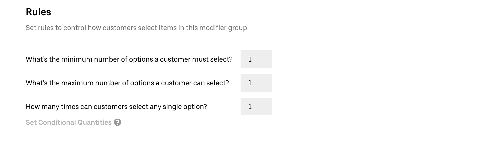
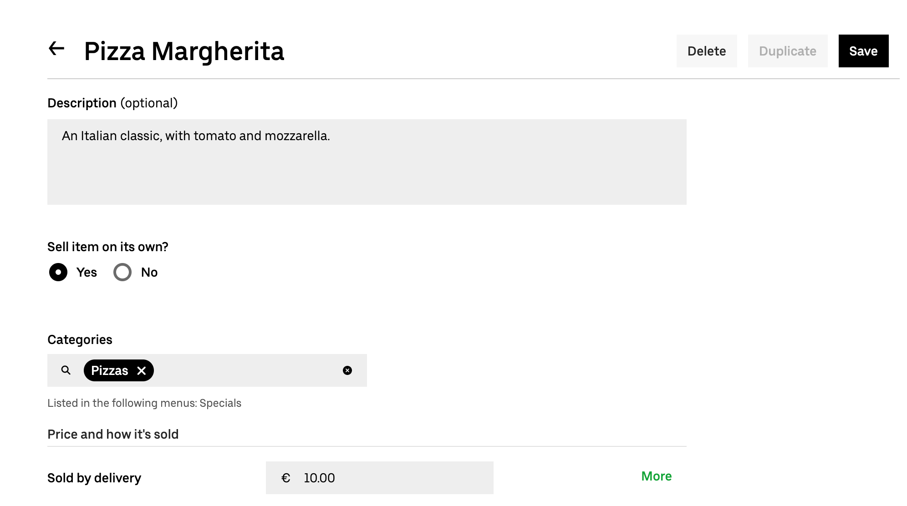
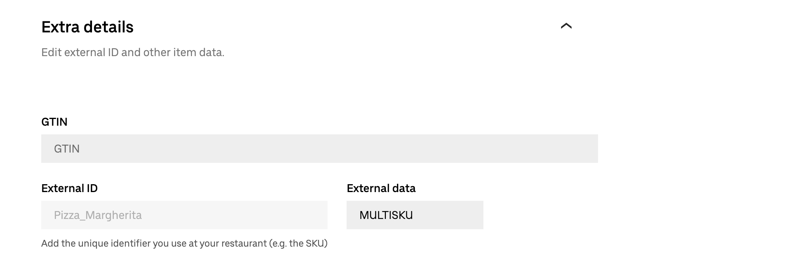

Uber Eats does not natively support products with multiple skus.
However, you can use Uber Eats items and modifiers to create a product that is sent to HubRise as a product with multiple skus.

If you [upload your HubRise catalog](/apps/uber-eats/pulling-menu) to Uber Eats with Uber Eats Bridge, products with skus are automatically created with the correct format on Uber Eats.
This page describes how you can achieve the same results when you manually create your menu with [Menu Maker](https://merchants.ubereats.com/us/en/technology/simplify-operations/menu-management/), the catalog management tool in Uber Eats back office. 

## Basic Product Structure

To create a product with multiple skus, you need to create the following product structure using items and modifier groups:
- Parent product (Item)
  - Choice of skus (Modifier group)
    - Sku 1 (Item)
    - Sku 2 (Item)
    - ...

For example, if you have a pizza with multiple sizes, the product's structure will be the following:
- Pizza Margherita
  - Choose your Margherita size
    - Pizza Margherita 8"
    - Pizza Margherita 10"
    - Pizza Margherita 12"

To be correctly parsed on HubRise by Uber Eats Bridge, the ref code of the parent product must be `MULTISKU`, while skus must have the same ref code they have in your EPOS.

## Step-By-Step Guide to Create a Product With Skus

The following sections explains the steps required to create a product with multiple skus on Uber Eats Menu Maker.

### 1. Create the Skus

To create the individual skus that are part of the product, follow these steps:

1. Log in to your [Uber Eats back office](https://restaurant.uber.com/).
1. Select **Menu** > **Items**, then click **New item**.
1. Fill in the details for your sku.
   - Enter the name of the sku, for example `Pizza Margherita 8"`.
   - Under **Sell item on its own**, select **No**.
     
   - Under **Default price**, enter the difference with the price of the main product, or 0.
   - Expand **Extra details**, then under **External data**, enter the ref code of the sku.
     
   - Optional: Fill in the other relevant fields in the page.
1. To confirm the sku, click **Save**.
1. Repeat the process for all the other skus that are part of the product. Click **Duplicate** to use the current sku as a starting point for the next ones.

### 2. Create the Modifier Group

After creating all the skus, to group them together within a modifier group follow these steps:

1. Select **Menu** > **Modifier groups**, then click **New group**.
2. Fill in the details of your modifier group.
   - Enter the name of the modifier group, for example `Choose your Margherita size`.
   - In the **Add item** field, select all the skus that are part of the product, then click **Add**.
     
   - Drag the skus in the order you want them to appear on the list.
   - In the **Rules** section, enter the following values:
     - **Minimum number of options a customer must select**: `1`
     - **Maximum number of options a customer can select**: `1`
     - **How many times can customers select any single option**: `1`
     
1. To confirm the modifiers group, click **Save**.

### 3. Create the Main Product

Finally, create the product and attach the modifier group to it.
Follow these steps:

1. Select **Menu** > **Items**, then click **New item**.
1. Fill in the details for the main product.
   - Enter the name of the product, for example `Pizza Margherita`.
   - Under **Sell item on its own**, select **Yes**.
   - Under **Categories**, select the category that contains the product.
   - Under **Default price**, enter the price of the cheapest sku.
     
   - Expand **Customise item**, then click **Add modifier group**. From the modifier groups list, select the modifier group that contains the skus, then click **Add**.
     
   - Expand **Extra details**, then under **External data**, enter `MULTISKU`.
     
   - Optional: Fill in the other relevant fields in the page.
2. To confirm the product, click **Save**.
