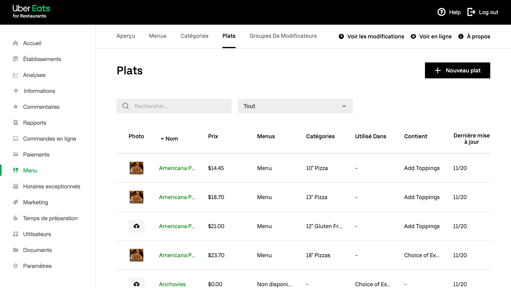

Pour que les commandes soient correctement traitées, la plupart des solution d'encaissement exigent un code ref pour chaque produit. Lorsque vous créez votre menu sur Uber Eats, vous devez donc vous assurer que chaque produit est associé à un code ref correct.

Pour attribuer des codes ref à vos produits Uber Eats, procédez comme suit :

1. Connectez-vous à votre [back-office Uber Eats](https://restaurant.uber.com/).
1. Si vous n'exploitez qu'un seul magasin Uber Eats, sélectionnez **Menu** dans le menu de gauche. Si vous possédez plusieurs magasins Uber Eats, choisissez le bon dans le menu déroulant, puis sélectionnez **Menu**.
1. Dans le menu supérieur, sélectionnez **Articles**. 
1. Cliquez sur le produit ou l'option que vous souhaitez modifier dans la liste des articles, puis faites défiler la page vers le bas.
1. Cliquez sur la section **Détails supplémentaires** pour la développer. 
1. Entrez le code ref dans le champ **Données externes**.
1. Cliquez sur **Enregistrer** pour revenir à la liste des articles.

Vous devrez répéter cette procédure manuelle pour tous vos articles disponibles.

Veuillez noter que les articles se trouvant sous l'onglet **Groupes de modification** comportent également un champ **Données externes**, mais qu'il n'est généralement pas nécessaire d'entrer de valeur, puisque celle-ci n'est pas envoyée à votre solution d'encaissement.

## Commentaires sur les produits

---

**REMARQUE IMPORTANTE :** les commentaires au niveau des produits sont automatiquement désactivés sur votre boutique Uber Eats lorsque vous vous connectez à HubRise.

---

Bien que HubRise prenne en charge les commentaires au niveau des produits, ce n'est pas le cas de la plupart des systèmes solution d'encaissement ni des intégrations. Afin d'éviter une expérience client négative causée par le fait que les commentaires sur les produits ne sont pas envoyés à votre solution d'encaissement, ceux-ci sont automatiquement désactivés lorsque vous connectez pour la première fois votre boutique Uber Eats à HubRise.

Si vous faites confiance à ces commentaires pour obtenir des instructions de cuisson ou de service (par exemple, "Cuisson à point", ou "Couper en tranches"), vous devez ajouter les articles correspondants dans votre solution d'encaissement, puis les inclure en tant qu'options dans le menu Uber Eats, afin qu'ils soient correctement encodés.

Toutefois, si l'intégration avec votre solution d'encaissement prend en charge les commentaires au niveau des produits, ou que vous disposez d'un autre moyen de les consulter (par exemple depuis votre tablette Uber Eats), vous pouvez toujours demander au service d'assistance Uber Eats de réactiver les commentaires de produits dans votre magasin.
