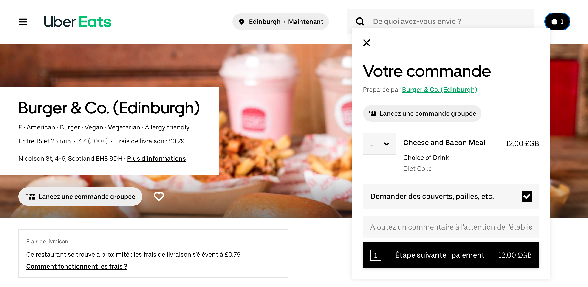

La page Configuration est accessible en cliquant sur la flèche <InlineImage width="20" height="20"></InlineImage> dans le coin supérieur droit de la page principale. Pour plus de détails, voir la rubrique [Interface utilisateur](/apps/uber-eats/interface-utilisateur).

La page Configuration vous permet de personnaliser le comportement de Uber Eats Bridge selon vos préférences.

Celles-ci sont divisées en différentes sections afin de faciliter la navigation.

## Langue

Dans cette section, vous pouvez choisir dans quelle langue vos reçus sont édités.

## Types de service

Les types de service tels que la livraison par Uber Eats, la livraison par le restaurant, la vente à emporter ou la consommation sur place peuvent nécessiter la saisie du code ref correspondant. Pour effectuer une vérification, reportez-vous à la documentation de votre solution d'encaissement connecté sur le site Web de HubRise.

## Articles spéciaux

Le **code ref des articles jetables** désigne le code ref utilisé lorsque les clients incluent des articles jetables à leurs commandes. Tous les restaurants Uber Eats n'offrent pas à leurs clients la possibilité de demander des articles jetables, tels que des couverts, pailles ou serviettes, lors d'une commande. Toutefois, si c'est le cas, vous devez fournir un code ref. Créez un produit "Articles jetables" sur votre solution d'encaissement et spécifiez ce code ref ici.

La capture d'écran suivante montre la case **Demander des couverts, pailles, etc.** que les clients peuvent cocher pour demander des articles jetables.

## Promotions

Le **code ref de promotion** est le code qui est associé aux promotions Uber Eats sur votre solution d'encaissement. Pour savoir comment gérer les promotions dans votre solution d'encaissement, reportez-vous à la documentation de votre solution d'encaissement connecté sur le site Web de HubRise.

## Paiements

Le **code ref de paiement** est le code qui est associé aux paiements Uber Eats sur votre solution d'encaissement. En l'absence de cette référence, votre solution d'encaissement ne saura pas comment identifier et traiter correctement les paiements Uber Eats. Pour savoir comment gérer les paiments Uber Eats dans votre solution d'encaissement, reportez-vous à la documentation de votre solution d'encaissement connecté sur le site Web de HubRise.

## Autres statuts

Uber Eats prend en charge les trois types de statut de commande suivants :

- `accepté` : la commande a été acceptée par la solution d'encaissement.
- `refusé` : l'envoi de la commande à la solution d'encaissement a échoué.
- `annulé` : la commande a été annulée par la solution d'encaissement.

Uber Eats Bridge vous permet de décider quel statut HubRise doit déclencher un statut donné dans Uber Eats. Cette option est utile pour gérer différents scénarios lorsque votre solution d'encaissement actualise le statut de la commande. Si, par exemple, votre solution d'encaissement marque une commande acceptée comme ayant le statut `reçu` sur HubRise, vous pourrez quand même avertir Uber Eats que cette commande a bien été acceptée.

Pour chaque statut de commande Uber Eats, sélectionnez le comportement souhaité pour votre intégration dans le menu déroulant. Pour connaître les exigences applicables à votre solution d'encaissement, reportez-vous à la documentation de votre solution d'encaissement connecté sur le site Web de HubRise.

## Sauvegarde de la configuration

Lorsque vous êtes satisfait(e) de la configuration d'Uber Eats Bridge, cliquez sur **Enregistrer** en haut de la page pour revenir à la page Opérations.

## Réinitialisation de la configuration

Si vous souhaitez réinitialiser la configuration et effacer ses valeurs, cliquez sur **Réinitialiser la configuration** en bas de la page.

---

**REMARQUE IMPORTANTE :** la réinitialisation de la configuration effacera également votre UUID de magasin Uber Eats. Pour continuer à recevoir des commandes Uber Eats, vous devrez saisir à nouveau votre UUID de magasin Uber Eats.

---

La réinitialisation de la configuration ne supprime pas les fichiers journaux des opérations affichés sur la page principale.
