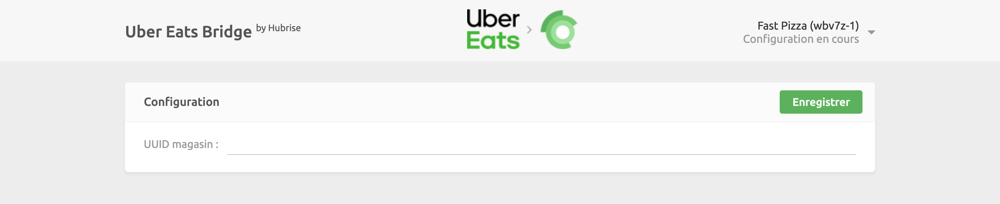

La connexion d'Uber Eats à HubRise s'effectue en quelques étapes simples.

---

**REMARQUE IMPORTANTE :** Si vous ne possédez pas encore de compte HubRise, commencez par en ouvrir un sur la [page d'inscription à HubRise](https://manager.hubrise.com/signup). L'inscription ne prend que quelques minutes !

---

## 1. Activez HubRise dans Uber Eats

Dans un premier temps, l'intégration de HubRise doit être activée sur votre compte Uber Eats.

Contactez-nous par e-mail à l'adresse [support@hubrise.com](mailto:support@hubrise.com) en précisant les informations suivantes :

- L'adresse URL du magasin Uber Eats que vous souhaitez connecter. Exemple : [https://www.ubereats.com/dijon/food-delivery/911-pizza-%2526-burger-darcy/IeJDe6o4SASA6EMABBbPZw](https://www.ubereats.com/dijon/food-delivery/911-pizza-%2526-burger-darcy/IeJDe6o4SASA6EMABBbPZw).
- Le nom et l'identifiant de votre point de vente HubRise. Exemple : `Fast Pizza Paris z6q31-0`.
- Le mode d'acceptation des commandes que vous souhaitez utiliser : manual accept (acceptation manuelle) ou offered state (état proposé). Pour plus de détails, reportez-vous à notre [FAQ](/apps/uber-eats/faqs/recevoir-commandes-sans-tablette).
- Si vous livrez les commandes par vos propres moyens, indiquez-le nous.
- Si vous utilisez des commentaires de produits dans votre boutique Uber Eats, informez-nous de votre souhait de continuer à les utiliser. Sinon, ils seront automatiquement désactivés. Pour plus d'informations sur la gestion des commentaires de produits dans HubRise, voir la rubrique [Commentaires sur les produits](/apps/uber-eats/associer-codes-ref#commentaires-au-niveau-du-produit).

Avec ces informations, l'équipe d'intégration d'Uber Eats pourra activer la connexion HubRise de votre magasin. HubRise vous fournira l'UUID de de magasin Uber Eats nécessaire à la connexion et vous indiquera l'étape suivante.

## 2. Connectez Uber Eats Bridge

---

**REMARQUE IMPORTANTE :** Uber Eats Bridge se connecte à HubRise au niveau du point de vente. Pour plus d'informations, voir la page [Points de vente (en anglais)](/docs/locations/).

---

Maintenant que vous disposez de votre UUID de magasin Uber Eats, vous pouvez connecter Uber Eats Bridge :

1. Connectez-vous à votre compte HubRise.
1. Sélectionnez le point de vente que vous souhaitez connecter dans le menu déroulant.
1. Sélectionnez **CONNEXIONS**, puis **Voir les apps disponibles**.
1. Dans la liste des apps, sélectionnez **Uber Eats**.
1. Cliquez sur **Connecter**.
1. Cliquez sur **Autoriser** pour donner à Uber Eats Bridge l'accès aux données HubRise de votre restaurant. Si votre compte possède plusieurs points de vente, développez **Tous les points de vente** et choisissez le point de vente à connecter, puis cliquez sur **Autoriser**.
1. Une nouvelle page vous demande d'indiquer votre UUID de magasin Uber Eats. Entrez l'UUID de magasin, puis cliquez sur **Enregistrer** pour terminer le processus de connexion.

## 3. Configurez vos préférences

Une fois la connexion effectuée, vous devez renseigner quelques paramètres sur la page Configuration afin que les commandes soient transmises correctement à votre solution d'encaissement.

Pour plus d'informations sur la page Configuration et la manière d'y accéder, voir la rubrique [Page de configuration](/apps/uber-eats/interface-utilisateur/#page-de-configuration). Pour plus de détails sur la configuration des paramètres d'Uber Eats Bridge, voir la rubrique [Configuration](/apps/uber-eats/configuration).

## 4. Renseigner les codes ref des produits

Si vous utilisez Uber Eats avec une solution d'encaissement, vous devez renseigner les codes ref de tous les produits de votre menu Uber Eats. Vous permettrez ainsi à votre solution d'encaissement d'identifier correctement chaque article.

Pour savoir associer les codes ref sur Uber Eats, voir la rubrique [Association des codes ref](/apps/uber-eats/associer-codes-ref).

## 5. Testez la réception des commandes

Nous vous recommandons de tester l'intégration avant de commencer à recevoir des commandes de clients réels.

Passez quelques commandes de test pour vous assurer de leur bonne réception dans votre solution d'encaissement, puis annulez-les pour en obtenir le remboursement. Vous aurez ainsi l'assurance que votre intégration est bien configurée.

Si vous le souhaitez, vous pouvez également vous passer de votre tablette Uber Eats en passant à une intégration directe. Pour plus de détails, voir la rubrique [Les commandes peuvent-elles être envoyées directement sur ma solution d'encaissement sans passer par les tablettes Uber Eats ?](/apps/uber-eats/faqs/recevoir-commandes-sans-tablette).

Si vous rencontrez des difficultés durant ces tests, contactez-nous à l'adresse : support@hubrise.com.
