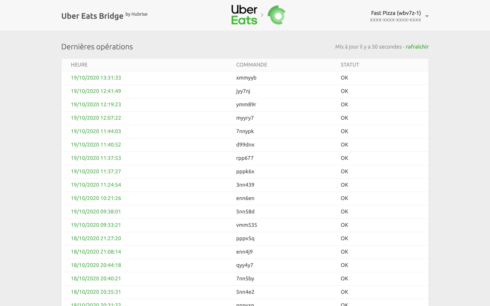
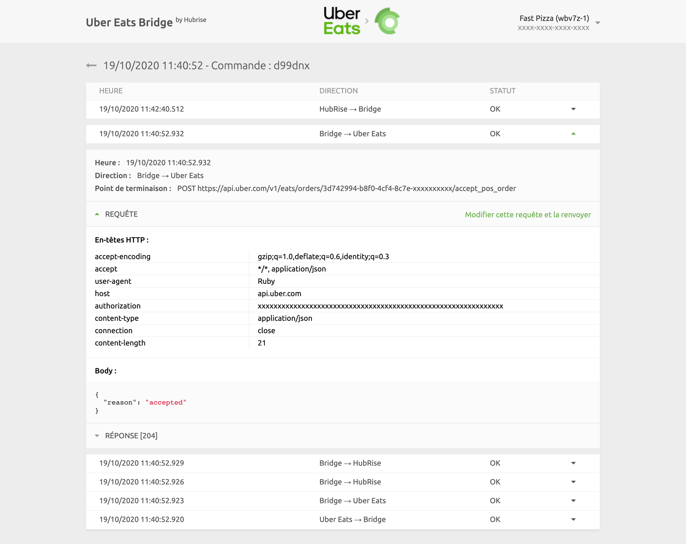
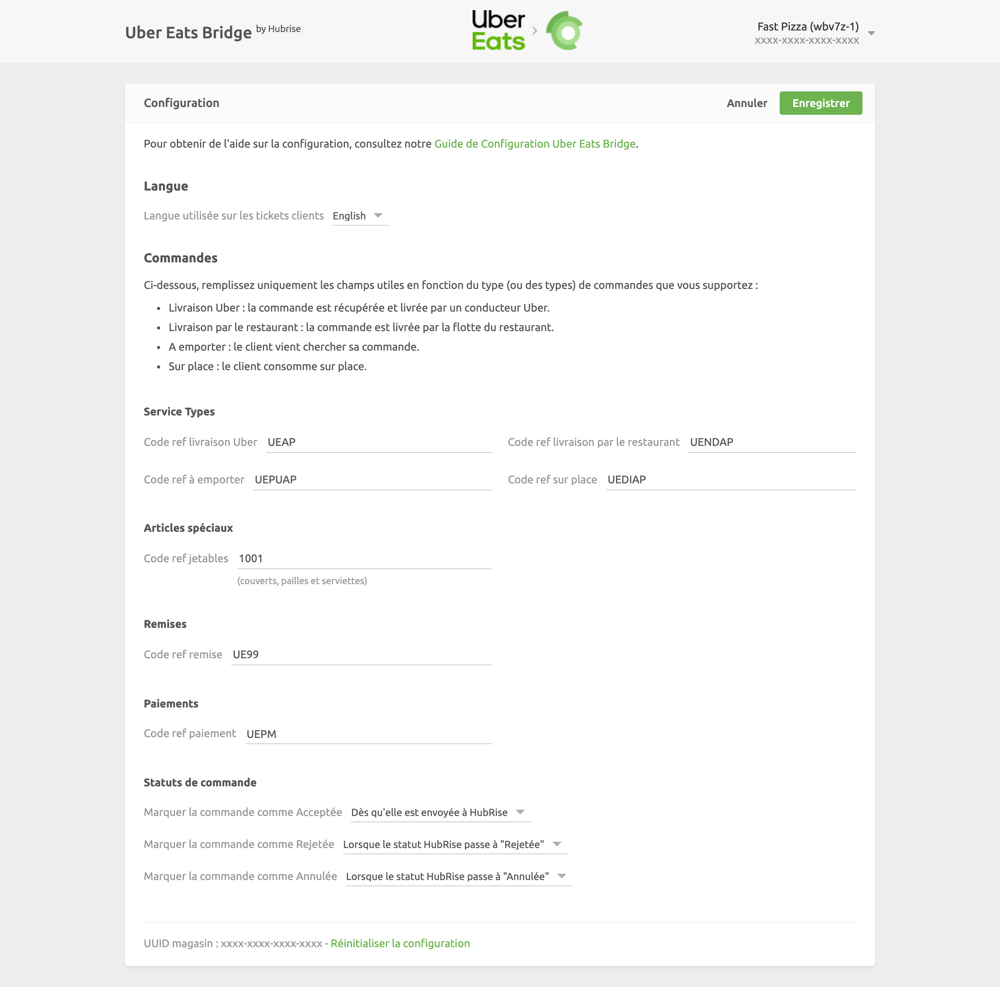

Sur la page principale d'Uber Eats Bridge, vous pouvez consulter les fichiers journaux de toutes les opérations effectuées entre HubRise et Uber Eats et accéder aux paramètres de configuration de l'intégration.

## Page des opérations

La page principale affiche les dernières opérations d'API exécutées entre HubRise, Uber Eats et Uber Eats Bridge.

Les opérations peuvent soit être liées à une commande spécifique, soit être des requêtes système génériques exécutées par Uber Eats Bridge.

Chaque ligne de la page affiche les informations suivantes à propos d'une opération :

- **HEURE** : date et heure de la commande.
- **COMMANDE** : identifiant de la commande HubRise, pour les opérations de commande.
- **STATUT** : statut de la commande. La valeur OK indique que la commande a été envoyée avec succès. Dans le cas contraire, un message explique le type de l'erreur qui est survenue.

Le libellé "Requête système" indique que l'opération n'est pas liée à une commande spécifique.

En cliquant sur une ligne, vous ouvrez une nouvelle page affichant les fichiers journaux associés à l'opération.

## Page des commandes

La sélection d'une opération de commande dans la liste qui figure sur la page principale affiche tous les fichiers journaux des requêtes d'API échangées entre HubRise et Uber Eats via Uber Eats Bridge.

Les requêtes sont classées selon les dates les plus récentes, celles qui sont liées au même événement de commande (commande reçue, commande annulée, etc.) étant regroupées visuellement.

Chaque ligne des fichiers journaux contient les informations suivantes :

- **HEURE** : date et l'heure d'envoi de la requête.
- **DIRECTION** : applications qui envoient et reçoivent la requête, selon le format Origine → Destination.
- **STATUT** : statut de la requête. La valeur OK indique que la requête a été reçue avec succès. Dans le cas contraire, un message explique le type de l'erreur qui est survenue.

Cliquez sur une requête pour la développer et révéler les fichiers journaux détaillés de la requête, ainsi que de sa réponse.

Les fichiers journaux constituent un puissant outil de débogage en cas d'incident. Pour comprendre en détail comment lire les fichiers journaux, voir la [documentation de HubRise](/docs/hubrise-logs/).

## Page de requête système

La mise en page d'une page de requête système est identique à celle d'une page de commande.

Les requêtes système sont généralement envoyées par Uber Eats Bridge afin d'informer HubRise d'une modification de la configuration, ou bien pour alimenter l'interface utilisateur avec les informations les plus récentes. À titre d'exemple, l'image suivante illustre une requête de mise à jour du rappel d'Uber Eats Bridge après un changement de configuration.

Les pages de requête système peuvent fournir des informations de débogage utiles aux équipes d'assistance, mais elles sont rarement intéressantes pour les autres utilisateurs.

## Langue et navigation

Dans le coin supérieur droit de la page principale, vous pouvez cliquer sur la flèche <InlineImage width="20" height="20"></InlineImage> pour développer le menu. De là, vous pouvez alterner l'affichage de la page en anglais ou en français.

Pour revenir à la page principale, cliquez sur les logos d'Uber Eats et de HubRise en haut de n'importe quelle page d'Uber Eats Bridge.

## Page de configuration

Pour accéder à la page de configuration d'Uber Eats Bridge, cliquez sur la flèche <InlineImage width="20" height="20"></InlineImage> dans le coin supérieur droit de la page pour développer le menu, puis cliquez sur **Configuration**.

Cette page vous permet de personnaliser le comportement d'Uber Eats Bridge. Pour plus de détails, voir [Configuration](/apps/uber-eats/configuration).
