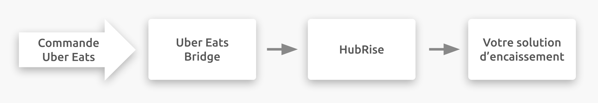

## Description

Uber Eats est une plateforme de commande en ligne et de livraison de repas appartenant à Uber Technologies, Inc.. Elle est présente dans plus de 30 pays.

Uber Eats permet à ses restaurants partenaires de profiter de sa notoriété pour développer leur activité et trouver de nouveaux clients. Les restaurants peuvent ainsi se concentrer sur ce qu'ils font le mieux, en l'occurrence préparer des plats, et laisser Uber Eats s'occuper de la logistique.

## Fonctionnalités de l'intégration

Pour connecter Uber Eats à HubRise, vous devez utiliser Uber Eats Bridge, une application développée par HubRise.

Uber Eats Bridge permet de :

- Recevoir les commandes Uber Eats dans HubRise.
- Recevoir les informations de livraison dans HubRise, lorsque les commandes sont livrées par votre personnel.

Uber Eats Bridge permet de recevoir les commandes avec la tablette Uber Eats éteinte.

---

**REMARQUE IMPORTANTE :** Le catalogue et la disponibilité des produits ne peuvent pas encore être synchronisés, mais HubRise prévoit de mettre en place cette fonctionnalité prochainement.

---

## Pourquoi se connecter ?

La connexion de votre restaurant Uber Eats à HubRise vous permet de recevoir les commandes Uber Eats directement dans votre solution d'encaissement. Vous pouvez ainsi gérer les commandes Uber Eats dans votre logiciel habituel, comme toutes les autres commandes.

## Prérequis

Pour permettre la connexion entre Uber Eats et HubRise, votre restaurant doit être partenaire d'Uber Eats.
