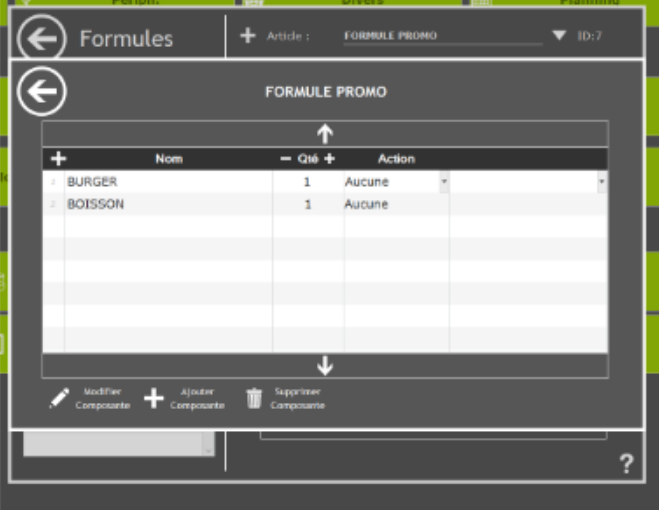

Une fois votre logiciel de caisse UltimaPOS connecté à HubRise, vous devez configurer vos autres applications connectées, afin que les différents éléments présents dans les commandes soient bien identifiés par UltimaPOS.

UltimaPOS identifie chaque élément d'une commande par un code ref. Vous devez indiquer les codes ref fournis par UltimaPOS dans vos autres applications, afin que les commandes puissent être réceptionnées.

Il y a deux façons de procéder :

- Vous pouvez exporter le catalogue UltimaPOS vers HubRise, puis importer ce catalogue dans vos autres applications. Voir [Exporter le catalogue vers HubRise](menu)
- Ou vous pouvez saisir manuellement les codes ref dans vos autres applications.

Seules certaines applications permettent l'import d'un catalogue depuis HubRise. Pour les autres, il faudra saisir manuellement les codes ref.

## Produits

Pour retrouver le code ref d'un produit, suivez ces étapes :

1. Depuis l'écran d'accueil d'UltimaPOS, allez dans **Programmation**, puis **Articles**.
2. Dans la section **Paramètres Articles**, cliquez sur **Articles**.
   

3. Le code ref du produit est indiqué en haut à droite, dans le champ **ID**.
   

## SKUs

UltimaPOS ne permet pas de créer de SKU. Pour remplacer cette fonctionnalité, vous devez associer chaque SKU d'un produit HubRise avec un produit distinct dans UltimaPOS.

## Options

Les options dans HubRise sont des articles dans UltimaPOS.
Pour retrouver le code ref d'une option, suivez les étapes de la section [Produits](#produits).

## Frais

Les frais dans HubRise sont des articles dans UltimaPOS.
Pour retrouver le code ref d'un type de frais, suivez les étapes de la section [Produits](#produits).

## Promotions

Les promotions dans HubRise sont les offres spéciales qui s'appliquent à certains articles.

Il s'agit des formules et des promotions dans UltimaPOS :

- Les formules sur UltimaPOS sont des articles dont le prix est fixe, liés à d'autres produits.
- Les promotions sur UltimaPOS proposent davantage de possibilités, dont la restriction sur le jour et l'heure, la possibilité d'offrir le produit le moins cher ou de changer le prix d'un produit, mais elles n'ont pas de codes ref et ne peuvent pas être associées dans HubRise.

Pour retrouver le code ref d'une formule dans UltimaPOS, suivez ces étapes :

1. Depuis l'écran d'accueil d'UltimaPOS, allez dans **Programmation**, puis **Articles**.
2. Dans la section **Paramètres Articles**, cliquez sur **Formules**.
3. Le code ref de la formule est indiqué en haut à droite, dans le champ **ID**.
   

## Remises

Les remises dans HubRise sont les offres spéciales qui s'appliquent à l'ensemble de la commande. Elles peuvent être en pourcentage ou en valeur.

Leur équivalent dans UltimaPOS est également appelée remise.

Pour retrouver le code ref d'une remise dans UltimaPOS, suivez ces étapes :

1. Depuis l'écran d'accueil d'UltimaPOS, allez dans **Programmation**, puis **Financier**.
2. Dans la section **Paramètres Financiers**, cliquez sur **Remises**.
3. Le code ref de la remise est indiqué en haut à droite, dans le champ **ID**.
   

## Méthodes de paiement

Les méthodes de paiement dans HubRise correspondent aux règlements dans UltimaPOS. Pour retrouver leur code ref, suivez ces étapes :

1. Depuis l'écran d'accueil d'UltimaPOS, allez dans **Programmation**, puis **Financier**.
2. Dans la section **Paramètres Financiers**, cliquez sur **Règlements**.
3. Le code ref du règlement est indiqué en haut à droite, dans le champ **ID**.

## Types de service

Les types de service dans HubRise correspondent aux centres de profit dans UltimaPOS. Pour plus d'informations sur les centres de profit, voir [Centres de profit](plateformes-livraison-repas#centres-de-profit).

Pour trouver le code ref des types de service, suivez ces étapes :

1. Depuis l'écran d'accueil d'UltimaPOS, allez dans **Programmation**, puis **Financier**.
2. Dans la section **Paramètres Financiers**, cliquez sur **Centres de profits**.
3. Le code ref du centre de profit est indiqué en haut à droite, dans le champ **ID**.
