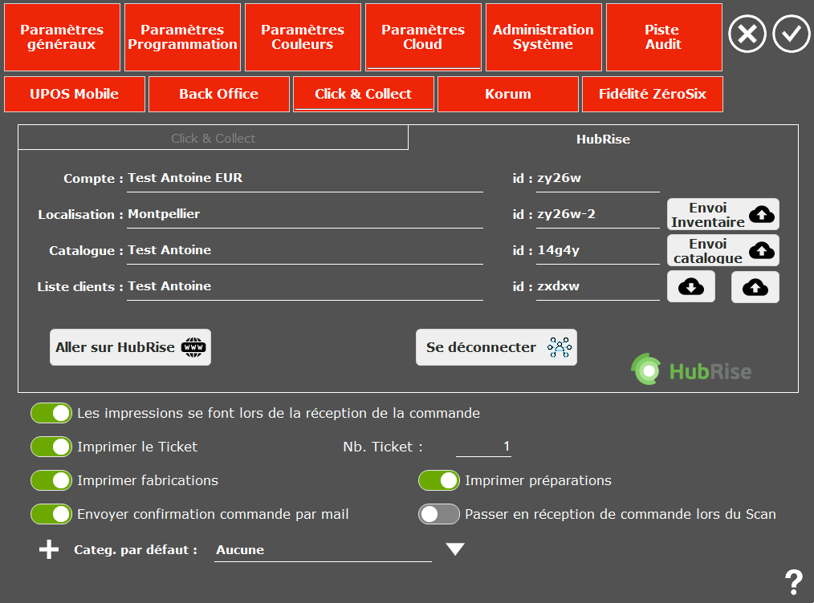

Pour envoyer votre inventaire UltimaPOS vers HubRise, suivez ces étapes :

1. Depuis l'écran d'accueil d'UltimaPOS, allez dans **Paramètres**, **Paramètres Cloud**, **Click & Collect**, puis dans l'onglet **HubRise**.
   
2. Cliquez sur **Envoi Inventaire**.
