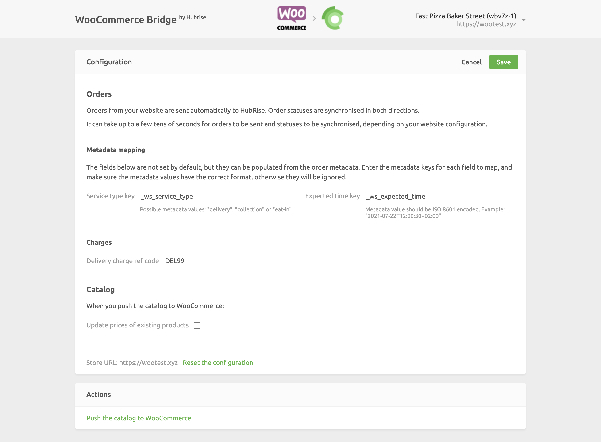

The configuration page allows you to customise the behaviour of WooCommerce Bridge based on your preferences.
These are divided into different sections for an easier navigation.

## Orders

From this section, you can customise how WooCommerce orders are sent to HubRise.

### Metadata Mapping

WooCommerce has no built-in support for the service type and expected time of an order. To send this information to HubRise, you need to use WooCommerce metadata.

In this section, you can specify the metadata fields to map. You must ensure that the values have the correct format that HubRise expects to encode the information correctly.

### Charges

If charges apply, a ref code might be required. Refer to your connected EPOS documentation on the HubRise website to verify.

In this section, you can specify the ref code for delivery charges applied to orders.

## Catalog

When you pull a catalog from HubRise into WooCommerce, we create new products in WooCommerce and we optionally update prices of existing products. For more information, see [Pulling the Catalog](/apps/woocommerce/pulling-catalog).

To update prices of existing products, tick the **Update prices of existing products** checkbox.

## Saving the Configuration

Once you are happy with the configuration of WooCommerce Bridge, click **Save** at the top of the page to go back to the Operations page.

## Pulling the Menu

To pull your HubRise catalog into WooCommerce, from the **Actions** section at the bottom of the page, select **Push the catalog to WooCommerce**. For more information on how HubRise catalogs are mapped to WooCommerce, see [Pulling the Catalog](/apps/woocommerce/pulling-catalog).

## Resetting the Configuration

If you want to reset the configuration and erase its values, click **Reset the configuration** at the bottom of the page.

---

**IMPORTANT NOTE:** Resetting the configuration will also erase your integration settings. To continue receiving WooCommerce orders, you will need to enter your integration settings again.

---

Resetting the configuration does not remove the operation logs displayed in the main page.
