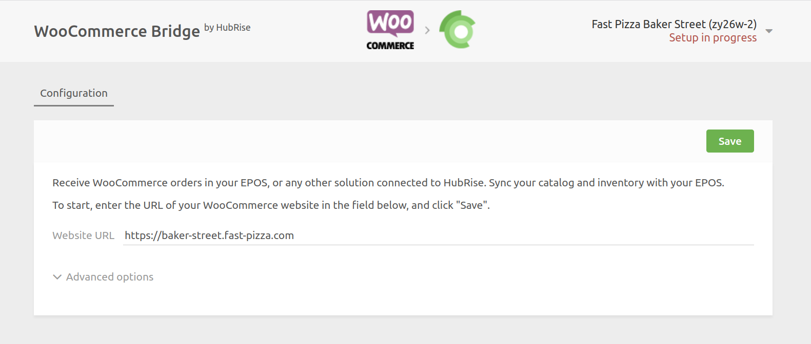
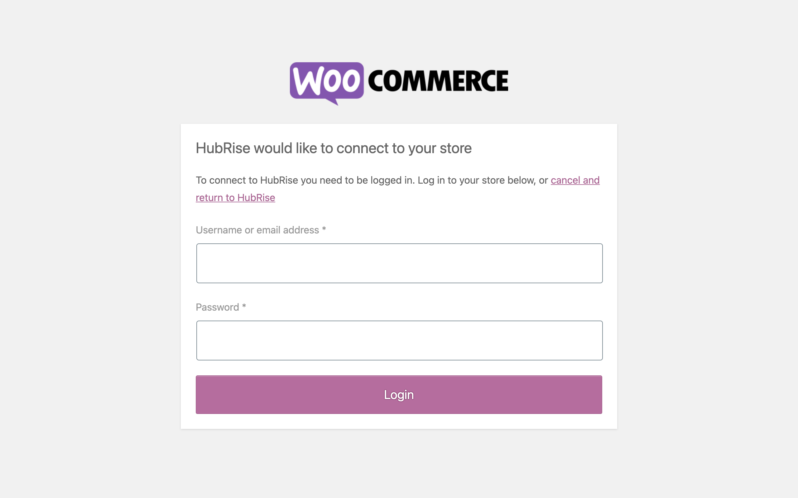

You can connect WooCommerce to HubRise with a few simple steps.

---

**IMPORTANT NOTE:** If you do not have a HubRise account yet, register on our [Signup Page](https://manager.hubrise.com/signup). It only takes a minute!

---

## 1. Connect WooCommerce Bridge

To connect WooCommerce Bridge to HubRise, follow these steps:

1. Log in to your [HubRise account](https://manager.hubrise.com).
1. Select the location you want to connect from the dropdown menu.
1. Select **CONNECTIONS**, then **View available apps**.
1. Select **WooCommerce Bridge** from the list of apps.
1. Click **Connect**.
1. Click **Allow** to grant WooCommerce Bridge access to your registered location on HubRise. If your account has multiple locations, expand the **Choose location** section to select the desired location, and then click **Allow**.
1. Enter the URL of your WooCommerce store:
   
1. If you have previously encountered connection issues, you may adjust the **Advanced options**. If not, leave them unchanged. For more information, refer to our [Troubleshooting](/apps/woocommerce/troubleshooting) guide.
1. Click **Save** to confirm.
1. Click **Connect WooCommerce**. You will be redirected to the WooCommerce authorisation page.
   - If you are not logged in to WooCommerce, enter your username and password, then click **Login**.
     
   - Click **Approve** to authorise the connection with HubRise.
     
1. You will be redirected to the WooCommerce Bridge Configuration page, where you can customise your connection with HubRise.

## 2. Configure Your Preferences

After connecting the Bridge, you need to configure a few parameters in the Configuration page to send orders correctly to your EPOS.

For more information about the configuration page and how to navigate to it, see [Configuration Page](/apps/woocommerce/user-interface#configuration). For details on how to configure the parameters of WooCommerce Bridge, see [Configuration](/apps/woocommerce/configuration).

## 3. Upload Your Menu

If you have a catalog of products on HubRise, you can upload it to your WooCommerce store with a single click.

For more information on HubRise catalogs, see [Catalogs](/docs/catalog).
To learn how to push your HubRise catalog into WooCommerce, see [Push the Catalog](/apps/woocommerce/push-catalog).
