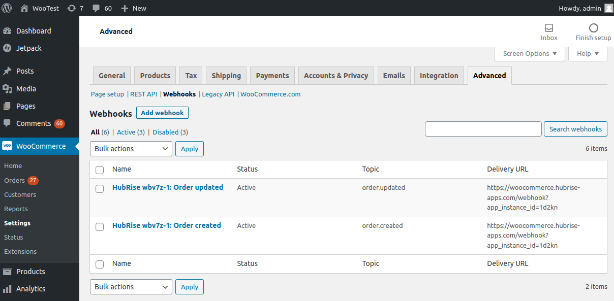

## Orders Not Received in HubRise

The first step to receive orders in HubRise is to connect WooCommerce to HubRise. If you have not done so, follow the steps in [Connect to HubRise](/apps/woocommerce/connect-hubrise/) first.

If you have connected WooCommerce to HubRise, but you are not receiving orders in HubRise, check the following items.

### Check WooCommerce Webhooks

When you connect WooCommerce Bridge, it creates two webhooks on your WooCommerce website. These webhooks are essential to transmit orders from WooCommerce to HubRise.

To check that the webhooks have been created:

1. Open your WooCommerce back office.
1. From the left navigation panel, click **WooCommerce > Settings > Advanced**.
1. Then click on **Webhooks**.
   
1. Find two entries with the following names:
   - `HubRise {{your_location_id}}: Order updated`
   - `HubRise {{your_location_id}}: Order created`

If these entries are present, it is a good sign that the connection to HubRise was successfully established. You can proceed to the next verification step.

However if you cannot find the two entries, you need to reconnect the bridge and check WooCommerce webhooks again. For more information on connecting the bridge, see [Connect to HubRise](/apps/woocommerce/connect-hubrise/).

### Place a Test Order in WooCommerce

To verify the connection between WooCommerce and HubRise, place a test order in WooCommerce and check that it is transmitted to HubRise.

1. Open your WooCommerce back office.
1. From the top menu, click **View Store**. This will open your WooCommerce website.
1. Place an order on your WooCommerce website.
1. Return to your WooCommerce back office, and from the left navigation panel click **WooCommerce > Orders**. The new order will be present.

When WooCommerce is connected to HubRise, orders placed in WooCommerce should be transmitted to HubRise immediately.

To verify that your test order was transmitted to HubRise, follow these steps:

1. From the HubRise back office, click **Data** > **Orders**.
1. Find your test order.

If you can see the order, the connection between WooCommerce and HubRise is working correctly.

## Orders Received in HubRise With a Delay

By default, orders are transmitted from WooCommerce to HubRise by a process called a **cron**. This process runs every few minutes and transmits all orders that have not been transmitted yet. This can delay order creation and status updates.

You can opt to transmit orders immediately, without waiting for the cron to run. This is called **synchronous webhooks**. To enable synchronous webhooks, follow these steps:

1. Access your WordPress site files using an FTP client or your hosting control panel's file manager.
1. Navigate to the `wp-content/themes/[your-theme]` directory, where `[your-theme]` is the folder of your active theme.
1. Open the `functions.php` file and append the following code snippet at the end of the file:
   ```
   add_filter( 'woocommerce_webhook_deliver_async', '__return_false' );
   ```
1. Save the file and the changes will take effect immediately.

If you are not sure how to do edit the `functions.php` file, contact the developer of your WooCommerce website.
