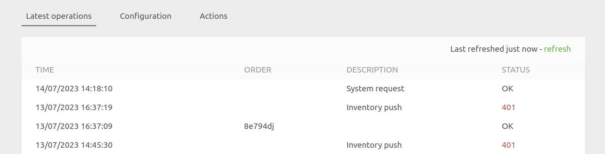
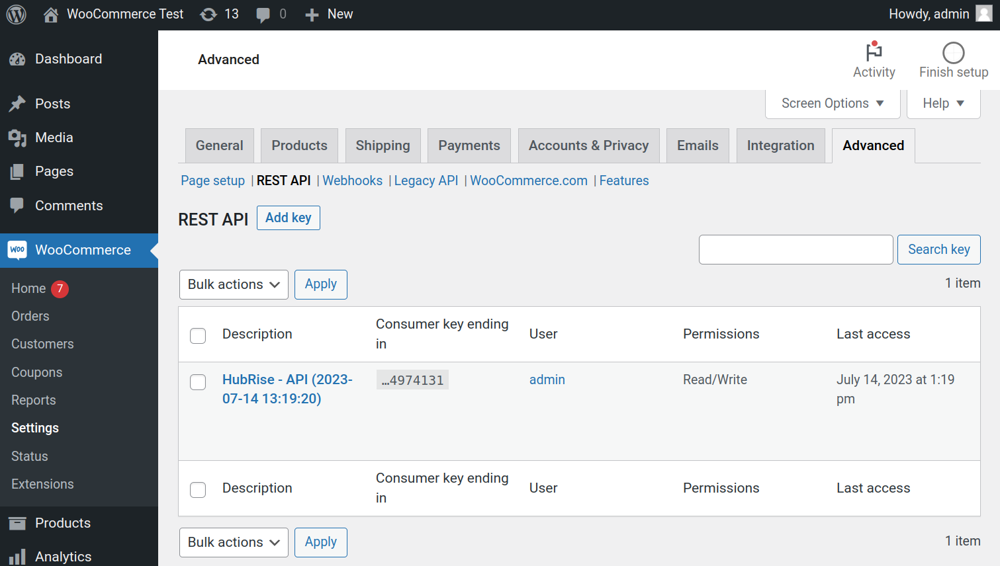
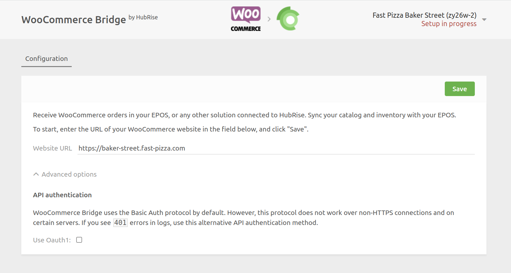

## Orders Not Received in HubRise

The first step to receive orders in HubRise is to connect WooCommerce to HubRise. If you have not done so, follow the steps in [Connect to HubRise](/apps/woocommerce/connect-hubrise) first.

If you have connected WooCommerce to HubRise, but you are not receiving orders in HubRise, check the following items.

### Check WooCommerce Webhooks

When you connect WooCommerce Bridge, it creates two webhooks on your WooCommerce website. These webhooks are essential to transmit orders from WooCommerce to HubRise.

Not only should you verify the presence of these webhooks, but you also need to ensure that their status is **active**. If the status is **inactive**, the webhooks will not work. You will need to reactivate them by clicking on their names.

To check that the webhooks have been created:

1. Open your WooCommerce back office.
1. From the left navigation panel, click **WooCommerce > Settings > Advanced**.
1. Then click on **Webhooks**.
   
1. Find two entries with the following names:
   - `HubRise {{your_location_id}}: Order updated`
   - `HubRise {{your_location_id}}: Order created`
1. Check the status of each entry. If any of them are set to **inactive**, click on their names to change the status to **active**.

If these entries are present and active, it is a good sign that the connection to HubRise was successfully established. You can proceed to the next verification step.

If you cannot find the two entries, you need to reconnect the bridge and check WooCommerce webhooks again. For more information on connecting the bridge, see [Connect to HubRise](/apps/woocommerce/connect-hubrise).

### Place a Test Order in WooCommerce

To verify the connection between WooCommerce and HubRise, place a test order in WooCommerce and check that it is transmitted to HubRise.

1. Open your WooCommerce back office.
1. From the top menu, click **View Store**. This will open your WooCommerce website.
1. Place an order on your WooCommerce website.
1. Return to your WooCommerce back office, and from the left navigation panel click **WooCommerce > Orders**. The new order will be present.

When WooCommerce is connected to HubRise, orders placed in WooCommerce should be transmitted to HubRise immediately.

To verify that your test order was transmitted to HubRise, follow these steps:

1. From the HubRise back office, click **Data** > **Orders**.
1. Find your test order.

If you can see the order, the connection between WooCommerce and HubRise is working correctly.

## Orders Received in HubRise With a Delay

By default, orders are transmitted from WooCommerce to HubRise by a process called a **cron**. This process runs every few minutes and transmits all orders that have not been transmitted yet. This can delay order creation and status updates.

You can opt to transmit orders immediately, without waiting for the cron to run. This is called **synchronous webhooks**. To enable synchronous webhooks, follow these steps:

1. Access your WordPress site files using an FTP client or your hosting control panel's file manager.
1. Navigate to the `wp-content/themes/[your-theme]` directory, where `[your-theme]` is the folder of your active theme.
1. Open the `functions.php` file and append the following code snippet at the end of the file:
   ```
   add_filter( 'woocommerce_webhook_deliver_async', '__return_false' );
   ```
1. Save the file and the changes will take effect immediately.

If you are not sure how to do edit the `functions.php` file, contact the developer of your WooCommerce website.

## 401 Errors

If you see 401 errors in WooCommerce Bridge, it means that WooCommerce Bridge is unable to authenticate with WooCommerce.



There are three common causes for 401 errors:

### API Key Removed

If the API key for HubRise has been removed in WooCommerce, it will lead to 401 errors. To check this:

1. Open your WordPress dashboard.
1. Navigate to **WooCommerce** > **Settings** > **Advanced** > **REST API**.
1. Verify if there is an API key named `HubRise - API`.

Refer to the screenshot for clarity:



If the `HubRise - API` key is not present, it means it has been removed, and you need to reconnect the bridge. For more information on reconnecting the bridge, see [Connect to HubRise](/apps/woocommerce/connect-hubrise).

### HTTP Basic Authentication Fail

If your WooCommerce setup does not work with the default HTTP Basic authentication method, it may also result in 401 errors. In such cases, you need to switch to the fallback OAuth1 method.

To do this:

1. Reset the configuration of WooCommerce Bridge.
1. Configure the bridge again from scratch, but when you reach the first step of the configuration, unfold **Advanced Options**.
1. Select the **Use OAuth1** option.
   
1. Proceed with the configuration as described in [Connect to HubRise](/apps/woocommerce/connect-hubrise).

After making this change, verify if the 401 errors are resolved. If not, check the other troubleshooting steps or contact HubRise support.

### Incorrect URL During Setup

---

**IMPORTANT NOTE:** This issue is only relevant if you are using the OAuth1 authentication method.

---

During the OAuth1 setup, if you added an extra `www` or omitted it from your website URL, the WooCommerce API will respond with the JSON message below:

```json
{
  "code": "woocommerce_rest_authentication_error",
  "message": "Signature non valide - La signature fournie ne correspond pas.",
  "data": {
    "status": 401
  }
}
```

In this case, the error message indicates that the signature provided does not match due to an incorrect URL input. This issue arises only with OAuth1 setup, because it requires the exact URL to compute the request signature, unlike Basic Auth which does not use the URL in the authentication of each request. To resolve this, you need to reconnect and use the exact URL of your website (either with or without the `www`, as per your actual website URL).

Here is how to correct this:

1. Reset the configuration of WooCommerce Bridge.
1. Configure the bridge again from scratch. When you reach the first step of the configuration, enter the correct URL of your WooCommerce store, ensuring the URL matches exactly with your website (pay attention to whether your website uses `www` or not).
1. Proceed with the configuration as described in [Connect to HubRise](/apps/woocommerce/connect-hubrise).
