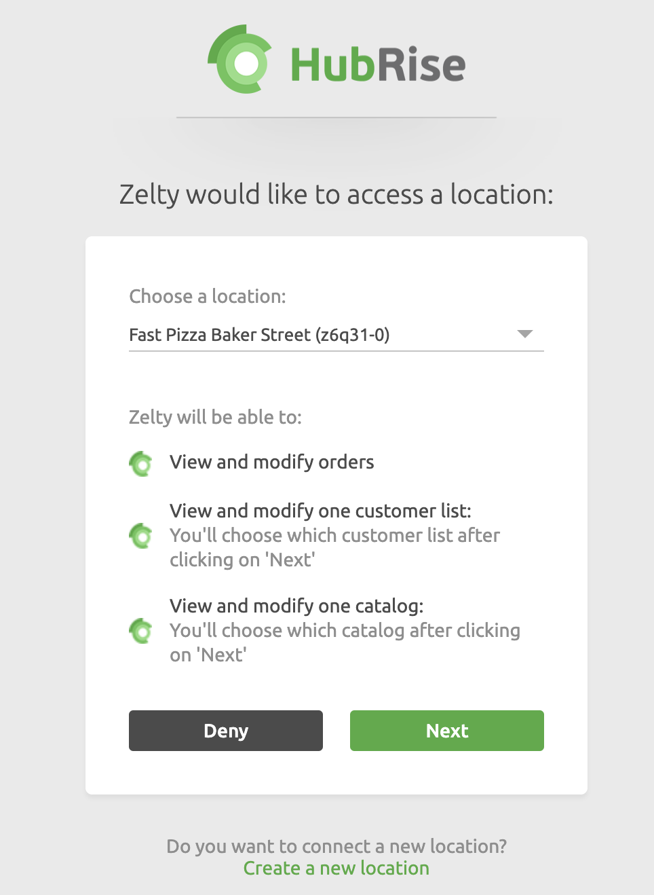

The connection between Zelty and HubRise can be done autonomously by the user.

## Connect to Locations {#connect}

In order to activate the connection between Zelty and HubRise:

1. Navigate to **MarketPlace** on your Zelty back office.
1. Select HubRise.
1. Click **Activer** (Connect). You are directed to the HubRise interface.
1. Find the location you are trying to connect and click on **Allow** to give Zelty access to your data.
1. If you have multiple restaurants, each location should be connected to HubRise independently following the steps outlined above.

---

**IMPORTANT NOTE:** You might need to log in to your existing HubRise account, or create a new HubRise account to complete the connection process. For more information on how to create a user profile or log in HubRise, see our [Getting Started Guide](/docs/get-started).

---

## Disconnect

In order to disable the connection between Zelty and HubRise:

1. On the Zelty backoffice, go to **Marketplace**.
1. Select HubRise.
1. Go to the **Gérer** (Manage) tab and click **Désactiver** (Disable).
1. Confirm when prompted.
