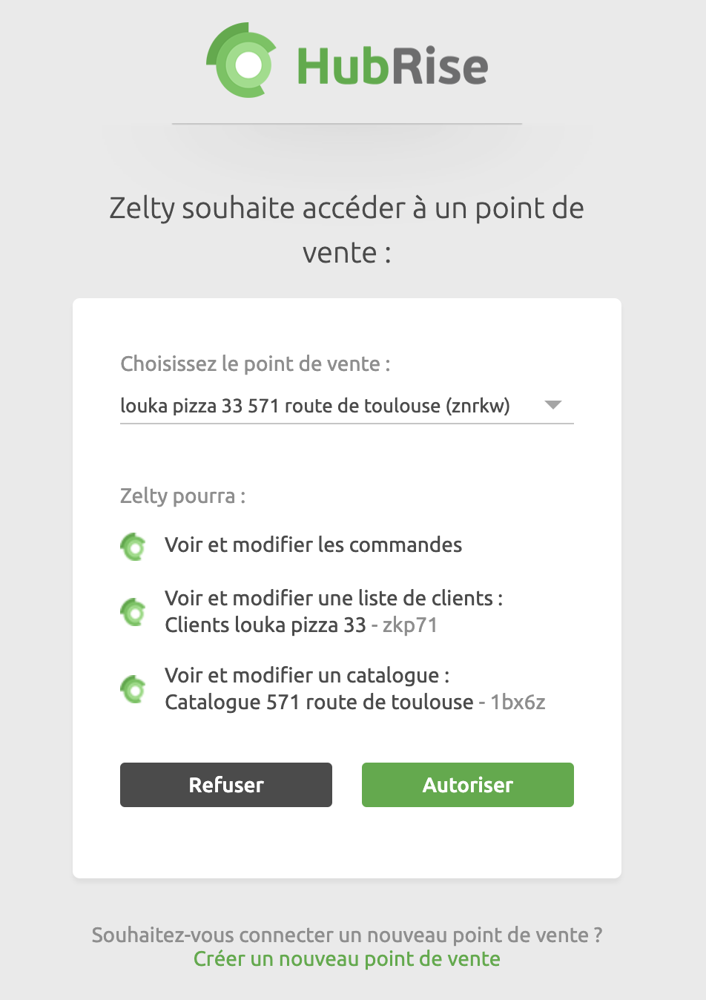

La connexion entre Zelty et HubRise peut être établie de manière autonome par l'utilisateur.

## Connexion aux points de vente

Pour activer la connexion entre Zelty et HubRise, procédez comme suit :

1. Accédez à la **MarketPlace** depuis votre back-office Zelty.
1. Sélectionnez HubRise.
1. Cliquez sur **Activer**. Vous êtes redirigé vers l'interface HubRise.
1. Recherchez le point de vente auquel vous essayez de vous connecter et cliquez sur **Autoriser** pour permettre à Zelty d'accéder à vos données.
1. Si vous avez plusieurs restaurants, chaque point de vente doit être connecté indépendamment à HubRise en suivant les étapes précitées.

---

**REMARQUE IMPORTANTE :** Pour établir la connexion, vous devrez soit vous connecter à un compte HubRise existant, soit créer un nouveau compte HubRise. Pour plus d'informations sur la création d'un profil utilisateur ou la connexion à HubRise, consultez notre [Guide de démarrage](/docs/getting-started/).

---

## Déconnexion

Pour désactiver la connexion entre Zelty et HubRise, procédez comme suit :

1. Sur le back-office de Zelty, accédez à la **Marketplace**.
1. Sélectionnez HubRise.
1. Accédez à l'onglet **Gérer** et cliquez sur **Désactiver**.
1. Confirmez votre action lorsque le système vous y invite.
