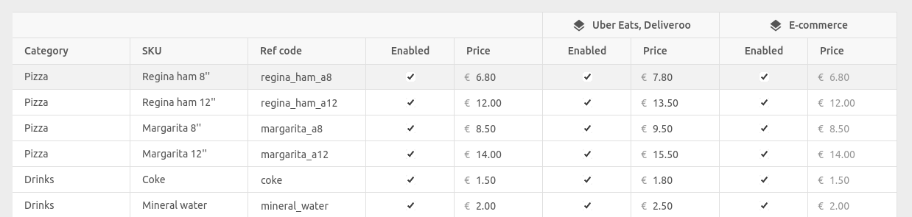

[//]: # "Photo credits: https://pixabay.com/vectors/watercolor-yellow-orange-red-green-4111953/"

We've introduced catalog variants. This new feature allows you to manage a single catalog across multiple sales channels and locations, while maintaining the flexibility to customise prices and availability for each channel and location. This feature will not only save you time, but also ensure consistency and accuracy across your sales channels.

In this blog post, we'll explore what catalog variants are, API changes for developers, and how existing integrations have been updated.

## What are Catalog Variants?

Catalog variants enable you to create pricing and availability rules for your items, depending on the context or platform they're being sold on, and without having to manage separate catalogs.

You can define any number of variants in a catalog. For each variant, you can specify:

- **Price overrides** at the SKU, and option level.
- **Restrictions** at the SKU, option, deal, discount, and charge level.

For example, if you want to offer a different price for a pizza on food platforms compared to your website, you can create a `Food platforms` variant and set price overrides for the SKUs and options which should have a different price. Similarly, you can disable some deals or options for some variants by using restrictions.

Each variant has a descriptive name, and a unique reference. In the apps using the catalog, variants will typically be referenced by their name, and not by their reference. Therefore, the actual references do not matter, so you can use `1`, `2`, `3`, etc., or `food_platforms`, `website`, etc.

The mapping between a specific channel/location and a variant is done outside the catalog, in the apps using the catalog. Each variant can therefore be used in multiple contexts, which avoids having to create one variant for each channel/location combination.

For example, imagine that you want to differentiate prices between food platforms in Paris and those outside Paris, as well as your website. Instead of creating a separate variant for each platform and location combination, you can just create 3 variants: `Food platforms Paris`, `Food platforms outside Paris`, and `Website`, and map each variant to the appropriate channel/location combination.

## API Changes

HubRise catalogs can now optionally include a `variants` array, at the same level as the `categories` array. This array contains one object per variant, with each object having a unique `ref` and a non-empty `name`:

```json
{
  "data": {
    "variants": [
      {
        "ref": "1",
        "name": "Food platforms"
      }
    ],
    ...
  }
}
```

The defined variants can be used in the `price_overrides` arrays and `restrictions` objects at the SKU, option, and deal level. For example:

```json
{
  "data": {
    "variants": [
      {
        "ref": "1",
        "name": "Food platforms"
      },
      {
        "ref": "2",
        "name": "Kiosk"
      }
    ],
    "categories": [...],
    "products": [
      {
        "name": "Regina ham",
        "category_ref": "pizza",
        "skus": [
          {
            "price": "6.80 EUR",
            "price_overrides": [
              {
                "variant_refs": ["1"],
                "price": "8.00 EUR"
              }
            ]
          }
        ]
      },
      {
        "name": "Expresso",
        "category_ref": "drinks",
        "skus": {
          "price": "1.50 EUR",
          "restrictions": {
            "variant_refs": ["2"]
          }
        }
      }
    ]
  }
}
```

In this example:

- The "Regina ham" pizza has a default price of €6.80, but the price is overridden to €8.00 when ordered through food platforms.
- "Expresso" is only available when ordered through the kiosk.

The API changes have been reflected in our [API documentation](/developers/api/catalogs) and [Postman collection](https://drive.google.com/drive/folders/1fn5u-4sY0-bnrxJY9RFPvpCu0bANGNBd?usp=sharing).

---

**IMPORTANT NOTE:** The `service_types` and `service_type_refs` fields in `restrictions` and `price_overrides` have been deprecated. They will continue to work for a little while, but we recommend migrating to `variant_refs` as soon as possible.

---

## Updates to Catalog Manager

[Catalog Manager](/apps/catalog-manager/overview) is a free app included with HubRise. It allows you to view and modify your catalogs.

We have added a new **Grid** mode, where you can create variants, customise prices, and disable items for some variants.



## Updates to Integrations

We have updated our integrations with Uber Eats, Deliveroo, Just Eat, Shopify, WooCommerce, and Glovo. To use variants with these integrations, you need to first update your catalog in HubRise, and then open the bridge configuration. You will be able to select the variant from the dropdown, or choose **(none)** to sync the default catalog.


