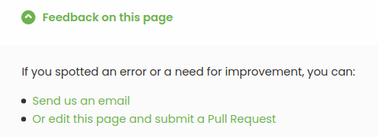

Our website includes various types of technical documentation. We try to provide sufficient detail to give all the necessary information to the reader but there is always a margin for improvement. You can help by contributing to:

- The developers API documentation used by engineers during the integration process.
- The user guide that provides users with assistance on how to use the HubRise Platform.
- The documentation created for every integrated app to help connecting and troubleshooting.

## Contributors

Anyone is welcome to contribute. Editors of integrated apps are proactively encouraged to review and keep its content updated but any HubRise users or stakeholders are welcome to give feedback. Motivation to contribute varies. It could be:

- To make users of connected apps more autonomous.
- To update the apps documentation with a new feature.
- To help support teams troubleshoot any issues that may arise.
- Or to document frequently asked questions and avoid answering the same questions over and over again.

## Process

When you are on a technical documentation page, scroll down to the bottom. At the bottom of the page, you will find the **Feedback on this page** link. Click on the link which will open a dropdown list of options.

A simple email can be sent but all our technical documentation is available in a public repository. If you are familiar with GitHub you can edit the page yourself and submit a Pull Request. The documentation has been written in Markdown. Your suggested modifications will be reviewed by the HubRise team.

## Style

The HubRise documentation follows a certain editorial style.

The editorial style is defined in a style guide which sets out writing guidelines. These include, but is not limited to, the copy patterns, the voice and the tone to use. For further guidance on the editorial style to use, refer to the [Style Guide](/contributing/style-guide).

When it becomes necessary to supplement your documentation with screenshots, these screenshots have to comply with certain technical specifications. For more information, refer to the [Screenshots Guide](/contributing/screenshots-guide).

You can also include videos. These videos have to comply with certain technical specifications. To find out more, refer to the [Videos Guide](/contributing/video-guide).
