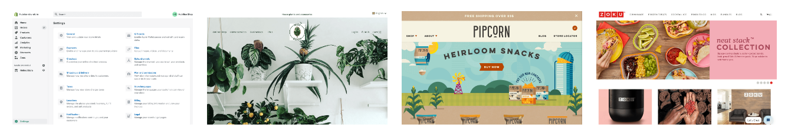

Once your solution has been technically approved by HubRise, you can ask for it to be included on our website by contacting us at [contact@hubrise.com](mailto:contact@hubrise.com).

Depending on the parts of the site in which your solution will be referenced, you must provide us with certain elements, details of which are given below.

## Apps Page

The [Apps](/apps) page presents all the solutions that have been integrated or that are in the process of being integrated.

To include your solution on this page, please send us the following elements:

- A high-resolution logo, in PNG format, on a transparent background. Final size: 250x130px. The HubRise team can resize your image if necessary.
- A description containing 30-35 words (no superlatives) that differentiates your solution from those listed on the page.

## Documentation of the Integration

This documentation presents the solution and the procedure to follow to connect it to HubRise. It is intended to allow users and support teams to install the solution autonomously and troubleshoot the connection. By way of example, refer to the documentation done for [LivePepper](/apps/livepepper).

For the overview page, which is the first visible page of this documentation, you must provide the following elements:

- A description containing 150-300 words (no superlatives) presenting the solution and its features in detail.
- 2-6 screenshots of the application, all with the same width-height ratio.

### Description of the Solution

You should only provide the content of the **Description** section. Our team will take care of writing the **Integration Features**, **Why Connect?** and **Prerequisites** sections.

### Screenshots width-height ratio

The illustration below shows why screenshots must have the same width-height ratio.

> Incorrect: one image in portrait mode next to others in landscape mode.

> Correct: all the images have the same width-height ratio.

## Partners Page

The Partners page does not exist yet, but will be added soon. Here is a preview of how a partner will be presented on this page.

In order to feature on our partners page, you must provide the following elements:

- A high-resolution logo, in PNG format, on a transparent background. Final size: 250x130px. The HubRise team can resize your image if necessary.
- A description comprising 2 blocks of approximately 45 words apiece (no superlatives). The first block presents your company, the second describes what makes you a HubRise expert.
