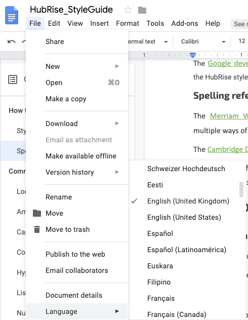

## Introduction

This guide provides instructions for when you want to contribute your documentation to the HubRise documentation. It provides instructions on style guide source, spelling, style and technical documentation.

The [Google developer documentation](https://developers.google.com/style/other-sources) style guide can be used as a general source reference. Where the Hubrise style guide doesn’t deal with a specific situation, it should be updated with the Google guide.

The [Merriam-Webster dictionary](https://www.merriam-webster.com/) should be used as a spelling reference when we have multiple ways of spelling the same word. In addition the [Cambridge Dictionary](https://dictionary.cambridge.org/) can be used as a secondary reference only.

All text in the contribution should be written in **British English**. The language setting in Google Docs can be set to **British English** by selecting **File > Language > English (United Kingdom)**.



Please also keep in mind that readers of the documentation might not be native english speakers.

## Capitalisation

The rule is as follows. If it’s an **official title or name**, something that can be or is **trademarked or copyrighted**, or the name of something that’s **unique in the universe**, capitalize it. Otherwise, don’t.

**If you’re unsure on whether to capitalize something or not, just don’t** because nine out of 10 times, you’ll be doing the right thing.

One exception is when referring to a specific item in HubRise.  For example, a customer may place an order at a restaurant.  If we are referring to the specific **Restaurant** object in HubRise, we capitalise it to show we refer to the HubRise item, as opposed to a generic restaurant.

Also, if it’s an expression that has a **well-known acronym** amongst your target audience, you shall capitalize the word.

Words such as “a,” “an,” “and,” “at,” “but,” “by,” “for,” “in,” “nor,” “of,” “on,” “or,” "out," “so,” “the,” “to,” “up,” “vs”, and “yet” mustn’t be capitalized.

You may use [Capitalize My Title](https://capitalizemytitle.com/) to help you capitalize your headings. Choose the “APA” style.

## Punctuation

### Colon

The first letter following a colon should always be capitalised.

### Commas

If you have a list of three or more items, add a comma before the last item. For instance, *“I’d like to order a focaccia, a margherita, and a tiramisu.”* In this list of three items, the comma after the second item is the **Oxford or serial comma**.

### Hyphenation

If you’re in doubt whether to hyphenate a set of words or not, first look up the word in the [Merriam-Webster dictionary](https://www.merriam-webster.com/) and follow the rules established there. For instance, the Merriam Webster spells “*well known*” with a hyphen: “*well-known*”.

A second rule of thumb is that, if the set of words doesn't play the same role in a sentence without hyphen(s), you should use the version adequate to the role you wish it plays in the sentence. For example, the [Merriam-Webster dictionary](https://www.merriam-webster.com/) states that “*kick off*” is a verb and “*kickoff*” is a noun (“*kick off*” is a verb in the sentence “*What time does the game kick off?*”, whereas “*kickoff*” is a noun in the sentence “*Kickoff will be at 11 o'clock prompt.*”)

For sets of two words only, if the dictionary indicates that there’s an alternative without a hyphen, then use that alternative instead of the hyphenated version.

### Parentheses

The use of parentheses is discouraged. Limit their use to clarify acronyms. If you have something to say, a sentence works just as well. Readers tend to ignore anything in  parentheses.

### Quotation Marks

Punctuation goes inside quotation marks. Only use quotation marks for actual quotes and dialogues.

## Lists

A short list of items can be represented in one sentence.  For more than three items or for multiple long instructions, display them as a bullet list.  Every item of a list should end with a full stop, except for single words or sentences without a verb.  

For example, a short list of items can be written as:

*Type indicates how the order will be received.  Types include **DELIVERY**, **COLLECTION** or **EAT-IN**.*

A longer list can be written as:

*Statuses include:*
  * ***New*** 
  * ***Accepted*** 
  * ***In Delivery*** 
  * ***Rejected*** 
  * ***Completed***

or:

*From the main page, you can perform the following actions:*
  * *Remove an order.*
  * *Place an order.*
  * *Modify the order details.*
  * *Remove all orders.*

Avoid using lists to repeat all fields to fill-in shown in the UI. For context, include a screenshot instead and refer to fields you need to provide information on. 

## References

### Cross-references

Cross-references can be used to guide readers to related information within the same document or in an external page. 

This is different from UI menu representation, which uses the > to indicate a sub-level.  For more information on UI menu representation, see [Menus](#).

Cross-references are hyperlinked to the header being referred to, with the final section linked. For example, if we are linking to the Change Password section of the documentation in this format:

 * Account
    * Account Settings
      * Change Password &#8592; Linking here

The link will be on **Change Password**.

Do not attach the cross-reference directly to a word in the text. Rather, use a separate sentence to introduce the cross-reference with the exact name of the header. 

*Wrong: We use [commas](#) to separate words.*

*Right: We use [commas](#) to separate words. For more information on use of commas, refer to Commas.*

### Links to other sites

Relative paths should always be used for internal links or cross-references, absolute paths should always be used for external links. Relative paths  will open the link in the same tab. Absolute paths will open a new tab.

## Readability

First and foremost, your text must be **easy-to-read**. Keep in mind that readers are busy, so they may read your text diagonally. You must have strategies in place to ensure that either your message passes on, or they find the help they need. You must also be **concise** and **objective**. Keep your text short and simple.

To achieve an easily readable text, you must use:

* Short Sentences.
* Short paragraphs.
* Bulleted lists.
* Tables.
* Diagrams.

Let’s look in more detail to the aspects that contribute to the readability of your text.

### Active voice

Avoid using the passive voice (in which the grammatical subject of the sentence is the person or thing being acted upon) as it makes your writing more distant and your message less clear. Use active voice instead (in which the grammatical subject of the sentence is the person or thing that performs the action). 

Almost every passive sentence has an active counterpart. If you can’t find an active alternative, use the passive form. Using it for less than 10% of your sentences isn’t that harmful.

Here are some examples of sentences in the active and passive voices:

| Passive Voice | Active Voice |
| :-------------: | :------------: |
| A plant is cultivated by the gardener. | The gardener cultivates a plant. |
| A plant is being cultivated by the gardener. | The gardener is cultivating a plant. |
| A plant will be cultivated by the gardener. | The gardener will cultivate a plant. |
| A plant will have been cultivated by the gardener. | The gardener will have cultivated a plant. |

### Politeness

Everyone wants to be polite, but for instructions it can be left out.

*Wrong: Please click **Save**.*

*Right: Click **Save**.*

### Clause order

Include conditional clauses before instructions, not after to give readers a chance to skip it if the circumstance doesn't apply.

*Right: For more information, see [link to other document].*

*Wrong: See [link to other document] for more information*

### Synonyms

**Avoid** using synonyms. If you can’t escape it, use **three at most**. Your text is not literary, and a lot of synonyms may sound repetitive to the reader, increasing the odds of low engagement levels.

### User Actions

Users may use different actions for the same event.  On a Desktop computer, they might “click” a link, while on a mobile device they might “tap” it.  When possible, use universal terms across platforms.  For example:

* _**Select** instead of **click** or **tap**._

### Second person and first person

The use of “*you*” (second person) instead of "*we*" is preferred. Identify who the "*you*" is (the developer, the user?) and to be consistent throughout to avoid confusion. In an instruction, if you can, leave out the "*you*".

* _Right: Click Connect_
* _Wrong: You can click on Connect_

### Repetition

While an entire document may be contained in one Google Doc, when it is converted to Markdown each ```<h2>``` section is converted to its own page.
To cut down on repetition, if the same information is necessary within a ```<h2>``` section it should be consolidated and referenced within the document.  

If this information is repeated across different ```<h2>``` sections, each ```<h2>``` section will have a copy.  The goal is to prevent readers from having to click back and forth between different pages, which can interrupt their reading flow and become frustrating.

### Prepositions vs Verbs

Log in to or log into is a common issue, made worse with login.

**Into** is a preposition.  It establishes a position in time or space.  For example:  *I enter into a car*.

**In to** is a two part verb.  I **log in** to a web page.  I’m not literally crawling through my monitor screen.  You may **log** a web page, or **log in** to a web page.
It’s a weird distinction, and they sound the same.  But the shorthand is you log in to a web page, you enter into a car.

### Numbers

A simple rule for using numbers that small numbers under ten should generally be spelled out. Larger numbers above ten are written as numerals.

### Ampersand

Unless it’s part of a name, such as the name of a company, don’t use the ampersand (“*&*”) as an abbreviation strategy.


