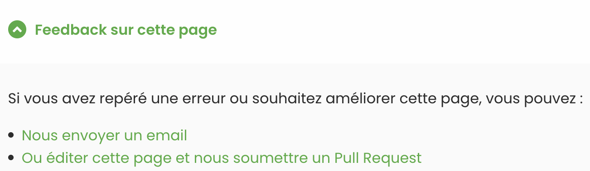

Notre site Web comprend différents types de documentation technique. Nous nous efforçons de fournir suffisamment de détails afin que nos lecteurs soient le mieux informés possible, mais il existe toujours une marge d'amélioration. Vous pouvez apporter votre contribution aux documents suivants :

- Documentation de l'API pour les développeurs, utilisée par les ingénieurs durant le processus d'intégration.
- Guide de l'utilisateur, qui contient une assistance sur la manière d'utiliser la plateforme HubRise.
- Documentation créée pour chaque application intégrée afin de faciliter la connexion et la résolution des problèmes.

## Contributeurs

Toute personne est invitée à apporter sa contribution. Les éditeurs d'applications intégrées sont encouragés à réviser et maintenir à jour leurs contenus à titre proactif, mais l'ensemble des utilisateurs et parties prenantes de HubRise peuvent exprimer librement leur avis. Les motifs de cette contribution sont divers. Il peut s'agir :

- De rendre les utilisateurs des applications connectées plus autonomes.
- De mettre à jour la documentation des applications avec une nouvelle fonctionnalité.
- D'aider les équipes d'assistance à résoudre les problèmes qui peuvent survenir.
- De documenter les questions fréquemment posées, pour éviter de répondre plusieurs fois aux mêmes questions.

## Procédure

Lorsque vous êtes sur une page de documentation technique, faites défiler celle-ci jusqu'en bas. La partie inférieure de la page comprend un lien intitulé **Commentaires sur cette page**. Cliquez sur le lien pour ouvrir une liste déroulante d'options.

Il est possible d'envoyer un simple e-mail, mais l'intégralité de notre documentation technique est accessible dans un référentiel public. Si vous êtes déjà familiarisé avec GitHub, vous pouvez éditer la page vous-même et soumettre une demande d'extraction (Pull Request). La documentation a été rédigée en langage Markdown. Les modifications que vous suggérez seront passées en revue par l'équipe de HubRise.

## Style

La documentation de HubRise est conforme à un certain style rédactionnel.

Celui-ci est lui-même défini dans un guide de style qui fixe les directives d'écriture. Il s'agit, notamment, des modèles de copie, de la voix grammaticale et de la tonalité à employer. Pour plus d'informations sur le style rédactionnel préconisé, reportez-vous au [guide de style](/contributing/guide-de-style).

Lorsqu'il s'avère nécessaire de compléter votre documentation par des captures d'écran, celles-ci doivent répondre à certaines spécifications techniques. Pour plus d'informations, voir le [guide des captures d'écran](/contributing/guide-des-captures-ecran) (en anglais).

Vous pouvez également inclure des vidéos. Celles-ci doivent respecter un certain nombre de spécifications techniques. Pour en savoir plus, reportez-vous au [guide des vidéos](/contributing/guide-des-videos) (en anglais).
