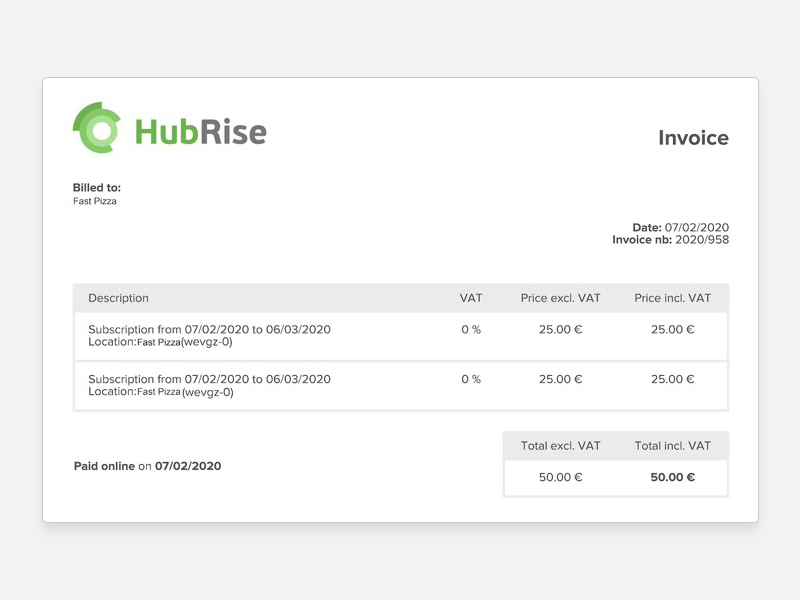

[comment]: # "This page is a duplicate from .../contributing/en"

## Primary Examples

Simple white blocks may be used on a gray background.
If the software you use allows, use rounded corners and a very light gray shadow pointed directly to the bottom.
This sample diagram was created with Google Drawing. To open the source diagram, see [Primary Example Source file](https://docs.google.com/drawings/d/1XaW7_OEfRfvW-AZz80lBrnN6LOeCYwsKZW_zsFC50qs/edit?usp=sharing).

You may use screenshots with a wider gray border, around 20px to 40px. Light or dark gray 1px borders can be used as well. In addition, some space around the image would be beneficial to emphasise its content.

## Secondary Example

You may use colours in your diagrams. For more information on colours to be used, see [Colours](#colours).
If the contrast between the colours are too high, a lighter shade or lower opacity may be used.

## Naming Convention

File naming convention for diagrams follow the exact same logic as images. For more information, see [Image Naming Convention](/contributing/screenshots-guide/#naming-convention).

## Icons

Icons can be used to clarify or to highlight specific points in the documentation. It is, however, important to use icons of the same color. Depending on the use case it can be green, gray if it should be subtle, and orange or red for alerts.

- For icon fonts, see [Font Awesome](https://fontawesome.com/download).
- For icon library, see [Noun Project](https://thenounproject.com/).
- Large professional icon-packs can also be bought to ensure consistency and style.

## Fonts

The following fonts may be used when contributing to the HubRise website documentation.

- Ubuntu – Good option for regular text, with Font Gray colour HEX: #555555, RGB: 85 85 85.
- Ubuntu Mono – Can be used for code.
- Exo 2 – This one is a custom font, good option to emphasise identity. Could be used for titles.

## Colours

Should you want to use colours in your diagrams, these are the colours that should be used.

|                      Colours                       |                                                      |
| :------------------------------------------------: | :--------------------------------------------------: |
| **Main Green**  | **Darkest Green** |
|                    HEX: #6cb14f                    |                     HEX: #262b24                     |
|                  RGB: 108 177 79                   |                    RGB: 38 43 36                     |
|  **Dark Gray**  | **Regular Gray**  |
|                    HEX: #f8f8f8                    |                     HEX: #cccccc                     |
|                  RGB: 248 248 248                  |                   RGB: 204 204 204                   |
| **Light Gray**  |   **Font Gray**   |
|                    HEX: #888888                    |                     HEX: #555555                     |
|                  RGB: 136 136 136                  |                    RGB: 85 85 85                     |
|  **Sky Blue**   | **Regular Blue**  |
|                    HEX: #3ca4c6                    |                     HEX: #4f79b1                     |
|                  RGB: 60 164 198                   |                   RGB: 79 121 177                    |
|   **Violet**    |    **Purple**     |
|                    HEX: #584fb1                    |                     HEX: #944fb1                     |
|                   RGB: 88 79 177                   |                   RGB: 148 79 177                    |
|   **Yellow**    |    **Orange**     |
|                    HEX: #d4b443                    |                     HEX: #eb7323                     |
|                  RGB: 212 180 67                   |                   RGB: 235 115 35                    |
| **Regular Red** |  **Darker Red**   |
|                    HEX: #d95147                    |                     HEX: #b2564f                     |
|                   RGB: 217 81 71                   |                    RGB: 178 86 79                    |
