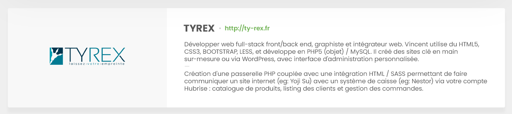

Une fois votre solution validée sur le plan technique par HubRise, vous pouvez demander son inclusion sur notre site en nous contactant sur [contact@hubrise.com](mailto:contact@hubrise.com).

Selon les parties du site dans lesquelles votre solution sera référencée, vous devrez nous fournir des éléments que nous décrivons dans les sections ci-dessous.

## Page Apps

La page [Apps](/apps) présente l'ensemble des solutions intégrées ou en cours d'intégration.

Pour une inclusion sur cette page, transmettez-nous les éléments suivants :

- Un logo en haute résolution, au format PNG, sur fond transparent. La taille finale est 250x130px, l'équipe HubRise pouvant se charger de le redimensionner si besoin.
- Une description de 30 à 35 mots, sans usage de superlatif, qui permet de différencier votre solution parmi celles listées sur la page.

## Documentation de l'intégration

Cette documentation présente la solution, et la démarche à suivre pour la connecter à HubRise. Elle vise à rendre les utilisateurs et les équipes de support autonomes dans l'installation et le dépannage de la connexion. Pour voir un exemple, consultez la documentation de [Nestor](/apps/nestor).

Pour la page d'aperçu, qui est la première page visible de cette documentation, vous devez fournir les éléments suivants :

- Une description de 150 à 300 mots, sans usage de superlatif, qui présente la solution et ses fonctionnalités en détail.
- De 2 à 6 captures d'écran de l'application, ayant toutes le même ratio largeur/hauteur.

### Description de la solution

Envoyez-nous uniquement la partie correspondant au chapitre **Description**. Notre équipe se chargera d'écrire les sections **Fonctionnalités de l'intégration**, **Pourquoi se connecter ?** et **Prérequis**.

### Ratio largeur/ hauteur des images

L'illustration ci-dessous montre pourquoi les captures d'écran doivent avoir le même ratio largeur/hauteur.

> Incorrect : Une image en portrait alors que les autres sont en paysage.

> Correct : Toutes les images ont le même ratio largeur/hauteur.

## Page Partenaires

La page Partenaires n'existe pas encore, mais sera ajoutée très prochainement. Voici un aperçu de la présentation d'un partenaire sur cette page.

Pour être présent sur la page de nos partenaires, vous devez fournir les éléments suivants :

- Un logo en haute résolution, au format PNG, sur fond transparent. La taille finale est 250x130px, l'équipe HubRise pouvant se charger de le redimensionner si besoin.
- Une description, sans usage de superlatif, composée de 2 blocs de 45 mots environ chacun. Le premier bloc présente votre entreprise, et le second décrit en quoi vous êtes un expert HubRise.
