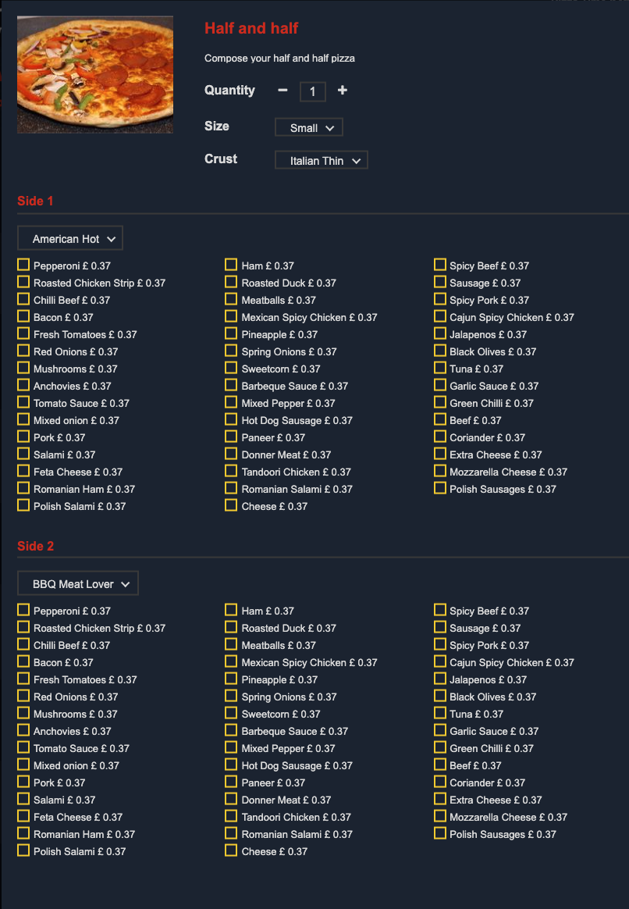

The HubRise API aims to address multiple markets by carefully avoiding over specialisation.

To cover the edge cases for specific markets, such as the restaurant industry, some partners have started to enforce some rules and conventions. Some of these conventions have spread to other partners, turning them into a de facto standard.

This page attempts to be a comprehensive list of the most widespread conventions used by HubRise partners. The conventions described here are not strictly enforced by the API, but using them in your solution will improve interoperability with other integrated solutions.

## General conventions

### Tags on categories

| Tag      | Description                                                                                                          |
| -------- | -------------------------------------------------------------------------------------------------------------------- |
| `hidden` | The category is hidden, but its products are available. Typically used to hide products only available within deals. |

### Tags on SKUs

The following tag can be set at the SKU level:

| Tag         | Description                                  |
| ----------- | -------------------------------------------- |
| `deal_only` | The SKU is only available as part of a deal. |

## Conventions for restaurants

### Tags on products

The following tags can be set at the product level. They apply to every SKU of the product.

| Tag                                  | Description                                                           |
| ------------------------------------ | --------------------------------------------------------------------- |
| `alcoholic`                          | Contains alcohol.                                                     |
| `spicy_1`                            | Midly spicy.                                                          |
| `spicy_2`                            | Spicy.                                                                |
| `spicy_3`                            | Very spicy.                                                           |
| `gluten_free`                        | Contains no gluten.                                                   |
| `vegan`                              | Contains no animal product.                                           |
| `vegetarian`                         | Contains no meat.                                                     |
| `no_allergens`                       | Contains no allergens.                                                |
| `allergen_celery`                    | Contains this allergen.                                               |
| `allergen_crustaceans`               | Contains this allergen.                                               |
| `allergen_eggs`                      | Contains this allergen.                                               |
| `allergen_fish`                      | Contains this allergen.                                               |
| `allergen_gluten`                    | Contains this allergen.                                               |
| `allergen_lupin`                     | Contains this allergen.                                               |
| `allergen_milk`                      | Contains this allergen.                                               |
| `allergen_molluscs`                  | Contains this allergen.                                               |
| `allergen_mustard`                   | Contains this allergen.                                               |
| `allergen_nuts`                      | Contains this allergen.                                               |
| `allergen_peanuts`                   | Contains this allergen.                                               |
| `allergen_sesame_seeds`              | Contains this allergen.                                               |
| `allergen_soybeans`                  | Contains this allergen.                                               |
| `allergen_sulphur_dioxide_sulphites` | Contains this allergen.                                               |
| `half_half`                          | Half & half product. See [Half & half products](#half-half-products). |

### Orders custom fields

The following custom fields can be attached to an order:

| Custom field            | Encoding | Description                                       |
| ----------------------- | -------- | ------------------------------------------------- |
| `restaurant.table_name` | `string` | A unique identifier of the table.                 |
| `restaurant.staff.name` | `string` | The name of the employee looking after the order. |
| `restaurant.staff.id`   | `string` | The id of the employee.                           |

Typical uses:

- The `restaurant.table_name` custom field is set by the ordering application when the order is created. It is used by the EPOS to associate the order to a specific table. It can also be used by a payment application to find an order associated with a table.
- The `restaurant.staff.[name,id]` custom fields are typically set by the EPOS, and used by kitchen display screens and ordering applications.

<details>

<summary>Example of an order with restaurant information</summary>

```json
{
  "status": "received",
  "items": [
    ...
  ],
  ...,
  "custom_fields": {
    "restaurant": {
      "table_name": "13",
      "staff": {
        "name": "Michel",
        "id": "6a1b8e55-55c7-47fb-8c1b-f39ae2eee4f5"
      }
    }
  }
}
```

</details>

### Half & half products

Half & half products are a common occurrence in the restaurant industry, especially the pizzeria industry. A half & half product lets customers mix two recipes, and customise each of them separately. Think of a half & half pizza as a normal size pizza split in two halves, each half having its own ingredients.

<details>

<summary>Example of half & half pizza in an online ordering solution</summary>



</details>

#### Orders

The recipe and toppings on each half are passed in 4 option lists: `Side 1`, `Side 2`, `Toppings 1`, and `Toppings 2`. These names should be treated as reserved words. In particular, they should not be translated when used in the API.

<details>

<summary>Example of an order containing a H&H item</summary>

```json
{
  ...
  "items": [
    {
      "price": "13.00 GBP",
      "quantity": "1",
      "product_name": "Half & half",
      "sku_name": "14\"",
      "sku_ref": null,
      "options": [
        {
          "option_list_name": "Side 1",
          "name": "Vesuvio",
          "ref": "pa_50555",
          "price": "0.00 GBP"
        },
        {
          "option_list_name": "Side 2",
          "name": "Caprino",
          "ref": "pa_50585",
          "price": "0.00 GBP"
        },
        {
          "option_list_name": "Toppings 1",
          "name": "Ricotta Cheese",
          "ref": "54641",
          "price": "1.50 GBP"
        },
        {
          "option_list_name": "Toppings 1",
          "name": "Jalapenos",
          "ref": "54643",
          "price": "1.50 GBP"
        },
        {
          "option_list_name": "Toppings 2",
          "name": "Jalapenos",
          "ref": "54643",
          "price": "1.50 GBP"
        }
      ]
    }
  ],
  ...
}
```

</details>

#### Catalogs

A half & half product is a product with one or more skus. It has the following features:

- SKU prices are usually zero. The price of the item will come entirely from options, which include the two selected sides.
- 2 mandatory option lists, named `Side 1` and `Side 2`. For each option list, the options are the recipes available on the half. Each option is generally priced half the amount of the full recipe.
- 2 optional option lists, named `Toppings 1` and `Toppings 2`. For each option list, the options are the additions available on the half. They can be priced half the amount of the topping, or the full price of it, depending on restaurant preferences.
- A `half_half` tag, to identify the product as a half & half. This allows the ordering solution to apply extra half & half pricing logic, and override the sides and toppings prices if needed.

## Conventions for delivery

### Location custom fields

The following custom field can be set on a location:

| Custom field         | Encoding                                                    | Description                                                       |
| -------------------- | ----------------------------------------------------------- | ----------------------------------------------------------------- |
| `delivery.door_time` | [decimal](/developers/api/general-concepts/#decimal-values) | Minimum time in minutes between order creation and customer door. |

Typical uses:

- The EPOS sets the `delivery.door_time` custom field, and it is used by ordering apps and platforms.

<details>

<summary>Example of a location with delivery information</summary>

```json
{
  "id": "3r4s3-1",
  "name": "Paris",
  ...,
  "custom_fields": {
    "delivery": {
      "door_time": "35"
    }
  }
}
```

</details>

### Orders custom fields

The following custom fields can be attached to an order to provide details about the delivery:

| Custom field                  | Encoding | Description                                                                                                                       |
| ----------------------------- | -------- | --------------------------------------------------------------------------------------------------------------------------------- |
| `delivery.driver_pickup_time` | `string` | The time in [ISO 8601 format](https://en.wikipedia.org/wiki/ISO_8601) format when the driver is expected to pick up the delivery. |
| `delivery.tracking_url`       | `string` | URL of the page showing the status of the delivery.                                                                               |
| `delivery.driver.first_name`  | `string` | Driver's first name.                                                                                                              |
| `delivery.driver.phone`       | `string` | Driver's phone number in [E.164 format](https://en.wikipedia.org/wiki/E.164).                                                     |

Typical uses:

- The delivery solution sets the `delivery.driver_pickup_time` custom field, and it is displayed in the EPOS for the staff to prepare the order in time.
- The delivery solution sets the `delivery.driver.first_name` and `delivery.driver.phone` custom fields, and they are displayed in the EPOS to provide the staff with a convenient way to reach out to the driver.
- The delivery solution sets the `delivery.tracking_url` custom fields, and it is displayed in the ordering application for customers to track their delivery.

<details>

<summary>Example of an order with delivery information</summary>

```json
{
  "status": "received",
  "items": [
    ...
  ],
  ...,
  "custom_fields": {
    "delivery": {
      "driver_pickup_time": "2021-03-02T12:55:00+02:00",
      "tracking_url": "https://delivery-service.com/track/664566410894-dbfqs",
      "driver": {
        "first_name": "John",
        "phone": "+440123456789"
      }
    }
  }
}
```

</details>

## Conventions for EPOS

### Order custom fields

The following custom fields can be attached to an order:

| Custom field           | Encoding         | Description                                                                                         |
| ---------------------- | ---------------- | --------------------------------------------------------------------------------------------------- |
| `epos.order_id`        | `string`         | Order identifier on the EPOS.                                                                       |
| `epos.rejection`       | (see&nbsp;below) | Information about an order rejection. Can only be present if the order status is `rejected`.        |
| `epos.rejection.cause` | `string`         | Short description of the problem. Ideally includes resolution steps. Use Markdown syntax for links. |
| `epos.rejection.info`  | `object`         | Free-format JSON object containing information about the problem.                                   |

Typical uses:

- The EPOS sets the `epos.order_id` custom field on order creation. Ordering solutions may use this field to include the order identifier in customer emails or in their back-office.
- When the EPOS rejects an order, it sets the `epos.rejection` object. This field is visible in the HubRise back-office, and it helps support teams and users troubleshoot an issue.

The rejection cause appears in the HubRise back-office, on the order page, which potentially allows users to troubleshoot the issue. The info object is visible when the user clicks **See more information**.


<details>

<summary>Example of an order with EPOS information</summary>

```json
{
  "status": "rejected",
  "items": [
    ...
  ],
  ...,
  "custom_fields": {
    "epos": {
      "order_id": "645433012",
      "rejection": {
        "cause": "At least one item in this order is not attached to a menu. See [documentation](https://epos.com/info/35346).",
        "info": {
          "status": "FAILED",
          "reason": "Could not add item 117192477640169 (not found)",
          "thirdPartyReference": "p81xp|719v7-2|52k399"
        }
      }
    }
  }
}
```

</details>
