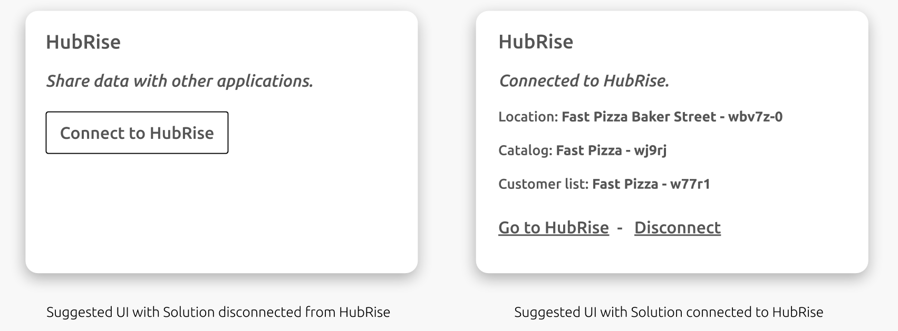

This document is a practical guide, meant to help you plan and build your integration with HubRise.

It is composed of the following sections:

- [Overview](#overview): general information about the integration process.
- [General Best Practices](#general-best-practices): a collection of best practices applicable to all integrations.
- [Online Ordering Solutions](#online-ordering-solutions): an integration checklist for online ordering websites, mobile ordering apps, self ordering kiosks and other similar solutions.
- [EPOS Solutions](#epos-solutions): an integration checklist for EPOS solutions, whether cloud-based or downloadable applications.

## Overview

### Let Us Help You!

First of all, we are very excited about the new integration you are going to develop!

When you are ready to start, please let us know at integration@hubrise.com.

But we won't just wait and see while you do the work: We will actively help you during the process. Here is what HubRise can do for you:

- We offer your team free email support during the integration phase. We generally respond in a few business hours (not days, or weeks).
- We waive your subscription fee so that you can place unlimited test orders during the development phase.
- We assess your integration by checking the logs.
- We schedule a call with one of our integration engineers to finalise the assessment together. The call usually takes an hour and a half.
- We send you a report with our recommendations. We keep this report updated as you make changes in your integration.

### Assessing the Integration

When your integration is ready, we assess it with you. After checking the logs of your test transactions, we ask you a few questions to create a report that we call the Integration Sheet. To see what to expect, check our [Integration Sheet template](https://docs.google.com/spreadsheets/d/1df-QRlD9h8M58bpFoFaCEzU5pbmYSeHXOLqIVip9-5s/edit?usp=sharing).

The Integration Sheet is useful to provide you with written feedback and help you avoid known pitfalls. We can also understand exactly how your integration works, and document it thoroughly.

### Documenting the Integration

Once your integration is assessed, we document it and include it in our [Integrated Apps](/apps) page, as we did in the past with other integrations (like dotdigital, PAR PixelPoint, LivePepper, Zelty, to name a few).

We document integrations to:

- Improve transparency across the various integrated solutions in the HubRise ecosystem.
- Explain users how to use your integration autonomously.
- Provide support teams with links they can include in support emails, instead of repeating common explanations multiple times.
- Build a public knowledge base that everyone can view.
- Give your brand some SEO juice.

Our documentation is public and open source. Everyone can help improve it and keep it up to date.

## General Best Practices

When you start developing your integration, taking the right decisions at the beginning can save you time and effort along the way. Here are a few suggestions.

### Create a User Account for your Support Team

We recommend registering a HubRise user account with an email alias such as <support@your-solution.com>.

If your customers need your help with the integration in the future, they will just need to grant this user access to their HubRise account. Your support team will then be able to access their logs and debug the problem.

### Scope and Permission

When you first create your integration client, you should typically connect to HubRise at the location level and request only the level of permission your integration needs. In the majority of cases, you should request `write` permission for orders and `read` or `write` permission for customers.

In more advanced scenarios where you read or modify the catalog of products, your solution should request `read` or `write` permission for the catalog, as well.

For more information about scopes, see [OAuth scopes](/developers/authentication#oauth-scopes).

### Connection Workflow

You should provide your users with an easy way to connect your solution to HubRise. The recommended approach is a button in the back office that allows connection with a single click via the OAuth protocol.

Once a user establishes a connection with HubRise, you should display all the relevant information about the account:

- Location name and ID
- Catalog name and ID
- Customer list name and ID

Once connected, your solution should provide an equally easy way to disconnect from HubRise. This will greatly improve the user's experience.

These are the suggested UI wireframes for your back office in the disconnected and connected states.

### Managing Order IDs and Customer IDs

Mapping IDs between your solution and HubRise is critical to retrieve orders and customers.

Ideally, you should store in your database the HubRise IDs associated with orders and customers, for example by including additional fields in your API model. In this case, you should also display the HubRise IDs in your user interface.

If storing the HubRise IDs is not an option, you can use the HubRise `private_ref` field to store your order and customer ID, instead. In this way, you essentially let HubRise do the mapping.

### Encoding Orders

When you push orders to HubRise, encode names and ref codes for all the fields included in the payload. For a complete list, see our [API reference](/developers/api/order-management/), and the **Orders** tab in the [Integration Sheet](https://docs.google.com/spreadsheets/d/1df-QRlD9h8M58bpFoFaCEzU5pbmYSeHXOLqIVip9-5s/edit#gid=615578553).

Pay attention to a few common traps:

- Multiple identical options should be encoded as separate individual objects.
- You should always pass at least one payment in the payload.
- Times should be encoded in the timezone of the store.
- Expected delivery times should always be in the future or `null`.

### Handling Images

When uploading product images to HubRise (for example, if you export your catalog), remember that the size limit is 1 Mb.
Your integration should prevent or at least warn users when they try to upload big images (more than 1000px high or wide). Large images only slow down catalog import/export, without any real benefit, since third party websites and tools generally scale down images anyway.

An app using images should always perform image scaling, rather than relying on other apps to send images with reasonable size.

HubRise supports various image formats: jpeg, png, gif and bmp. We recommend using jpeg for photos, and png for "low entropy" images (text, diagrams, simple drawings, etc).

## Online Ordering Solutions

Connecting your online ordering solution to HubRise will allow your clients to receive orders and customers directly in their EPOS systems.

It generally involves the following steps, which are described in further details in this section:

1. [Establishing and managing the connection](#establishing-and-managing-the-connection)
1. [Pushing customers](#pushing-customers)
1. [Pushing orders](#pushing-orders)
1. [Receiving status updates](#receiving-status-updates)
1. [Pulling the catalog](#pulling-the-catalog)

### Establishing and Managing the Connection

We recommend that you follow our general best practices and connect to HubRise at the location level.

You should also register an active callback to listen to order update events. This will allow your application to inform a user whenever the status of an order is changed on HubRise, for example when it is accepted or cancelled by the EPOS. For more details about callbacks, see our [Developers documentation](/developers/api/callbacks/#callbacks).

**Main suggestions**

- Choose the `location[orders.write,customer_list.write]` scope.
- Add the `catalog.read` or `catalog.write` permission to the scope if your solution handles catalogs.
- Register an active callback with the `"order": ["update"]` event.
- See [Connection Workflow](#connection-workflow) for other best practices on managing your solution's connection.

### Pushing Customers

If users can create an account on your solution, you should push their details to HubRise as soon as they register.
More generally, every time users update their details, you should update them on HubRise, as well.

You should also anonymise customers immediately if they request so, or if they have been inactive for a certain period of time (for example, 3 years). This is a legal requirement in many markets, including for example the EU countries under GDPR regulations. For more details, see [Anonymise customer](/developers/api/customer-management/#anonymise-customer).

**Main suggestions**

- Send a `POST /customer_lists/:customer_list_id/customers` request with the customer's details as soon as they register.
- Send a `PATCH /customer_lists/:customer_list_id/customers/:id` request when customers update their online profile.
- Anonymise customers with a `POST /customer_lists/:customer_list_id/customers/:customer_id/anonymise` request when needed.

### Pushing Orders

You should push new orders to HubRise as soon as they are created by the user. However, wait for payment confirmation first, if the order is paid online.

If you have registered users, you should include their `customer_id` in the payload and update their details just before pushing the order. If you do not have registered users (for example, for self ordering kiosks or orders via a tablet at the table), you can include the customer's details directly in the order payload with a so-called "guest order". For more information, see [Order's Customer](/developers/api/order-management/#order-s-customer).

When you need to test that orders are pushed to HubRise correctly, you can connect OrderLine to your HubRise account. This free app allows you to receive and manage in real time your HubRise orders. For more details on this app, see the [OrderLine documentation](/apps/orderline/).

**Main suggestions**

- Send a `POST /location/orders` request as soon as orders are placed on your system, but after payment confirmation for online payments.
- Send a `PATCH /customer_lists/:customer_list_id/customers/:id` request just before pushing the order.
- Include the `customer_id` in the payload, if your users can register; otherwise, create guest orders.
- Connect OrderLine to receive test orders.

### Receiving Status Updates

If your solution supports order statuses, you should update it whenever you receive an order update callback.

Your solution should monitor orders and raise an alert (for example, by sending an email to the restaurant managers and/or to the customer) if an order is still in `new` status after a fixed delay from the initial reception (typically five minutes within business hours).

**Main suggestions**

- Update the order status after an `order.update` callback.
- Raise an alert if an order status remains `new` for too long.

### Pulling the Catalog

HubRise offers advanced catalog functionalities. We recommend that you implement a feature to pull catalogs from HubRise to your solution. This will simplify the onboarding of new users and reduce issues with the menu.

Your solution can automatically pull the catalog when this is updated on HubRise (via a `catalog.update` callback), or you can implement a button in your back office for a manual import. Even better, you could let your users decide the preferred behaviour via a setting in your back office.

When you import a catalog from HubRise, make sure you save the ref codes for all the products, options, charges, etc. You should include them in the payload when you push an order. This is very important because most EPOS systems will ignore products without a ref code, or even reject the order.

**Main suggestions**

- Implement catalog import from HubRise in your solution.
- Support both automatic and manual import, then let the user decide the preferred behaviour.
- Save the ref codes for all the items and pass them in the order's payload.

## EPOS Solutions

Connecting your EPOS solution to HubRise will allow you to receive orders from multiple integrated partners, including many popular food delivery platforms. You can also take your customers management to a higher level with the various marketing and loyalty solutions integrated with HubRise.

It generally involves the following steps, which are described in further details in this section:

1. [Establishing and managing connections](#establishing-and-managing-connections)
1. [Receiving orders](#receiving-orders)
1. [Updating orders](#updating-orders)
1. [Pushing the catalog](#pushing-the-catalog)
1. [Pushing local orders and customers](#pushing-local-orders-and-customers)

### Establishing and Managing Connections

We recommend that you follow our general best practices and connect to HubRise at the location level.

You should also register an active callback to listen to order events. This will allow your application to receive new orders from HubRise and status updates. For more details about callbacks, see our [Developers documentation](/developers/api/callbacks/#callbacks).

See [Connection Workflow](#connection-workflow) for other best practices on managing your solution's connection.

**Main suggestions**

- Choose the `location[orders.write,customer_list.write]` scope.
- Add the `catalog.read` or `catalog.write` permission to the scope if your solution handles catalogs.
- Register an active callback with the `"order": ["create","update"]` event.

### Receiving Orders

Registering an active callback is the recommended way to receive new orders. As an alternative, for example if you cannot listen on a public URL, use a passive callback to fetch new events at regular intervals.

When you process the payload, bear in mind the following rules:

- Phone numbers are generally encoded in E.164 format, but they may occasionally be encoded in a free format for older integrations. We recommend that you support both.
- Do not reject orders if prices or ref codes are wrong.

For other tips and suggestions, check the **Orders** tab in our [Integration Sheet](https://docs.google.com/spreadsheets/d/1df-QRlD9h8M58bpFoFaCEzU5pbmYSeHXOLqIVip9-5s/edit?usp=sharing).

If you need to inject new orders in HubRise to test your solution, you can use the curl command or Postman. Remember to create a separate HubRise client to inject orders, so that the your main client callback is triggered. For more details, see our [Quick Start Guide](/developers/quick-start)

**Main suggestions**

- Use an active callback to receive new orders (recommended). Alternatively, use a passive callback and poll new events at regular intervals, for example every 30 seconds.
- Do not use a `GET /location/orders` request to fetch new orders, as this approach is not scalable in production.
- Use curl or Postman to inject test orders.

### Updating Orders

You should acknowledge new orders by updating their status to `received`. This will let the online ordering solution know that the order is on its way and prevent it from raising alerts.
HubRise supports a detailed range of order statuses: use them whenever possible to update the order. For more details, see [Order Status](/developers/api/order-management/#order-status).

If possible, you should update the confirmed delivery time of the order on HubRise, so that the customer can be notified. You would typically do this in a request that also updates the order status to `accepted`.

**Main suggestions**

- Send a `PATCH /location/orders/:id` request to update the order status and the confirmed delivery time.
- Update the status of a new order to `received` to acknowledge reception.
- Use other statuses like `accepted`, `rejected`, etc., when this makes sense.
- Update the confirmed delivery time, when this is available, at the same time the order status is changed to `accepted`.

### Pushing the Catalog

HubRise offers advanced catalog functionalities. Pushing the catalog from your EPOS solution to HubRise simplifies the onboarding of new users and reduces menu synchronisation issues. For more details about catalogs on HubRise, see our [API Reference](/developers/api/catalog-management/).

We recommend to only allow manual catalog uploads. Automatic uploads triggered by a wrong catalog update could cause issues on connected online ordering platforms, without the user being aware.

For more information on encoding requirements on HubRise, see the **Catalog** tab in the [Integration Sheet](https://docs.google.com/spreadsheets/d/1df-QRlD9h8M58bpFoFaCEzU5pbmYSeHXOLqIVip9-5s/edit#gid=1531685884).

**Main suggestions**

- Implement a manual catalog export feature in your solution.
- Follow the encoding requirements described in the [Integration Sheet](https://docs.google.com/spreadsheets/d/1df-QRlD9h8M58bpFoFaCEzU5pbmYSeHXOLqIVip9-5s/edit#gid=1531685884).
- See [Handling Images](#handling-images) for specific suggestions about images.

### Pushing local orders and customers

When you take orders directly on your EPOS system at your restaurant, we recommend that you also push them to HubRise.
In this way, you will benefit from all the integrated apps already available on your HubRise account, such as delivery management solutions, marketing solutions, digital receipts and digital payments on the customer smartphone, kitchen displays, etc.

**Main suggestions**

- Send local orders with `POST /location/orders` requests, to benefit from all integrated apps.
- See [Encoding Orders](#encoding-orders) for other suggestions on how to encode the payload.
