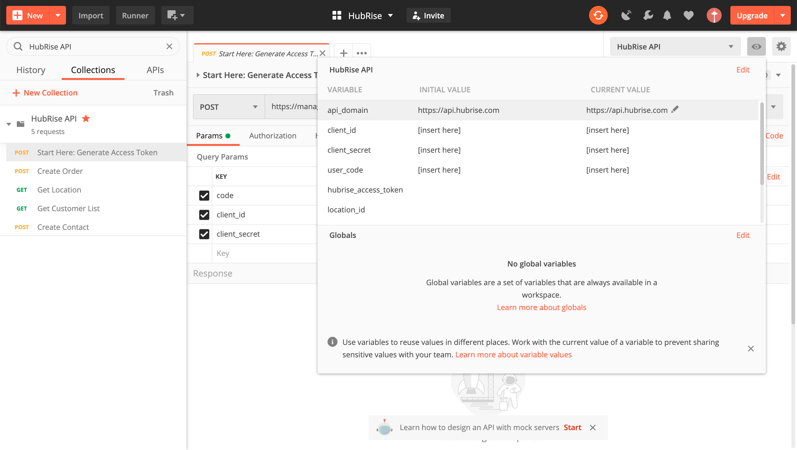

## Overview

This guide will help you to get started with the HubRise API. At the end of the process, you will know how to send an order to HubRise. And the best part is that you will not have to write a single line of code!

## Getting Started

### Create a HubRise Account

First of all, you need to create a user profile on HubRise with an account and an associated location. It is free, and only takes a few minutes! Just click on the **Sign up** button on the top of this page and follow instructions.

### Set up Postman

Postman is an API development environment that makes sending API requests very easy.

- Download and install [Postman](https://www.getpostman.com/).
- Download the [HubRise API Postman Bundle](https://drive.google.com/drive/folders/1fn5u-4sY0-bnrxJY9RFPvpCu0bANGNBd?usp=sharing) and import the folder into Postman.

### Create the OAuth Client

Then, you need to create an OAuth 2.0 client for your application.

- Log in to the [HubRise back office](https://manager.hubrise.com/).
- Go to **SETTINGS** > **DEVELOPER**, then click on **Create an OAuth 2.0 client**.
- Enter a name for your client. We recommend using the name of your application.
- Click the **Create** button.

Download the client secret JSON, which should look like this:

```json
{
  "client_id": "459691768564.clients.hubrise.com",
  "client_secret": "c9ba1790673172ddcdee071c551d98dee4d0d6fc696c"
}
```

The client's **id** and **secret** are used to identify your application. You will generally need to create a single client for your application. The same client can be used by several HubRise accounts.

## Request the Account's Authorisation

In order for your application to access a HubRise account's information, you need the authorisation from the account's owner.

As the owner of your test HubRise account, you must authorise access to your own application.

Open a web browser with the following URL and make sure you replace `{{client_id}}` with the `client_id` you downloaded from the secret JSON:

```http
https://manager.hubrise.com/oauth2/v1/authorize?
  redirect_uri=urn:ietf:wg:oauth:2.0:oob&
  client_id={{client_id}}&
  scope=location[orders.write,customer_list.write,catalog.read]
```

Review the connection details and grant access permissions to your application by clicking **Allow**.

If everything goes well, you will see a page that displays an **authorisation code**. Copy it and head to the next section.


## Generate the Access Token

You now have three codes:

- The client id
- The client secret
- The authorisation code

With these, you can generate your access token with Postman.

An access token is how you authenticate the requests you send to HubRise.
Basically, you want your application (client id) to be authorised (via the client secret) to send requests to HubRise on behalf of the account owner (authorisation code), and you do this with the **access token**.

---

**IMPORTANT NOTE**: The HubRise access token never expires after being generated. In real scenarios, your application should generate a new access token for every new HubRise location it is connected to, and use it for all future requests.

---

### Set up Variables in Postman

In Postman, select the **HubRise API** environment and enter the values for `client_id`, `client_secret` and `auth_code`.



### Send the Request

Select the **Generate Access Token** request and click the **Send** button.

Postman will send the following request to the API:

```json
POST https://manager.hubrise.com/oauth2/v1/token?code={{auth_code}}&client_id={{client_id}}&client_secret={{client_secret}}
```

If the request is successful, Postman will automatically populate the `X-Access-Token` variable in the environment, and this will be used as access token for all of the following requests.

## Create Your First Order

Now you are ready to send valid requests to HubRise and to create new orders.

In Postman, send the **Create Order** request. If the request is successful, you should see a new order in the [HubRise back office](https://manager.hubrise.com/orders).

Congratulations! You placed your first order on HubRise.

## Set up a Callback (Optional)

In many cases, your application will need to be notified when a certain event occurs, such as when an order is created or updated. This can be achieved with a callback.

As an optional step, you can set up a second application that listens to the events generated by the first application via a callback mechanism. To do this, you will first need to create a second OAuth client and obtain the access token, just as you did before.

---

**IMPORTANT NOTE**: An application cannot receive callback notifications for events generated by itself!

---

### Obtain the Access Token

After creating the new client, head to the Postman collection and populate the `callback_client_id`, `callback_client_secret`, and `callback_auth_code` fields in the environment.

You can send the `Callback: Generate Access Token` request to obtain the access token. This will be automatically saved as a separate environment variable from the previous one, since you will need both.

### Obtain the Webhook URL

In order to register your callback, you need a valid URL that can listen to events. If you don't have your own server already, you might use the [webhook.site](https://webhook.site/) service. When you visit the website, a unique URL will be created that you can use as your webhook URL.

This page will show all the events received by the callback.

### Register the Callback

Now that you have the callback URL, head back to Postman and copy the value in the `callback_url` field. Then, send the `Callback: Create Webhook` request.

A successful response means that you registered your callback URL correctly.

### Place an Order and Check the Webhook

Now you can try to place an order with your first application. You can use the same `Create Order` request you sent before. This time, however, you will see that the order is automatically forwarded to your webhook URL.

---

**IMPORTANT NOTE**: The event should appear almost immediately on the webhook.site page. If it fails to do so, check that the order was placed using your first application token.

---

### Get New Events without a Public URL

In some circumstances, a webhook cannot be set up because a callback URL cannot be exposed. This is typical for applications that users download and run from their computer.

In this case, you can set up a passive callback. Your application will then check for new events at regular intervals of time and perform the necessary operations when a new event is found.

The `Callback: Get Events` request in Postman is an example of how you can do that. Simply create a new order, as usual, and send this request right after to obtain the order's details.

After you process the event, you should delete it so that it will not appear in the next `GET /events` request.
Unlike active callbacks, events need to be manually deleted after being processed with a passive callback.

## Next Steps

After this brief introduction to HubRise, you are now ready to take the next steps. Here is what we recommend.

### Install Developer Tools, Catalog Manager, and OrderLine

Because API logs are available from the HubRise back-office, the following applications are great tools to see how the API works:

- **Developer Tools** is a free application to inject fake orders and catalogs.
- **Catalog Manager** is a free application to view and edit catalogs.
- **OrderLine** is a simple, free application to manage incoming orders. With OrderLine, you will be able to accept or reject incoming test orders.

To connect an application, click on **CONNECTIONS** > **View available apps**, then scroll down the list and select the application.

### Explore the API

Check our comprehensive [API Reference](/developers/api/general-concepts) and see how your application fits into the API.

The [Conventions and special cases](/developers/conventions) guide documents the conventions used by other developers to address use cases which are not natively covered by the API.

### Check the Integration Guide

The [Integration Guide](/developers/integration-guide) is a hands-on, developer oriented, guide containing integration best practices. It is organised in several chapters, each covering a specific integration scenario.

You can use it as an integration checklist, and it can also help you estimate the integration effort before writing any code.

### Experiment with the Postman collection

The [HubRise Postman collection](https://drive.google.com/drive/folders/1fn5u-4sY0-bnrxJY9RFPvpCu0bANGNBd?usp=sharing) contains typical requests to create and update orders and customers, send or receive a catalog, and update order statuses.

Postman has a useful built-in functionality that allows to transform requests into actual code snippets in various languages. In this way, you will be able to transition from testing to integrating really quickly.

### Chat with Us

Last but not least, our friendly team of engineers is always available by email or video call to help you integrate. To start the conversation, send us an email at integration@hubrise.com.
