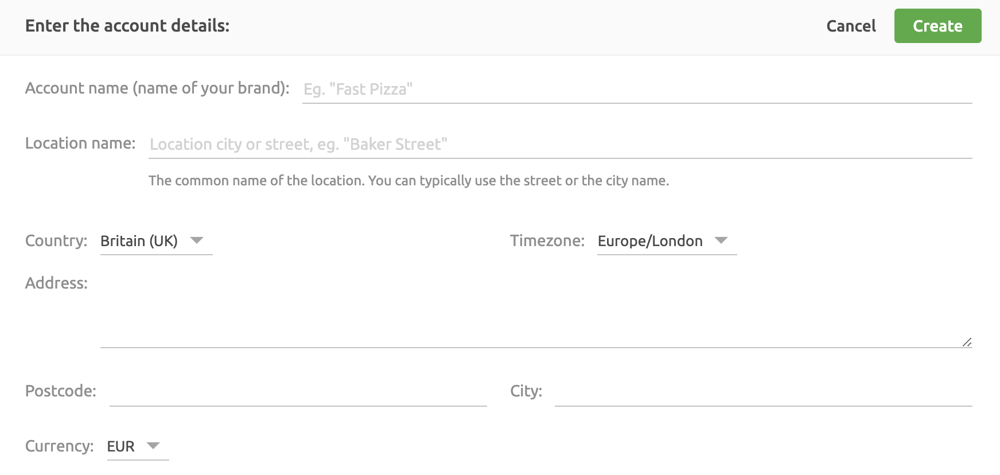

As described in [Accounts and Locations](/docs/getting-started/#accounts-and-locations), Accounts refers to the brand, and contains one or more Locations.

Users with a single Account will have it selected by default. For users with multiple Accounts, the **SETTINGS** > **ACCOUNTS** section lists all Accounts you have been granted access to with the following information:

- **NAME**: The name and unique identifier of the Account.
- **ROLE**: Your role for the Account. For more information on roles, see [Permissions](/docs/permissions/).

To view details for a specific Account, click its name.

Users with only one Account will automatically be entered into their sole Account.

## Account Settings

Accounts and Locations have many of the same sub-sections and settings. Depending on your situation, you may have given your Locations different settings than the Account it belongs to.

The ability to have different settings for Accounts and Locations allows you to:

- Have one payment method setup for all locations or differentiate them from one location to another. This is useful if you need to have a Location use a different payment method for accounting purposes.
- Permissions can be granted for users at either the Account level or the Location level. For example, you may grant one user complete access to an Account as an Admin, but allow another user only to view and manage a specific Location.
- View data across an Account, or filter information to a specific Location.
- Modify your Account and Locations in ways that best fits your business needs.

The primary differences between the settings for Accounts and Locations to note are:

- Accounts contain one or more Locations. Each Location is attached to only one Account.
- Currency settings are set at the Account level, and can not be changed once created. If you have made a mistake in the currency selection, you will have to create a new Account with the correct currency value.
- If you have markets with different currencies, you will have to create an Account for each market. The recommended practice is to create a different Account for each country you have a market in, even if they share the same currency.

## Create an Account

When creating a new Account, the first Location must be created at the same time through the following steps:

To create a new Account and it's first location, click **SETTINGS** > **ACCOUNTS** > **Create Account**. Enter the information required and click **Create**.

The **Account Name** is the name you give your business or brand. For example, if your brand is called Fast Pizza, the **Account Name** will be **Fast Pizza**.

The **Location Name** could be the city, the area, or the street name. For example, if the location is the only one in a town like London, the location could be named **London**. If you have multiple locations in London, you could name it after their street address **Baker Street**, **Dublin Street**, and **Duncannon Street**.

It is important to enter the correct **Currency** as you will not be able to change it later.

<video controls title="Create an Account">
  <source src="../images/038-en-settings-account-create-account.webm" type="video/webm"/>
</video>

---

**Related FAQ**: <Link to="/docs/faqs/how-can-i-clear-accounts/">Too Many Accounts for My Business on HubRise. How Can I Clear the System?</Link>

---

## Modify Account Details

The only field that can be modified is the **Account Name**.
It is recommended to name the Account the same as your business or brand.

---

**IMPORTANT NOTE**: The currency value can only be set when the Account is created, and can not be modified. If the currency for the HubRise Account does not match the currency set on the connected apps, errors may occur. Create a new Account with the correct currency and use that Account to connect your apps instead.

---

To modify an existing Account:

1. Select **SETTINGS** > **ACCOUNT**.
1. If there are multiple Accounts, click the name of the Account to update.
1. Click **Modify**.
1. Update the fields as required and Click **Modify**.

---

**IMPORTANT NOTE**: It is a legal requirement to include the Intra-Community VAT number. HubRise will display a notification to update the VAT number if this information is missing from your Account.

---

<video controls title="Change account information">
  <source src="../images/019-en-settings-account-change-account-name.webm" type="video/webm"/>
</video>
