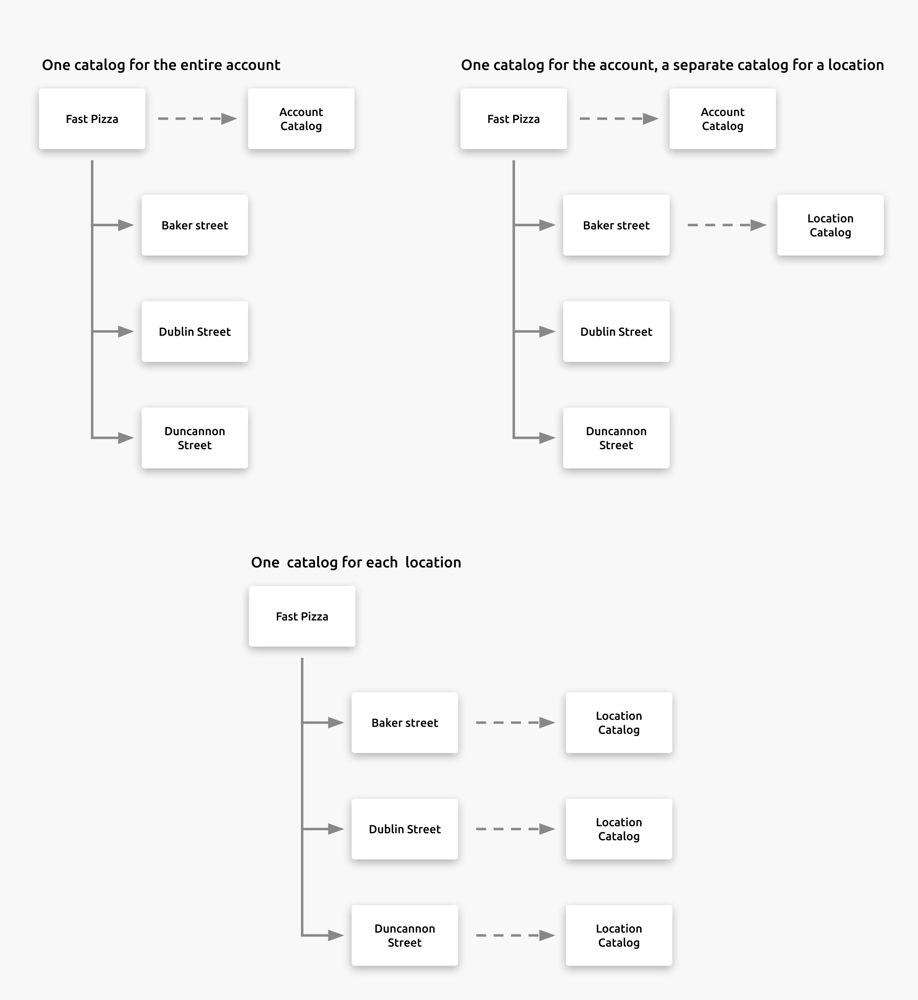

The **SETTINGS** > **ACCOUNTS** > **Catalogs** section allows you to create, edit, or remove the catalogs used by your HubRise Account.

The rules for Catalogs are as follows:

- By default, Accounts define one Catalog named after the Account. Locations do not have a Catalog defined by default.
- An Account **must** have at least one Catalog. If you attempt to delete the last Catalog of an Account, an error notification will be displayed.
- You can create as many Catalogs as you need. For example:
  - You can create a test Catalog to be used without impacting production.
  - Create Catalogs for a Location that offers different products from the other Locations.

The list of products, their descriptions and details are managed from the third party app. Connecting and importing products into the HubRise catalog can only be done from your third party app.

You cannot edit your list of products from HubRise. Removing a catalog from HubRise does not effect the product list in third party apps.

## Add a Catalog

To add a catalog:

1. In the **SETTINGS** > **ACCOUNTS** > **Catalogs** section, click **Add a catalog**.
1. Enter the name for the catalog. Catalogs should have the same name as your Account. If you have multiple Locations with their own different catalogs, it is preferable to follow a strict naming convention such as: **Account Name - Location Name**. For example, your default Account catalog may be **Fast Pizza**, and the catalog for a location would be **Fast Pizza - Baker Street**.
1. Click **Create** to save the new catalog.

## Catalog Details

To view the list of products included within a catalog, see [Catalogs](#catalogs).

The following information is displayed in the **SETTINGS** > **ACCOUNTS** > **Catalogs** section:

1. **Name**: The name of the catalog, followed by its unique character code. This unique character code does not change even if the name of the catalog is changed. For example: The catalog **Baker Street** would be displayed as **Baker Street - abc123**. If the catalog **Baker Street** is renamed to **Dunning Street**, it will be displayed as **Dunning Street - abc123**.
1. **Created**: The date the catalog was created in HubRise.
1. **Products**: The number of products imported from your app into this catalog.

To view the contents of a Catalog, click the name of the Catalog. It will connect you to the **DATA** > **Catalog** screen for the specific Catalog.

<video controls title="Catalog link example">
  <source src="../images/045-en-catalog-link.webm" type="video/webm"/>
</video>

## Edit a Catalog

Catalogs can be renamed to reflect special needs, such as labeling a Catalog for testing purposes, or for the products offered by a specific Location.

Changes to the Catalog in HubRise does not effect the list of products in connected apps. Any changes to the products lists, descriptions, etc is performed by the connected app.

To change the name of a Catalog:

1. In the **SETTINGS** > **ACCOUNTS** > **Catalogs** section, click the edit icon for the catalog to edit.
1. Enter the new name for the Catalog.
1. Click **Update** to save the new settings.

## Remove a Catalog

Catalogs can be removed from HubRise when the following criteria are met:

- There are no active connections to the Catalog from an app.
- The last Catalog of an Account can not be removed.

Removing a catalog from HubRise does not effect the product list in third party apps.

To remove a catalog:

1. In the **SETTINGS** > **ACCOUNTS** > **Catalogs** section, click the remove icon<InlineImage width="15" height="16"></InlineImage> for the catalog to delete.
1. Click **Delete** to confirm the removal of the catalog.
