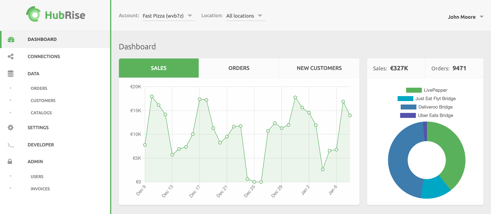

The Dashboard displays a quick overall view of transactions on your HubRise Account. In a single view, you can see the last 30 day performance for completed sales, created orders, new customers, and revenue from those sales.

You can display information for the Account by selecting **All locations**, or narrow the results to a specific Location by selecting the outlet in the **Location** dropdown.

Click the **SALES**, **ORDERS**, or **NEW CUSTOMERS** tabs to display the related content.

For more detailed analysis of your data, connect a more specialised solution integrated with HubRise or integrate your own proprietary solution.
Technical partners offering detailed reporting are available in the HubRise website Apps page, under the [Operations and Inventory](/apps/operations-and-inventory#nav) section.
