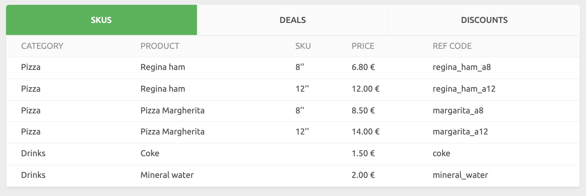

The Data section provides records for orders, customers, and catalogs. At any time, you can select which Account and Locations to display.

## Orders

The **ORDERS** page displays your recent orders, with the most recent on top. For every order on the list, you can find the following attributes:

- **Date, time and unique ID**: The date, time, and unique identifier for the order.
- **Location**: If you select **All locations**, this column shows the Location that received the order.
- **Customer**: The customer that made the order.
- **Amount**: The total amount of the order.
- **Status**: The current status of the order. For an overview of possible statuses, see the [Order status section](/developers/api/order-management/#order-status) of the HubRise API Order Management page.
- **Origin**: What app the order was generated from.

To filter orders by start and end date:

1. Select **From** and **To** fields in and set the date ranges to filter by.
1. Select the search icon <InlineImage width="17" height="17"></InlineImage> to filter records by these dates.
1. To clear the date filters, remove the dates from the **From** and **To** fields, then select the search icon <InlineImage width="17" height="17"></InlineImage>.

Click on the date of the order to view full details.
To view the full details of the request, click the date and time in the **Logs** section. For more information, see [Logs](/docs/data/#logs).

---

**Related FAQ**: <Link to="/docs/faqs/check-connection-between-my-system-and-hubrise/">How Do I Check If the Connection Between My System and HubRise Is Working?</Link>

---

## Customers

The **CUSTOMERS** page displays the selected customer lists for the selected Account. Customers are ordered by reverse creation date.

The records on this page display the following attributes:

- **Name**: The customer's name followed by their unique identifier.
- **Orders**: How many orders the customer made since registration.
- **Spending**: How much the customer has spent across all orders made on the Account.
- **Since**: The date of the customer's first order.

To filter customers by name or email address:

1. If there are multiple customer lists for the Account or Location, select the drop down list next to **Customers** and select the customer list to display.
1. Click the **Search by name or email** field and enter the text to search for.
1. Select the search icon to filter the customer records.
1. To clear the customer filer, remove all text from the **Search by name or email** field then select the search icon <InlineImage width="17" height="17"></InlineImage>.

To see full details of a customer, click the customer name.
To see full log file details of all requests effecting customers, click **View logs**. For more information, see [Logs](/docs/data/#logs).

To create, edit or remove a customer lists, see [Customer Lists](/docs/customer-lists).

## Catalogs

The **CATALOGS** page displays the products included in the selected Catalog.

Connected apps that have access to your HubRise catalog can pull its product list or push new products into it.
For example, a connected EPOS can push its products catalog into HubRise for an e-commerce website to use it.

From the Catalogs page, you can view the catalogs pushed into HubRise and the logs of the requests that made changes to the catalog.

### View Catalog

Accounts and Locations can contain multiple Catalogs. To view a specific Catalog, select it from the dropdown list next to the title **Catalogs**.

Catalogs are presented in three tabs:

- **SKUS**: The items that you sell to the customers.
- **DEALS**: The deals available in the catalog.
  A deal provides a price reduction on combinations of Products bought together. For instance, **Buy One Get One Free** is a deal that applies to two Products. It applies to two Products and provides a price reduction equal to the price of the cheapest Product.
- **DISCOUNTS**: The discounts available in the catalog.
  Discount codes apply savings to the overall order rather than specific products. For example, **FREEDELIVERY** might remove the delivery fee for the entire order, or **FRIYAY** might provide a 10% discount to the entire order on Friday.

For SKUs, you can see the following attributes:

- **CATEGORY**: The category for the product, for example _Boots_.
- **PRODUCT**: The name displayed to the customer. Product names do not need to be unique. For example, you may sell shoes of different sizes, but with the same product name _Waterproof boots_.
- **SKU**: The SKU or product size. For example, in the case of _Waterproof boots_, you might sell a SKU with size 28 and black colour, and another SKU with size 32 and brown colour.
- **PRICE**: The price of the product, and the currency used.
- **REF CODE**: The unique identifier of the product from the source product management system. This identifies the item across all apps. Identifiers are alphanumeric with special characters. For example, `boots_waterproof_size_28_black` can refer to a pair of boots with size 28 and black colour.

For Deals and Discounts, you can see the following attributes:

- **NAME**: The Deal or Discount name.
- **REF CODE**: The unique identifier of the Deal or Discount from the source product management system.

To see the full logs of all the requests that make changes to the catalogs, click **View logs**. For more information, see [Logs](/docs/data/#logs).

To create, edit or remove a catalogs, see [Catalogs](/docs/catalog).

## Logs

Each page in the **DATA** section provides more information through its log page.

Logs record the requests from an app to HubRise. Each request is a transaction between an app and HubRise, such as an order, a new customer registered, or a catalog update.

The log page displays a summary list of requests in reverse chronological order. When you open an order in the **ORDERS** page or select **View logs** on the **CUSTOMERS** or **CATALOGS** pages, the following information is displayed:

- **TIME (UTC)**: The date and time of the request, in UTC format.
- **ORIGIN**: The app that created the request.
- **ENDPOINT**: The endpoint of the request, including HTTP method and URL path.
- **RESPONSE**: The HTTP response code.

Further log details are available for advanced users and developers to view app communications and troubleshoot issues. To view details for a log entry:

1. Click the row to display. A full list of the query and response will be displayed.
1. To download either the query or response, select the download icon <InlineImage width="15" height="14"></InlineImage>. The selected query or response will be provided as a JSON file.

For more information, see [Understanding Logs in HubRise](/docs/hubrise-logs). For a complete reference on the HubRise API, see the [HubRise API Reference page](/developers/api/general-concepts).
