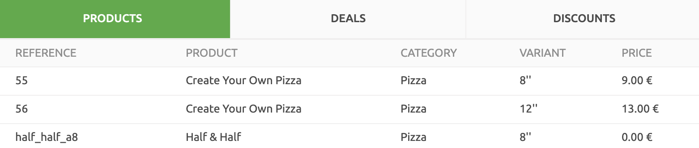

The Data section provides records for orders, customers, and catalogs. At any time, you can select which Account and Locations to display. For more information see [Accounts and Locations](/docs/getting-started/#accounts-and-locations).

## Orders

The **DATA** > **ORDERS** page displays records in reverse chronological order. The records on this page display the following attributes:

- **Date, time and Unique ID**: The date, time, and unique identifier for the order.
- **Customer**: The customer that made the order.
- **Amount**: The total amount of the order.
- **Status**: The current status of the order. For an overview of possible statuses, see the [Order status section](/developers/api/order-management/#order-status) of the HubRise API Order Management page.
- **Origin**: What app the order was generated from.

To filter orders by start and end date:

1. Select **From** and **To** fields in and set the date ranges to filter by.
1. Select the search icon <InlineImage width="17" height="17"></InlineImage> to filter records by these dates.
1. To clear the date filters, remove the dates from the **From** and **To** fields, then select the search icon <InlineImage width="17" height="17"></InlineImage>.
1. Click on the date of the order to view full details.
1. To view the full details of the request, click the date and time. For more information see [Logs](/docs/data/#logs).

<video controls title="Filter Orders by date">
  <source src="../images/016-en-data-filter-orders-by-date.webm" type="video/webm"/>
</video>

---

**Related FAQ**: <Link to="/docs/faqs/check-connection-between-my-system-and-hubrise/">How Do I Check If the Connection Between My System and HubRise Is Working?</Link>

---

## Customers

The **DATA** > **CUSTOMERS** page displays the selected customer lists for the selected Account. Customers are ordered by reverse creation date.

The records on this page display the following attributes:

- **Name**: The customer's name followed by their unique identifier.
- **Orders**: How many orders the customer made since registration.
- **Spending**: How much the customer has spent across all orders made on the Account.

To filter customers by name or email address:

1. If there are multiple customer lists for the Account or Location, select the drop down list next to **Customers** and select the customer list to display.
1. Click the **Search by name or email** field and enter the text to search for.
1. Select the search icon to filter the customer records.
1. To clear the customer filer, remove all text from the **Search by name or email** field then select the search icon <InlineImage width="17" height="17"></InlineImage>.
1. To see full details of a customer, click the customer name.
1. To see full log file details of all requests effecting customers, click **View logs**. For more information see [Logs](/docs/data/#logs).

<video controls title="Filter customers">
  <source src="../images/029-en-filter-customers.webm" type="video/webm"/>
</video>

## Catalogs

The **DATA** > **CATALOGS** page displays the products offered in the selected Catalog. Updating your product list and importing them into HubRise is performed by the connected app from which your catalog is managed. For example, a connected EPOS would manage its catalog and transmit its information to HubRise.

From the Catalogs page, you can view the catalogs imported into HubRise and the logs of request effecting the catalog.

### View Catalog

The Catalog displayed is set by the Account and Location selected at the top of the page. For more information on setting the Account to display, see [Accounts and Locations](/docs/getting-started/#accounts-and-locations).

Accounts and Locations can contain multiple Catalogs. To display the specific Catalog, select it from the dropdown list next to the title **Catalogs**.

Catalogs are presented in three tabs:

- **PRODUCTS**: The item being sold to the customer.
- **DEALS**: A deal provides a price reduction on either an Order Product or Products. For instance, **Buy One Get One Free** is a deal that applies to two Products. It applies to two Products to provide a price reduction equal to the price of the cheapest Product.
- **DISCOUNTS**: Discount codes apply savings to the overall order rather than specific products. For example, **FREEDELIVERY** to remove the delivery fee for the entire order, or **FRIYAY** would provide a 10% discount to the entire order on Friday.

Depending on which tab is selected, the following attributes are available:

- **REFERENCE**: The unique identifier of the product or deal from the source product management system. This identifies the item across all apps. Identifiers are alphanumeric with special characters. For example `sparkling_mineral_water_75_c` may refer to a bottle of sparkling water of a specific size.
- **PRODUCT**: The name displayed to the customer. These names do not need to be unique. For example, you may sell shoes of different sizes with the product references `boots_waterproof_size_28` and `boots_waterproof_size_30`, with the product name for both as Waterproof boots.
- **CATEGORY**: The product category for the product, such as Snacks, Shirts, Boots, etc.
- **VARIANT**: The SKU or product size. For example, the product reference may be `boots_waterproof_size_28_black`, with the name Waterproof boots, and the variant as Size 28 and black colour. Another set of boots may have the reference `boots_waterproof_size_32_brown the name`, with the name Waterproof boots, and the variant as Size 32 and brown colour.
- **PRICE**: The price of the product, and the currency used.

To see full log file details of all requests effecting catalogs, click View logs. For more information see [Logs](/docs/data/#logs).

<video controls title="Catalog tabs">
  <source src="../images/039-en-data-catalog-tabs.webm" type="video/webm"/>
</video>

## Logs

Each subsection in **DATA** provides more information through their log page.

Logs record the requests from an app to HubRise. Each request is a transaction between an app and HubRise. It could be an order, a new customer registered, or any other communication between an app and HubRise.

The log page displays a summary list of requests in reverse chronological order. When you open an order in the **ORDERS** page or select **View logs** on **CUSTOMERS** or **CATALOGS** pages, the following information is displayed:

- **DATE**: The date and time of the request.
- **CLIENT NAME**: The source of the request.
- **METHOD**: The HTTP method used in communicating the request.
- **PATH**: The URL path for the update.
- **CODE**: The HTTP response.

Further log details are available for advanced users and developers to view app communications and troubleshoot issues. To view details for a log entry:

1. Click the row to display. A full list of the query and response will be displayed.
1. To download either the query or response, select the download icon <InlineImage width="15" height="14"></InlineImage>. The selected query or response will be provided as a JSON file.

For more information, see [Understanding Logs in HubRise](/docs/hubrise-logs). For a complete reference on the HubRise API, see the [HubRise API Reference page](/developers/api/general-concepts).

[comment]: # "Understanding Logs in HubRise link not working"

<video controls title="View logs example">
  <source src="../images/037-en-data-customers-view-logs.webm" type="video/webm"/>
</video>
