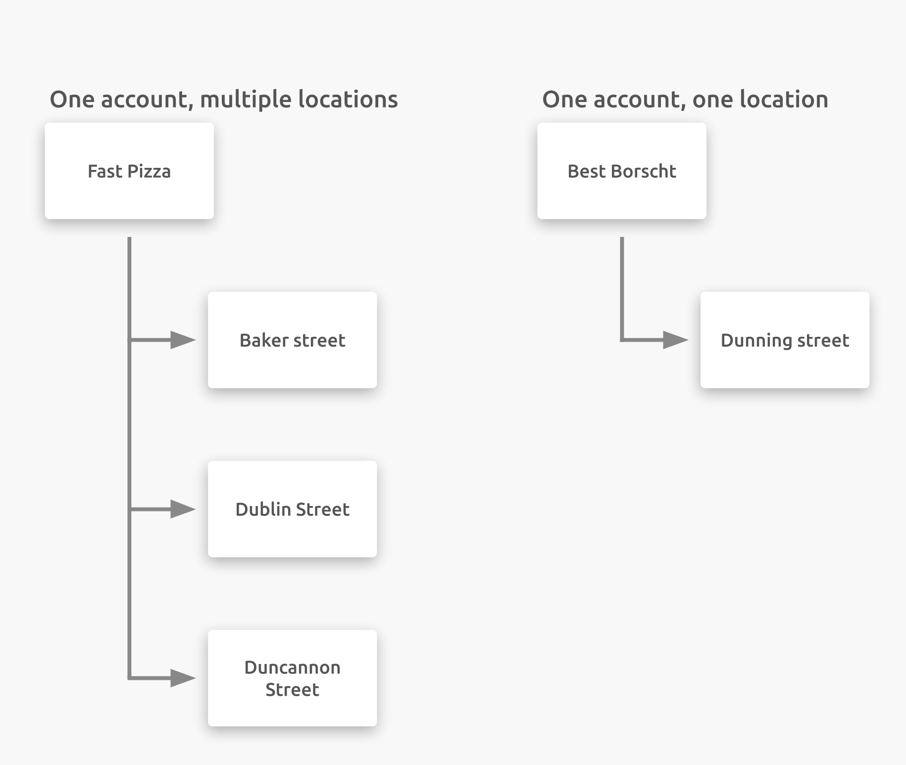

HubRise is accessed through a web browser. You can use HubRise on any device: your desktop, tablet, or smartphone.

## Create a User Profile

You must be a registered user to connect to HubRise. Registration is free, and only takes a minute. All you need is a name, email address, and secure password. Visit the [HubRise Registration page](https://manager.hubrise.com/signup) to create a new user profile.

---

**Related FAQ**: <Link to="/docs/faqs/create-a-user-profile-for-another-person/">How Do I Create a User Profile for Another Person?</Link>

---

## Log In

Registered users can log in to HubRise directly from the [HubRise Login page](https://manager.hubrise.com/login) or the [HubRise home page](https://www.hubrise.com). Enter your email address and password, then click **Login**.

---

**Related FAQ**: <Link to="/docs/faqs/check-if-i-already-have-a-user-profile-in-hubrise/">How Do I Check If I Already Have a User Profile in HubRise?</Link>

---

## Resetting Lost Password

If you are a registered user but you have lost or forgotten your password, go to the [HubRise Reset password page](https://manager.hubrise.com/reset_password/new). Enter the email address associated with your HubRise profile, and click **Reset Password**. You will receive an email with instructions on how to reset your password. Once complete, you will be able to log in again.

---

**IMPORTANT NOTE**: If you do not see the password reset instructions in your email's Inbox folder within a few minutes, refresh your Inbox and check your Spam or Trash folders.

---

## Accounts and Locations

An **Account** identifies your brand. **Locations** refers to the point of sales within this brand, they typically correspond to physical outlets.

A small business may have one Account with one Location, while a larger business may have one Account with multiple Locations tied to the same Account.

If you want to get an overall view of an Account's performance, select all Locations. If you want to narrow results to one Location within an Account, select the Account then the corresponding Location.

- For users with multiple Accounts, click the down arrow <InlineImage width="28" height="21"></InlineImage> next to **Account** and select the Account to display.
- To display data on all Locations or for a specific Location, click the down arrow <InlineImage width="28" height="21"></InlineImage> next to **Location** and select either **All locations** or the specific location.

For more information on Account, see [Accounts](/docs/account/). For more information on Locations, see [Locations](/docs/locations/).

<video controls title="Display account from Dashboard">
  <source src="../images/008-en-access-account-from-dashboard.webm" type="video/webm"/>
</video>

## Set Language Preference

Users can set the language for their HubRise session by clicking the down arrow <InlineImage width="28" height="21"></InlineImage> next to your name in the upper right hand corner, and selecting your preferred language.

<video controls title="Change language from Dashboard">
  <source src="../images/007-en-change-language-from-dashboard.webm" type="video/webm"/>
</video>

You can also set your preferred language for all communications from HubRise (such as emails, etc) in the **SETTINGS**. For more information see [Profile and Password](/docs/profile-password).

## Access Account Settings

Your HubRise user profile may be connected to multiple Accounts and locations based on permissions. For more information, see [Accounts and Locations](/docs/getting-started/#accounts-and-locations).

You can view the settings for the HubRise Account you are working in by selecting the down arrow <InlineImage width="28" height="21"></InlineImage> next to your name in the upper right hand corner, and click **Account**. You can also access all of your Accounts by selecting **SETTINGS** > **ACCOUNTS** from the left navigation panel.

<video controls title="Access user profile from Dashboard">
  <source src="../images/049-en-access-account-from-dashboard.webm" type="video/webm"/>
</video>

## Logout

By default users stay connected to HubRise until they have manually logged out of their session, or have gone six months without any activity.

To log out of HubRise, click the down arrow <InlineImage width="28" height="21"></InlineImage> next to your name in the upper right hand corner, then select **Log out**.

<video controls title="HubRise Logout example">
  <source src="../images/009-en-hubrise-logout.webm" type="video/webm"/>
</video>
