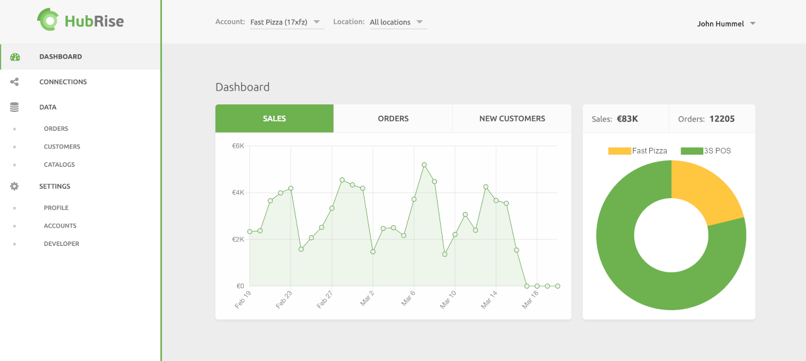
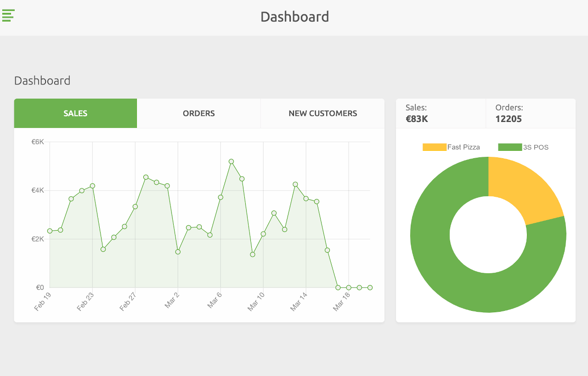
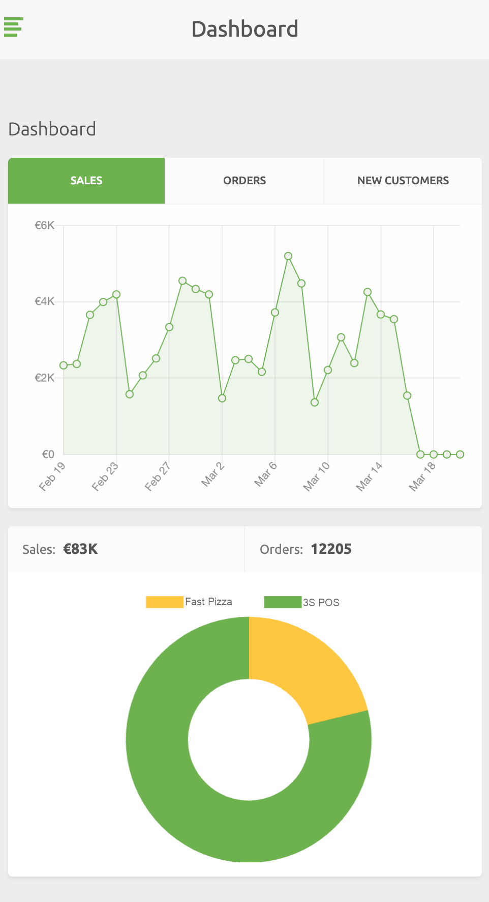

HubRise is a middleware that connects third party solutions, providing a single interface to an ever growing ecosystem of integrated applications including:

- Point of Sale
- Online ordering
- Delivery management
- Delivery services
- eMarketing (SMS/Emailing)
- Loyalty management
- Food aggregators
- And more, including a robust system to allow developers to connect other apps using the <Link to="/developers/api/">HubRise API</Link>.

Transactions are saved into HubRise to provide apps real-time access to your data.

Logs are made available for users and support teams to understand the workflow and check the status on each transaction. These logs are primarily aimed at developers, but are designed to be understood by anyone.

HubRise offers a paid plan per Location. A free plan is provided with a limited quota of transactions. Once usage exceeds the free quota limit, Locations are required to upgrade their plan. For more details, see our <Link to="/pricing/">pricing page</Link>.

HubRise is available wherever you work and whatever device you use: your desktop browser, your tablet, or your smartphone.

- Desktops
  
- Tablets
  
- Cell Phones
  

With HubRise, you can track orders from all connected solutions, keep track of your customers, and check your catalog of products through one system.

The HubRise interface is organised into the following sections:

- **Dashboard**: A quick overview of your organisation’s sales, orders, and new customers.
- **Connections**: Connect new applications to your HubRise Account, and manage your existing connections.
- **Data**: View orders, catalogs, and customers across your locations.
- **Settings**: Add new locations, manage employee access and roles, view payment history or payment methods, and developer access to integrate applications with HubRise.
