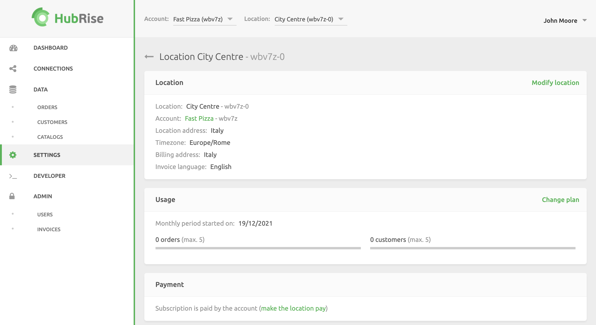
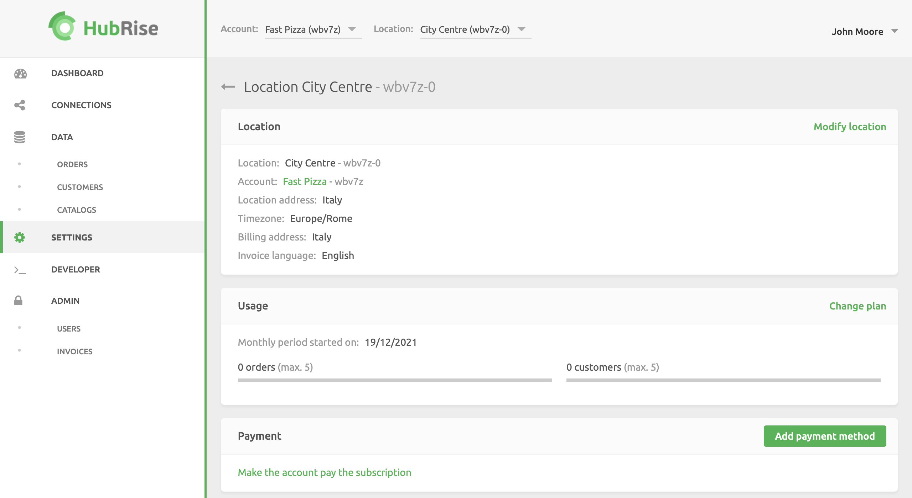
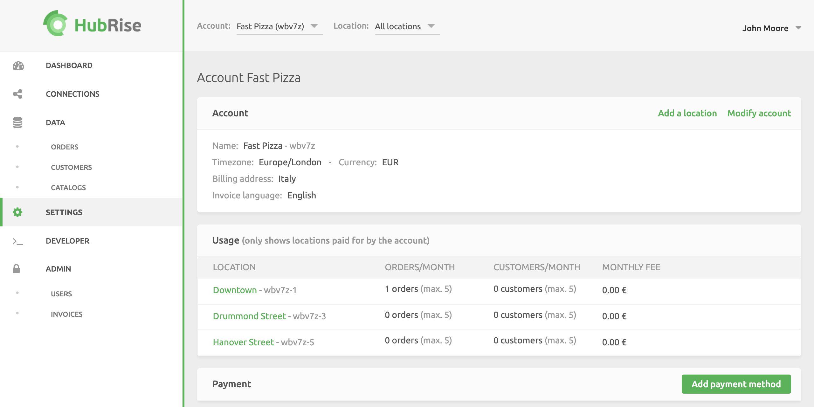
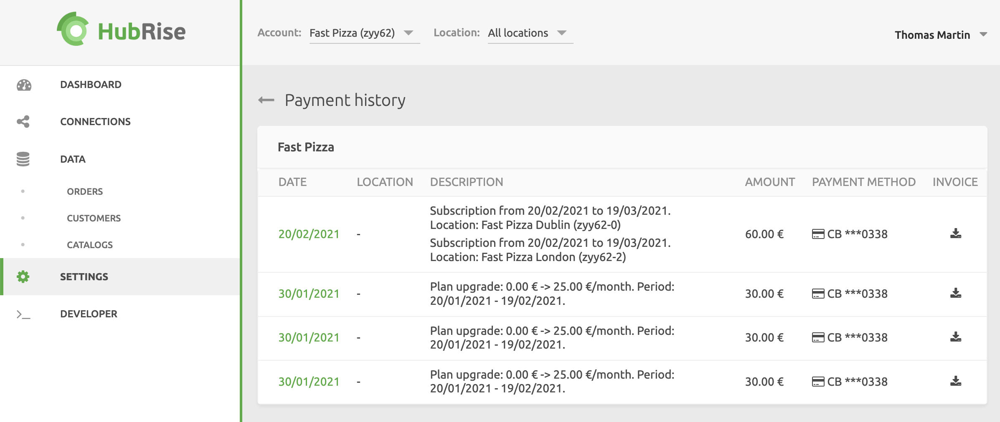

Accounts and Locations set up with a paid plan will pay a monthly subscription to HubRise when they exceed the free [usage](/docs/usage-plan#usage-plans) limit. For complete pricing information, see the [HubRise Price page](/pricing/).

You can set up your payment method in the **SETTINGS** > **Payment** section. You must have a credit card to automate payments. Direct debit is not available. Wire transfer is accepted for a minimum of 12 months usage.

Subscription payments are in EUR, regardless of the Account currency.

## Account or Location Payments

You can pay your HubRise subscription at the Account level, or at the Location level.

Account level payments are the default and preferred choice. If you have multiple Locations, you can set up a single payment method and manage a single invoice for all your Locations.

However, if you have specific billing requirements or other business needs, you can set up a different payment method at the Location level.

### Switching To Location Level Payment

To set up a Location level payment for a specific Location, follow these steps:

1. If you have access to multiple Accounts, select the **Account** containing the specific Location.
1. Select the Location from the **Location** dropdown.
1. Go to **SETTINGS**.
1. Under **Payment**, click **Make the location pay**.
   

### Switching To Account Level Payment

To set up an Account level payment for a specific Location, follow these steps:

1. If you have access to multiple Accounts, select the **Account** containing the specific Location.
1. Select the Location from the **Location** dropdown.
1. Go to **SETTINGS**.
1. Under **Payment**, click **Make the account pay the subscription**.
   

The Location billing cycle will match the Account billing cycle. If the current billing date for the Location is different from that of the Account, the following situations can happen:

- If the Location next billing date is before the Account next billing date, you immediately receive a prorated charge to align the Location next billing date to the Account's.
- If the Location next billing date is after the Account next billing date, nothing changes until the Account next billing date. At that point, you receive a prorated charge and the Location next billing date aligns with the Account's.

## Billing Cycles

Billing Cycles are a month in duration, and start on the same calendar day the Account is created. The start date of the Billing Cycle cannot be changed.

For example, if you open your HubRise Account on March 17, you will be billed on the 17th day of each month. The billing cycle of each Location will match.

## Edit Billing Information

Billing information included in invoices can be configured at the Account and Location levels.

1. Go to **SETTINGS**.
1. In the **Location** dropdown, select the Location you want to edit, or **All locations** to edit your Account billing information.
1. Click **Modify account** or **Modify location**.
1. Fill in the information required under **Billing details**.
1. Click **Update**.

## Add a Payment Method

To add or update a payment method at the Account level, follow these steps:

1. Go to **SETTINGS**.
1. If you have access to multiple Accounts, select the **Account**, then scroll down to the **Payment** section.
   
1. If there is no existing payment method, click **Add payment method**. If there is a previously set method, click **Change your payment method**.
1. Enter your credit card information. Credit cards must be valid to be accepted.
1. When finished, click **Save**.

To add or update a payment method at the Location level, follow these steps:

1. Go to **SETTINGS**.
1. If you have access to multiple Accounts, select the **Account** containing the specific Location.
1. Select the Location from the **Location** dropdown, then scroll down to the **Payment** section.
   
1. If there is no existing payment method, click **Add payment method**. If there is a previously set method, click **Change your payment method**.
1. Enter your credit card information. Credit cards must be valid to be accepted.
1. When finished, click **Save**.

## Remove a Payment Method

To remove a payment method, follow these steps:

1. Log in to your HubRise account.
1. If you have access to multiple Accounts, select the relevant Account.
1. Go to **SETTINGS**.
1. To check for payment set at Account level, verify that **All locations** is selected. To check for payment set at Location level, select the Location from the Location dropdown.
1. In the Payment section, click **Delete** and **Confirm** in the dialog prompt.

---

**Related FAQ**: [How Do I Stop Paying For My Subscription?](/docs/faqs/stop-paying-subscription/)

---

## Process Pending Quotes

When you change your plan, the payment must be authorized before the credit card can be charged. Admin users will receive notifications reminding them to complete the payment process. For more information on notifications, see [Plan Notifications](/docs/usage-plan/#plan-notifications).

To process a payment from the notification:

1. Connect to your HubRise back office.
1. Make sure a credit card is saved on your Account or Location. If not, see the instructions in [Add a Payment Method](#add-a-payment-method).
1. Click **View the earliest quote**, then click **Pay**. To check on all unpaid quotes, click **Check your account** from the notification.

---

**Related FAQ**: [What Happens If My Free Plan Quota Is Exceeded?](/docs/faqs/free-plan-quota-exceeded-what-happens/), [How Do I Pay For My First Invoice?](/docs/faqs/pay-first-invoice/), [Can My Plan Be Paused During Setup and Test Phases?](/docs/faqs/pause-plan-during-setup-and-test-phases/)

---

## Payment History

Admin users receive payment notifications and invoices via email. Invoices are also available for download from the HubRise back office.

To view your payments history:

1. Go to **SETTINGS**.
1. If you have access to multiple Accounts, select the **Account** you are interested in.
1. If payment is done at Account level, verify that **All locations** is selected. If payment is done at Location level, select the Location from the **Location** dropdown.
1. Under **Payment**, click on **Payment history**. Payments are listed in reverse historical order, with the most recent payments displayed first.

Payment history for Accounts will group Location payments for the date.

The first time you make a payment, the payment is identified as **Plan upgrade**. Subsequent payments will be listed with the date of the [billing period](docs/payment#billing-cycles). Once you have a valid payment method saved, payments are automated.

Details within each invoice can be viewed directly on the HubRise back office by clicking on the date. Each payment will display:

- **Date**: The payment date.
- **Amount excl. VAT**: The payment amount excluding value-added tax (VAT). HubRise being headquartered in France, VAT only applies to companies based in France and Monaco.
- **Description**: The period and locations covered by the payment.
- **Payment Method**: The payment method used.

Invoices can also be saved as PDF files by selecting the download icon <InlineImage width="15" height="14"></InlineImage>.

