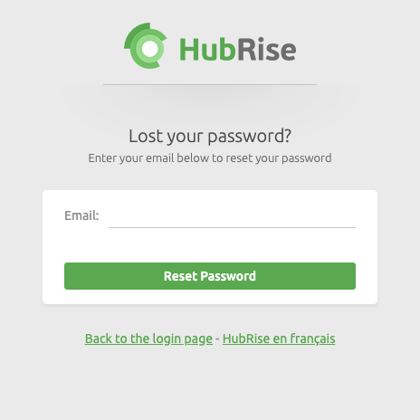

The Profile page on HubRise displays your User Profile information, and allows you to update it or change your password.

## Edit Profile

To update your User Profile:

1. Click your name in the top right corner of HubRise the back office, then click **Profile**.
1. Click **Modify**.
1. Update your name, email address, or correspondence language. The **Correspondence Language** sets the language for all communications from HubRise to you.
1. Select **Update**.

---

**IMPORTANT NOTE**: When changing your email address, verify that it is accurate and able to receive emails. Otherwise password resets and other notifications will not work.

---

## Update Password

To update your password:

1. Click your name in the top right corner of HubRise the back office, then click **Profile**.
1. Enter your current password in the **Current password** field.
1. Enter your new password in **New password** and **Confirm new password** fields. Both fields must match.
1. Click **Update**.

## User Permissions

The Profile page includes information on your User Profile **Permissions**. This includes:

- The **ACCOUNT** and **LOCATION** that you have access to.
- The **ROLE** you have been assigned for the Account or Location. It could be a Manager or an Admin role.

To remove your access to an Account or a Location:

1. Click your name in the top right corner of HubRise the back office, then click **Profile**.
1. Find the granted permission in the **Permissions** section, and click the trash icon <InlineImage width="15" height="16"></InlineImage>

---

**IMPORTANT NOTE**: You cannot remove yourself from an Account if you are the only Admin. If you attempt to do so, an error message will be displayed. If you need to remove yourself as the last Admin for an Account, create another user as an Admin for that Account, then remove yourself.

---

For more information, see [Permissions](/docs/permissions/).

## Create an Account

To create a new Account:

1. Click your name in the top right corner of HubRise the back office, then click **Profile**.
1. In the **Permissions** section, click **Create Account**. For more information, see [Create an Account](/docs/account#create-an-account).

## Reset a Lost Password

If you are a registered user but you have lost or forgotten your password, go to the [HubRise Reset password page](https://manager.hubrise.com/reset_password/new). Enter the email address associated with your HubRise profile, and click **Reset Password**. You will receive an email with instructions on how to reset your password. Once complete, you will be able to log in again.

---

**IMPORTANT NOTE**: If you do not see the password reset instructions in your email's Inbox folder within a few minutes, refresh your Inbox and check your Spam or Trash folders.

---

