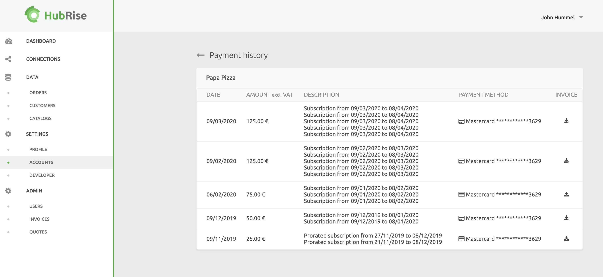

## Profile

The profile page on **SETTINGS** > **PROFILE** displays your user information, and allows you to update it or change your password.

To update your user profile:

1. Click **Modify**.
2. Update your name, email address, or correspondence language. The **Correspondence Language** sets all communications (emails, etc) from HubRise to you as the specified language.
3. Select **Update**.

----------------

**IMPORTANT NOTE**: When changing your email address, verify that it is accurate and able to receive emails. Otherwise password resets and other notifications will not work.

----------------

To update your password:

1. Select **SETTINGS** > **PROFILE**.
2. Enter your current password in the **Current password** field.
3. Enter your new password in **New password** and **Confirm new password** fields. Both fields must match.
4. Click **Update**.

The Profile page includes information on your **Permissions**. This includes:

- The **Account** and **Location** that you have access to.
- The **Role** you have been assigned for the Account or Location.

To remove your granted permission to an Account, select the trash icon <InlineImage width="15" height="16"></InlineImage>

----------------

**IMPORTANT NOTE**: You cannot remove yourself from an Account if you are the last Admin. If you attempt to do so, an error message will be displayed. If you need to remove yourself as the last Admin for an Account, create another user as an Admin for that Account, then remove yourself.

----------------
For more information, see [Permissions](#permissions).

To create a new Account from the Profile page, select **Create Account**. For more information see [Create an Account](#account).

## Accounts

As described in [Accounts and Locations](/docs/getting-started/#accounts-and-locations), Accounts refers to the brand, and contains one or more Locations.

### Account

The **SETTINGS** > **ACCOUNTS** section lists all Accounts you have been granted access to with the following information:

- **NAME**: The name and unique identifier of the Account.
- **ROLE**: Your role for the Account. For more information on roles, see [Permissions](#permissions).

To view details for a specific Account, click its name.

Users with only one Account will automatically be entered into their sole Account.

#### Account Settings

Accounts and Locations have many of the same sub-sections and settings. Depending on your situation, you may have given your Locations different settings than the Account it belongs to.

The ability to have different settings for Accounts and Locations allows you to:

- Have one payment method setup for all locations or differentiate them from one location to another. This is useful if you need to have a Location use a different payment method for accounting purposes.
- Permissions can be granted for users at either the Account level or the Location level. For example, you may grant one user complete access to an Account as an Admin, but allow another user only to view and manage a specific Location.
- View data across an Account, or filter information to a specific Location.
- Modify your Account and Locations in ways that best fits your business needs.

The primary differences between the settings for Accounts and Locations to note are:

- Accounts contain one or more Locations. Each Location is attached to only one Account.
- Currency settings are set at the Account level, and can not be changed once created. If you have made a mistake in the currency selection, you will have to create a new Account with the correct currency value.
- If you have markets with different currencies, you will have to create an Account for each market. The recommended practice is to create a different Account for each country you have a market in, even if they share the same currency.

#### Create an Account

When creating a new Account, the first Location must be created at the same time through the following steps:

To create a new Account and it’s first location, click **SETTINGS** > **ACCOUNTS** > **Create Account**. Enter the information required and click **Create**.

The **Account Name** is the name you give your business or brand. For example, if your brand is called Fast Pizza, the **Account Name** will be **Fast Pizza**.

The **Location Name** could be the city, the area, or the street name. For example, if the location is the only one in a town like London, the location could be named **London**.

It is important to enter the correct **Currency** as you will not be able to change it later.

<video controls title="Create an Account">
  <source src="../images/038-en-settings-account-create-account.webm" type="video/webm"/>
</video>

#### Modify an Account

The only field that can be modified is the **Account Name**.
It is recommended to name the Account the same as your business or brand. 

----------------

**IMPORTANT NOTE**: The currency value can only be set when the Account is created, and can not be modified. If the currency for the HubRise Account does not match the currency set on the connected apps, errors may occur. Create a new Account with the correct currency and use that Account to connect your apps instead.

----------------

To modify an existing Account:

1. Select **SETTINGS** > **ACCOUNT**.
2. If there are multiple Accounts, click the name of the Account to update.
3. Click **Modify**.
4. Update the fields as required and Click **Modify**.

----------------

**IMPORTANT NOTE**: It is a legal requirement to include the Intra-Community VAT number. HubRise will display a notification to update the VAT number if this information is missing from your Account.

----------------

<video controls title="Change account information">
  <source src="../images/019-en-settings-account-change-account-name.webm" type="video/webm"/>
</video>

### Locations

As described in [Accounts and Locations](/docs/getting-started/#accounts-and-locations), Locations refers to the different points of sales for an Account. Locations are displayed with:

- The Location name
- The unique identifier for the Account they are associated with.
- The number indicating in what order the Location was added (starting at zero).

For example, `Baker Street z6q31-0` indicates the Location name of **Baker Street**, that it belongs to Account **z6q31**, and **-0** signifies it was the first Location added to this Account.

----------------

**IMPORTANT NOTE**: Depending on your business, the Location may have a different VAT number than the Account. Verify that all VAT numbers are correctly configured on all Accounts and Locations you manage.

----------------

#### Location Details

To view Location details:

1. Go to **SETTINGS** > **ACCOUNTS**.
2. If you have multiple Accounts, select the Account for the Location
3. In the **Locations **section click on the Location’s name.

Locations are managed in the same way as Accounts, but the information is specific to the selected Location.

Change of settings for specific locations allows you to have different payment methods per location, different users access and roles, and so on. For more information, see [Accounts](#account).

#### Create a Location

The first Location is created simultaneously with the Account. For more information on creating an Account, see [Account](#account).

To add a new Locations to an existing Account:

1. Click **SETTINGS** > **ACCOUNTS**.
2. If you have multiple Accounts, select the Account that the Location will be added to.
3. In the **Locations** section, click on **Add a location**.
4. Enter the required information. 
5. If this Location has a VAT number separate from the Account, enter it here in the **Intra-Community VAT number** field provided.
6. If the billing address is different than the Location’s address, check **The billing address is different from the location address** and fill out the form.
7. Click **Add a new location** to save the new values.

It is recommended to name the location after the city, the area or street it is located at.

<video controls title="Add Location example">
  <source src="../images/020-en-settings-account-locations-add-location.webm" type="video/webm"/>
</video>

#### Updating Location Details

To update the name and address for a location, follow these steps:

1. Click **SETTINGS** > **ACCOUNT**.
2. If you have multiple Accounts, select the Account that the Location will be added to.
3. Select the Location to update.
4. Click **Modify**.
5. Update the values as needed. 
6. If this Location has a VAT number separate from the Account, enter it here in the **Intra-Community VAT number** field provided.
7. If the billing address is different than the Location’s address, check **The billing address is different from the location address** and fill out the form.
8. Click **Update** to save the changes.

### Usage

The **SETTINGS** > **ACCOUNTS** > **Usage** section displays the number of orders and customers that have been processed through HubRise in the current billing cycle. Billing cycles are always a month in duration, and starts on the same calendar day as the Account is created. It also shows the HubRise fee related to each of the Locations on your Account.

To view Usage details for an Account or Location:

1. Select **SETTINGS** > **ACCOUNTS**.
2. For profiles with multiple Accounts, select the specific Account to view. The **Usage** section will display across the entire Account and all of its Locations.
3. To view information for one location, select the specific Location.

#### Plans

HubRise provides both free and paid plans for its services. For complete information on plans and pricing, see the [HubRise Price Page](/pricing/).

Free plans are available for Locations with a limited number of transactions a month.Once this limit is reached, you must upgrade to the paid tier to continue service. When the free plan limit is reached, all Admin users for the Account and the specific Location will be notified.

If you know that you will have more than the free plan quota allows, you can set the plan to the paid tier before being notified. The plan will not begin until the free quota limit is surpassed, even if you have selected the paid tier level and set your payment method.

It is possible to contact HubRise at [support@hubrise.com](mailto:support@hubrise.com) and request a free plan during your launch and test date.

##### Plan Notifications

When there is an issue with a plan, Account admins will receive an email and have a notification displayed when they log in to HubRise. Notifications can be sent and displayed in the HubRise back office for any reason involving payments or plan issues, such as:

- When a location has exceeded its free transactions limits and no payment method was saved in HubRise.
- Credit card has expired and needs an update.
- The credit card cannot be processed after a couple of automated payment attempts. For safety reasons, your bank might require you to enter the 3-digit security code again.
- A credit card has been saved in HubRise for payments but outstanding quotes have not been paid. For more information, see [Payment](#payment).

If a payment notification appears, click the link and follow the instructions to resolve the issue. For more information, see [Usage](#usage).

----------------

**IMPORTANT NOTE**: If there is a problem with your payment method, admin users will receive an email notification and a message will display in the HubRise back office. Failing a response after two weeks, the HubRise Account will be automatically suspended.

----------------

##### Change Plan

You can change your plan to best meet your needs and the traffic of your business at any time without being over charged. For more details, see [Usage](#usage).

To change your plan for a location:

1. Select **SETTINGS** > **ACCOUNTS**.
2. For users with multiple Accounts, select the Account containing the specific Location.
3. Click the Location to update.
4. Under **Usage**, select **Change plan**.
5. To set your plan to use the paid plan that allows more transactions a month, click **Upgrade**. To change the plan to one that allows fewer orders and customers a month, click **Downgrade**. Please note that once you have reached the transaction limit for a free plan, you must upgrade to the paid plan again.

----------------

**IMPORTANT NOTE**: If upgrading, you must have your Payment type set. For information on setting your payment method, see [Payment](#payment). Your Account will not be charged until you exceed the free monthly limitation.

----------------

### Payment

Credit card payments can be set and tracked in the **SETTINGS** > **ACCOUNTS** > **Payment** section. Accounts with paid plans must have a credit card set as the payment method, or else the plan will not be processed. All payments will be debited in EUR, even if the Account currency setting is different.

#### Account or Location Payment

For Accounts with multiple Locations, we recommend you set the Account to pay for all plans. It means one payment method to update and one invoice to manage for all your Locations.

Locations can be set to their own payment method rather than using the Account. This may be required for specific billing purposes or other business needs.

To change whether your Location uses your HubRise Account payment method, or whether the Location will use a separate payment method, follow these steps:

1. Go to **SETTINGS** > **ACCOUNTS**.
2. For users with multiple Accounts, select the Account containing the specific Location.
3. Click the Location to update.
4. Under **Payment**:
   1. To set a location that uses its own payment method to use the same payment method as its Account, click **Make the account pay for the subscription**.
   2. If the location uses the same payment method as the Account and you want it to have a separate payment method, click click **Make the location pay for it**.

<video controls title="Payment by Account or Location example">
  <source src="../images/042-en-settings-payment-byaccount-bylocation.webm" type="video/webm"/>
</video>

#### Add or Change Payment Method

To update your payment method for an Account or Location:

1. Go to **SETTINGS** > **ACCOUNTS**.
   1. To update the payment method for an Account, select the Account and scroll down to the Payment section.
   2. To update the payment method for a Location, select the Account, then select the Location, and scroll down to the Payment section.
2. If there is no existing payment method, click **Add payment method**. If there is a previously set method, click **Change your payment method**.
3. Enter your credit card information. Credit cards must be valid to be accepted.
4. When finished, click **Save**.

<video controls title="Add payment type"><source src="../images/040-en-settings-payment-add-payment-type.webm" type="video/webm"/></video>

#### Process Pending Quotes

When a plan has been changed, the payment must be authorized before the credit charge can be charged. Admin users will receive notifications reminding them to complete the payment process. For more information on notifications, see [Usage](#usage).

To process a payment from the notification:

1. Make sure a credit card is saved on your Account or Location. If not, see the instructions in [Payment](#payment).
2. Click **View the earliest quote **link, then click **Pay**. To check on all unpaid quotes, click **check your account** from the notification.

<video controls title="Pay subscription example">
  <source src="../images/041-en-process-pending-quotes.webm" type="video/webm"/>
</video>

#### Payment History

Payments made to HubRise are listed in the **SETTINGS** > **ACCOUNTS** > **Payment** > **Payment history** link. Payments are listed in reverse historical order, with the most recent payments displayed first.

Select **Payment history** to display all payments made for the selected HubRise Account or Location. Each payment will display:

- **Date**: The date the payment was made.
- **Amount excl. VAT**: The amount of the payment excluding value-added tax (VAT). HubRise being headquartered in France, VAT only applies to companies based in France.
- **Description**: The purpose of the charge.
- **Payment Method**: The specific payment method used for this charge.

Admin users receive invoices via email. The invoice can also be saved as a PDF file by selecting the download icon <InlineImage width="15" height="14"></InlineImage>.

Payment history for Accounts will group Location payments for the date.

The payment history for locations will display invoices paid by the Account and all of its Locations.

The first time you make a payment to a plan the payment is listed as an upgrade. Subsequent payments will be listed for the date of the plan period. Once you have a valid payment method saved, plans are billed automatically.

### Permissions

Permissions lists the users, their email address, and role. The role refers to the list of actions the user is able to take. HubRise supports the following roles:

- **Admin**: Admins have access to all areas of HubRise, including invoice. They are responsible for keeping the Payment information up to date. They will receive invoices by email when a payment is made or notifications regarding HubRise pending payments. They can also grant access to other users.
- **Manager**: Managers have access to all areas except HubRise invoices. They will not receive notifications regarding payments to HubRise.

You can add or remove users for the HubRise Account, or for specific Locations. To view and update the permissions for a Location:

1. **SETTINGS** > **ACCOUNTS** > **Locations**.
2. For users with multiple Accounts, select the Account containing the specific Location.
3. Click the Location to modify.

You can also view and edit your own permissions from **SETTINGS** > **PROFILE**. For more information, see [Profile and Password](#profile-and-password).

#### Add a User

Admins can grant access to other users provided they have an existing profile on HubRise. New HubRise users can create a profile in the [HubRise signup page](https://manager.hubrise.com/signup). If you create a new profile on someone else’s behalf, use the [HubRise Reset password page](https://manager.hubrise.com/reset_password/new) to have the user enter their own secure password.

To add a user:

1. To grant access for the Account and all of its Locations, select **SETTINGS** > **ACCOUNTS**. Admins with multiple Accounts, select the Account to modify. To grant access only for a specific Location, select the location’s name in the **Locations** section.
2. In the Permissions section, select **Add**.
3. Enter the user’s email address in the column marked **EMAIL**.
4. In the **ROLE** column, set the new user’s role as Admin or Manager.
5. Click the plus icon <InlineImage width="13" height="13"></InlineImage> to add the new user.

<video controls title="Add user example">
  <source src="../images/023-en-permissions-add-user.webm" type="video/webm"/>
</video>

#### Remove a User

To remove a user:

1. Click the remove icon <InlineImage width="15" height="16"></InlineImage>for the user to remove.
2. When prompted, click **Delete** to confirm removing the user.

----------------

**IMPORTANT NOTE**: You can not remove your own user profile from **Permissions**. To remove your profile from an Account, set another user as an Admin, and have them remove your profile from the Account.

----------------

<video controls title="Remove a user example">
  <source src="../images/024-en-permissions-remove-user.webm" type="video/webm"/>
</video>

### Catalogs

The **SETTINGS** > **ACCOUNTS** > **Catalogs** section allows you to create, edit, or remove the catalogs used by your HubRise Account.

The rules for Catalogs are as follows:

- By default, Accounts define one Catalog named after the Account. Locations do not have a Catalog defined by default.
- An Account **must** have at least one Catalog. If you attempt to delete the last Catalog of an Account, an error notification will be displayed.
- You can create as many Catalogs as you need. For example:
  - You can create a test Catalog to be used without impacting production.
  - Create Catalogs for a Location that offers different products from the other Locations.

The list of products, their descriptions and details are managed from the third party app. Connecting and importing products into the HubRise catalog can only be done from your third party app.

You cannot edit your list of products from HubRise. Removing a catalog from HubRise does not effect the product list in third party apps.

#### Add a Catalog

To add a catalog:

1. In the **SETTINGS** > **ACCOUNTS** > **Catalogs** section, click **Add a catalog**.
2. Enter the name for the catalog. Catalogs should have the same name as your Account. If you have multiple Locations with their own different catalogs, it is preferable to follow a strict naming convention such as: **Account Name - Location Name**. For example, your default Account catalog may be **Fast Pizza**, and the catalog for a location would be **Fast Pizza - Baker Street**.
3. Click **Create** to save the new catalog.

#### Catalog Details

To view the list of products included within a catalog, see [Catalogs](#catalogs).

The following information is displayed in the **SETTINGS** > **ACCOUNTS** > **Catalogs** section:

1. **Name**: The name of the catalog, followed by its unique character code. This unique character code does not change even if the name of the catalog is changed. For example: The catalog **Baker Street** would be displayed as **Baker Street - abc123**. If the catalog **Baker Street** is renamed to **Dunning Street**, it will be displayed as **Dunning Street - abc123**.
2. **Created**: The date the catalog was created in HubRise.
3. **Products**: The number of products imported from your app into this catalog.

To view the contents of a Catalog, click the name of the Catalog. It will connect you to the **DATA** > **Catalog** screen for the specific Catalog.

<video controls title="Catalog link example">
  <source src="../images/045-en-catalog-link.webm" type="video/webm"/>
</video>

#### Edit a Catalog

Catalogs can be renamed to reflect special needs, such as labeling a Catalog for testing purposes, or for the products offered by a specific Location.

Changes to the Catalog in HubRise does not effect the list of products in connected apps. Any changes to the products lists, descriptions, etc is performed by the connected app.

To change the name of a Catalog:

1. In the **SETTINGS** > **ACCOUNTS** > **Catalogs** section, click the edit icon for the catalog to edit.
2. Enter the new name for the Catalog.
3. Click **Update** to save the new settings.

#### Remove a Catalog

Catalogs can be removed from HubRise when the following criteria are met:

- There are no active connections to the Catalog from an app.
- The last Catalog of an Account can not be removed.

Removing a catalog from HubRise does not effect the product list in third party apps.

To remove a catalog:

1. In the **SETTINGS** > **ACCOUNTS** > **Catalogs** section, click the remove icon<InlineImage width="15" height="16"></InlineImage> for the catalog to delete.
2. Click **Delete** to confirm the removal of the catalog.

### Customer Lists

The **SETTINGS** > **ACCOUNTS** > **Customer lists** section allows you to add, edit, and delete customer lists.

Customer Lists can be added to Accounts and Locations with the following conditions:

- By default, Accounts define one Customer list named after the Account. Locations do not have a Customer list defined by default.
- An Account **must** have at least one Customer list. If you attempt to delete the last Customer list of an Account, an error notification will be displayed.
- You can create as many Customer lists as you need. For example:
  - You can create a test Customer list to be used without impacting production.
  - Create a Customer list for a Location that have different Customers as other Locations.

You can connect integrated apps to a specific customer list. Your customers are registered, managed and imported from your third party application into HubRise, and can not be edited from the HubRise interface.

Adding or editing a customer list does not effect third party applications.

The **Customer list** section displays the following information:

- **Name**: The name of the customer list, followed by its unique character code. This unique character code does not change even if the name of the catalog is changed. For example: The catalog **Baker Street** would be displayed as **Baker Street - abc123**. If the catalog **Baker Street** is renamed to **Dunning Street**, it will be displayed as **Dunning Street - abc123**.
- **Customer Count**: The number of customers imported into HubRise. To view customer list details, see [Customers](/docs/data/#customers).

#### Add a customer list

To add a customer list:

1. In the section **SETTINGS** > **ACCOUNTS** > **Customer lists**, click **Add a customer list**.
2. Enter the name for the new customer list. The recommended naming convention is to name the Account customer list with the same name as your Account, and location customer lists as **Account Name - Location Name**. For example, your default Account customer list may be **Fast Pizza**, and the customer list for a location would be **Fast Pizza - Baker Street**.
3. Click **Add a customer list** to save the new list.

#### View a customer list

To view the details of a customer list, click the name of the list. It will automatically link you to the **DATA** > **Customers** page for the specific list.

<video controls title="Customer list link">
  <source src="../images/049-en-access-account-from-dashboard.webm" type="video/webm"/>
</video>

#### Edit a customer list

To change the name of a customer list:

1. In **SETTINGS** > **ACCOUNTS** > **Customer lists** section, click the edit icon <InlineImage width="15" height="15"></InlineImage>for the customer list to update.
2. Enter the new name of the customer list.
3. Click **Edit customer list** to save the changes.

#### Delete a customer list

Customer lists can only be deleted when there are no active connections to them from an app, or when removing them will leave no Customer lists connected to the Account.

1. In **SETTINGS** > **ACCOUNTS** > **Customer lists** section, click the remove icon <InlineImage width="15" height="16"></InlineImage>for the customer list to delete.
2. Click **Delete** to confirm.

## Developer

The **SETTINGS** > **DEVELOPER** section is provided for you to create your own integrations into the HubRise ecosystem. It could be an app you have created, or a third party solution you customised to your needs in need of transactional data available in HubRise. For more information, see [HubRise Developer page](https://www.hubrise.com/developers/). The HubRise API is public; anyone is welcome to integrate.
