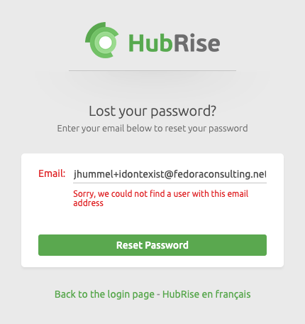

The easiest way to see if you have a user profile in HubRise is by using the [Lost your password page](https://manager.hubrise.com/reset_password/new). Enter your email address and click **Reset Password**. If you have a user profile, an email will be sent instructing you on how to complete the password reset process.

If you do not have a HubRise user profile, a message will be displayed indicating that the email address is not registered. To create a new profile, use the [HubRise Registration page](https://manager.hubrise.com/signup).

