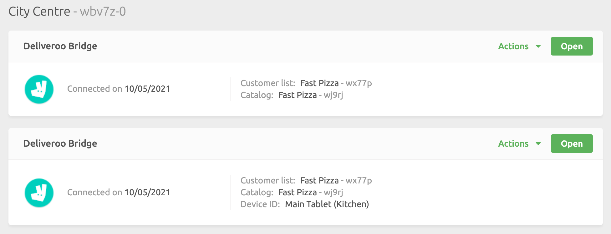

In some circumstances, you might need to connect multiple instances of the same app to a single HubRise location. For example, you might have multiple stores of a food delivery platform that you want to connect to the same EPOS.

To connect the first instance of the app, see [Connecting a New App](/docs/connections#connect). If you already connected the app, you do not need to repeat this step again.

To connect the second instance of the app, follow these steps.

1. Log in to HubRise from the [HubRise Login page](https://manager.hubrise.com/login).
1. Click **CONNECTIONS** on the left navigation panel.
1. Select **View available apps**.
1. Select the same app you installed before, then click **Connect**.
1. In the authorisation page, select the correct HubRise location from the dropdown menu.
1. Click on the URL in the navigation bar and include `device_id=BrandName&` after the initial portion of the URL: `https://manager.hubrise.com/oauth2/v1/authorize?`, and before `account_id=`. BrandName within `device_id=BrandName&` should be replaced by the name of the brand. For more information, see [Naming Rules](#naming-rules).
   
1. Then hit the Return key on your keyboard.
1. Click **Allow** to connect the app.
1. Follow the instructions on screen to configure the new instance of the app. For more details, click the **View documentation** link for the corresponding app in the [HubRise apps page](/apps).

If your app is not present on the HubRise apps page but connects to HubRise from its own back office, you can still connect multiple instances. All you need to do is to follow the steps above from 5 onwards when you are redirected to the authorisation page.

---

**IMPORTANT NOTE**: This process can be repeated any number of times by substituting the string `device_id=n&`, with a different value of `n` every time. A meaningful value for `device_id` can help you differentiate your various instances in the **CONNECTIONS** page. When you choose this value, follow the naming rules described below.

---

Once connected, the new instance of the app appears in the **CONNECTIONS** page.
You will be able to distinguish the various instances by the device ID value you chose during the setup.

## Naming Rules {#naming-rules}

To help you identify your app instances, you can freely choose the device ID value during the initial setup.
In `device_id=BrandName&`, BrandName can include any combination of the following characters:

- Letters, both lowercase and uppercase
- Numbers
- Underscores
- Hyphens
- Round, square, and curly parentheses
- Dots

If you need to include a space in the BrandName for more clarity, replace the space by a `+`. For instance, the Papa John's Morocco becomes `Papa+John's+Morocco`.
