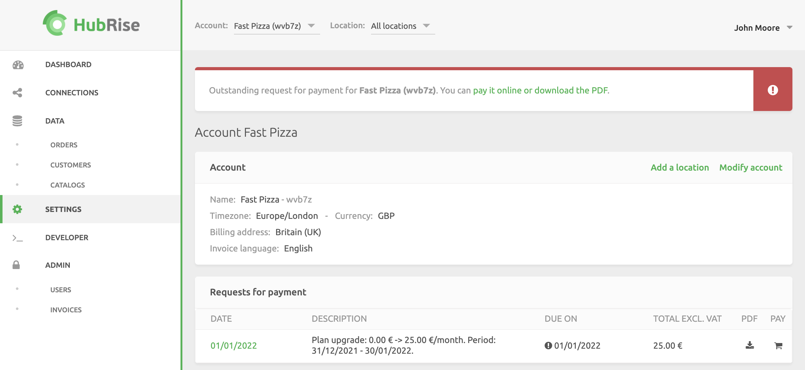

When you switch from a free plan to a paid plan, an email and a notice on the HubRise back office will request you to pay for your HubRise subscription.

To pay the first subscription, you must register a payment method and check your billing details, and pay online.

## Register a Payment Method

To verify your registered payment method or add a new one to your HubRise Account, follow these steps:

1. Log in to your [HubRise account](https://manager.hubrise.com/login).
1. Click on **SETTINGS**.
1. To pay at the Account level, verify that **All locations** is selected. To pay invoices per Location, select the Location from the **Location** dropdown. For more information, see [Account or Location Payments](/docs/payment#account-or-location-payments).
1. In the **Payment** section, review your payment method details. If there is no existing payment method, click **Add payment method**.
1. Enter your credit card details.
1. Click **Save**.

## Check Your Billing Information

To verify your billing information at Account level, follow these steps:

1. Log in to your [HubRise account](https://manager.hubrise.com/login).
1. Click on **SETTINGS**.
1. In the **Account** section, click **Modify account**.
1. Fill in the information required under **Billing details**.
1. Click **Update**.

Follow the exact same steps to verify your billing information for payment at Location level but click **Modify location**. For step by step information, see [Account or Location Payments](/docs/payment#billing-information-at-location-level).

## Pay Online

When your payment method is set up, the first request for payment should be charged automatically within a few hours. However, we recommend paying the first subscription request online, to reduce the risks of your bank rejecting the transaction.

1. In your HubRise back office, click on **SETTINGS**.
2. In the **Requests for payment** section, review the details of the outstanding payment. You can see the description of the payment, the payment deadline, and the total amount due. Depending on your setup, requests for payment might be available at Account or Location levels.
3. Click the <InlineImage width="17" height="17"></InlineImage> cart icon under **PAY**.
   
4. Follow the instructions to complete the payment.

---

**IMPORTANT NOTE:** During the payment authorisation process, your bank might verify the payment via 3D Secure or other processes necessary to authorise direct debit on your card. Check with your bank about the standard authorisation process.

---

Subsequent payments to HubRise will be automated until you change usage plan or your payment method expires. For more information about HubRise usage plans, see [Usage](/docs/usage-plan/).
