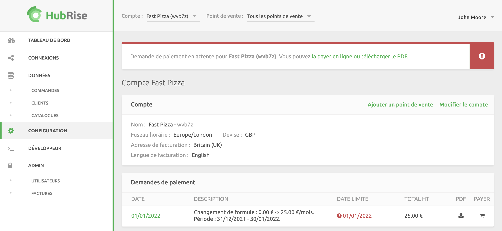

Lorsque vous passez d'une formule gratuite à une formule payante, un e-mail et un avis sur le back-office de HubRise vous demanderont de payer votre abonnement à HubRise.

Pour régler votre premier abonnement, vous devez enregistrer un mode de paiement et confirmer vos coordonnées de facturation, puis procéder au paiement en ligne.

## Enregistrer un moyen de paiement

Pour vérifier votre moyen de paiement enregistré ou en ajouter un nouveau à votre compte HubRise, procédez comme suit :

1. Connectez-vous à votre [compte HubRise](https://manager.hubrise.com/login?locale=fr-FR).
1. Cliquez sur **CONFIGURATION**.
1. Pour effectuer le paiement au niveau du compte, vérifiez que l'option **Tous les points de vente** est sélectionnée. Pour régler les factures en fonction du point de vente, sélectionnez une entrée dans la liste déroulante **Point de vente**. Pour plus d'informations, voir la rubrique [Paiements du niveau du compte ou du point de vente](/docs/payment#account-or-location-payments).
1. Dans la section **Paiement**, vérifiez les détails de votre mode de paiement. Si aucun mode de paiement n'existe actuellement, cliquez sur **Ajouter un mode de paiement**.
1. Saisissez les détails de votre carte de crédit.
1. Cliquez sur **Enregistrer**.

## Vérifier vos informations de facturation

Pour vérifier vos informations de facturation au niveau du compte, procédez comme suit :

1. Connectez-vous à votre [compte HubRise](https://manager.hubrise.com/login?locale=fr-FR).
1. Cliquez sur **CONFIGURATION**.
1. Dans la section **Compte**, cliquez sur **Modifier le compte**.
1. Renseignez les informations requises à la section **Détails de facturation**.
1. Cliquez sur **Mettre à jour**.

Procédez exactement de la même manière que pour vérifier vos informations de facturation pour le paiement au niveau du point de vente, mais cliquez sur **Modifier le point de vente**. Pour plus d'informations, voir la rubrique [Paiements au niveau du compte ou du point de vente](/docs/payment#account-or-location-payments).

## Payer en ligne

Une fois votre mode de paiement configuré, la première demande de paiement devrait être débitée automatiquement dans les heures qui suivent. Toutefois, nous vous recommandons de régler la première demande de payement en ligne afin de réduire les risques de rejet de la transaction par votre banque.

1. Dans votre back-office HubRise, cliquez sur **CONFIGURATION**.
2. Dans la section **Demandes de paiement**, examinez les détails du paiement en suspens. Vous pouvez voir la description du paiement, la date limite de paiement et le montant total dû. En fonction de votre configuration, les demandes de paiement peuvent être disponibles au niveau du compte ou du point de vente
3. Cliquez sur l'icône de carte <InlineImage width="17" height="17"></InlineImage> sous la section **PAYER**. 
4. Suivez les instructions pour procéder au paiement.

---

**REMARQUE IMPORTANTE** : pendant le processus d'autorisation de paiement, il se peut que votre banque vérifie le règlement via 3D Secure ou d'autres processus nécessaires afin de valider le prélèvement automatique sur votre carte. Veuillez vérifier la procédure d'autorisation standard adoptée par votre établissement bancaire.

---

Les paiements ultérieurs au profit de HubRise seront automatisés jusqu'à ce que vous changiez de formule d'utilisation ou que votre moyen de paiement arrive à expiration. Pour plus d'informations sur les formules d'utilisation de HubRise, voir la rubrique [Utilisation et formule](/docs/usage-plan).
