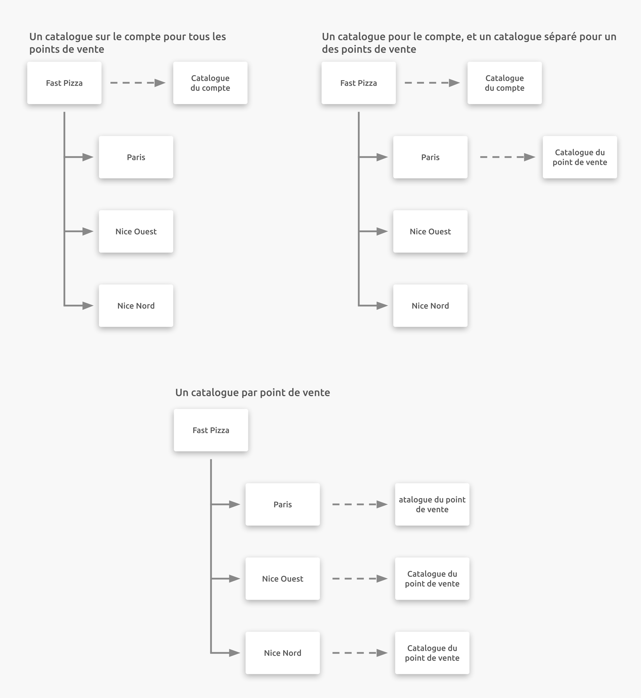
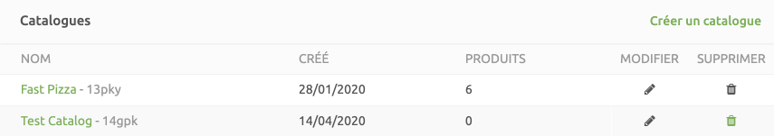

La section **Catalogues** de la page **CONFIGURATION** vous permet de créer, modifier ou supprimer les catalogues utilisés par votre compte HubRise.

Les règles applicables aux catalogues sont les suivantes :

- Par défaut, les comptes définissent un seul catalogue qui porte le nom du compte. Les points de vente ne comportent aucun catalogue défini par défaut.
- Un compte doit impérativement comporter au moins un catalogue. Si vous tentez de supprimer le dernier catalogue d'un compte, une notification d'erreur s'affiche.
- Vous pouvez créer autant de catalogues que vous le souhaitez. Exemple :
  - Vous pouvez créer un catalogue à des fins de test, dont l'utilisation n'aura aucune conséquence sur la production.
  - Vous pouvez créer des catalogues pour un point de vente particulier qui propose des produits différents de ceux d'autres points de vente.

Vous pouvez connecter des applications intégrées à un catalogue spécifique afin d'y transférer ou d'en extraire des données. Vous pouvez modifier et gérer les produits d'un catalogue HubRise uniquement à partir d'applications tierces, ou avec le **Catalog Manager** HubRise connecté à votre compte HubRise.

La suppression d'un catalogue de HubRise n'affecte pas la liste des produits contenus dans les applications tierces.

## Ajouter un catalogue

Pour ajouter un catalogue, procédez comme suit :

1. Sélectionnez **CONFIGURATION**.
1. Pour ajouter le catalogue au niveau du compte, vérifiez que l'option **Tous les points de vente** est sélectionnée. Pour ajouter un catalogue à un point de vente, sélectionnez une entrée dans la liste déroulante **Point de vente**.
1. Dans la section **Catalogues**, cliquez sur **Ajouter un catalogue**.
1. Saisissez le nom du catalogue. Si vous n'avez qu'un seul catalogue, nous vous recommandons d'utiliser le nom de votre compte ou de votre point de vente. Si vous avez plusieurs catalogues, utilisez un nom descriptif, tel que `Site web` ou `Plateformes de livraison de repas`. Veillez à ne pas inclure le mot `Catalogue` dans le nom de votre catalogue. Par exemple, utilisez `Fast Pizza` et non `Catalogue Fast Pizza`.
1. Cliquez sur **Créer** pour sauvegarder le nouveau catalogue.

## Détails du catalogue

Les informations suivantes apparaissent dans la section **CONFIGURATION** > **Catalogues** :

- **Nom** : appellation du catalogue, suivie de son identifiant unique. Cet identifiant unique ne change pas même si le nom du catalogue est modifié. Exemple : le catalogue `Avenue d'Italie` apparaîtra comme `Avenue d'Italie - abc123`. Si le catalogue `Avenue d'Italie` est renommé `Rue Denfert-Rochereau`, il apparaîtra comme `Rue Denfert-Rochereau - abc123`.
- **Créé** : date à laquelle le catalogue a été créé dans HubRise.
- **Produits** : nombre de produits inclus dans ce catalogue. Pour afficher les détails du catalogue, voir [Catalogues](/docs/data#catalogs).

Pour afficher le contenu d'un catalogue, cliquez sur le nom de celui-ci. Vous serez alors redirigé vers l'écran **DONNÉES** > **Catalogue** du catalogue concerné.

## Modifier le nom d'un catalogue

Les catalogues peuvent être renommés afin de répondre à des besoins particuliers, tels que l'étiquetage d'un catalogue à des fins de test, ou pour les produits proposés par un point de venue ou dans une solution spécifique. La modification du nom d'un catalogue n'affecte pas les applications qui utilisent celui-ci.

Pour modifier le nom d'un catalogue, procédez comme suit :

1. Sélectionnez **CONFIGURATION**.
2. Dans la section **Catalogues**, cliquez sur l'icône Modifier <InlineImage width="15" height="15"></InlineImage> pour le catalogue à éditer.
3. Saisissez le nouveau nom du catalogue.
4. Cliquez sur **Mettre à jour** pour enregistrer les nouvelles configurations.

Les modifications apportées au catalogue dans HubRise n'affectent pas la liste des produits dans les applications connectées. Les modifications apportées aux listes de produits, aux descriptions et aux prix sont toujours effectuées par l'application connectée.

## Supprimer un catalogue

Les catalogues peuvent être supprimés de HubRise lorsque les critères suivants sont remplis :

- Aucune connexion au catalogue depuis une application n'est active.
- Le dernier catalogue disponible au niveau du compte ne peut pas être supprimé.

La suppression d'un catalogue dans HubRise n'affecte pas la liste des produits contenus dans les applications tierces.

Pour supprimer un catalogue, procédez comme suit :

1. Sélectionnez **CONFIGURATION**.
1. Dans la section **Catalogues**, cliquez sur l'icône Supprimer <InlineImage width="15" height="16"></InlineImage> pour le catalogue à supprimer.
1. Cliquez sur **Supprimer** pour confirmer la suppression du catalogue.
