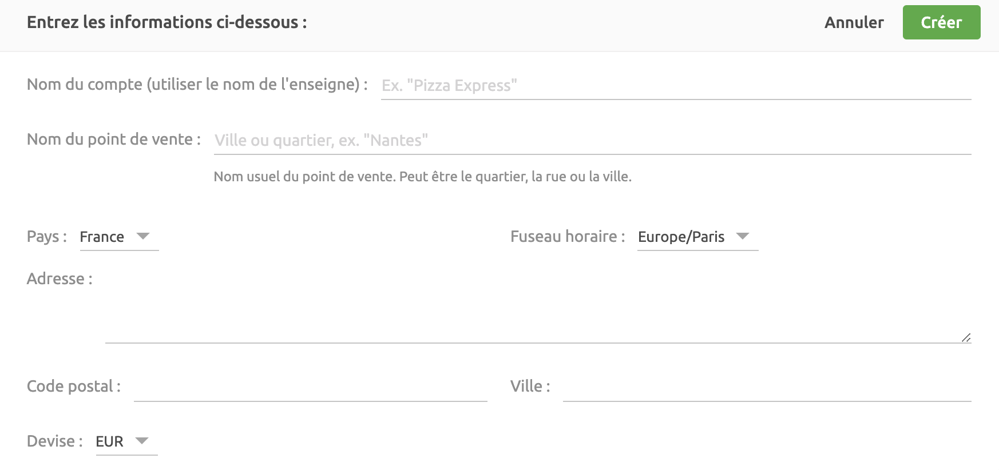
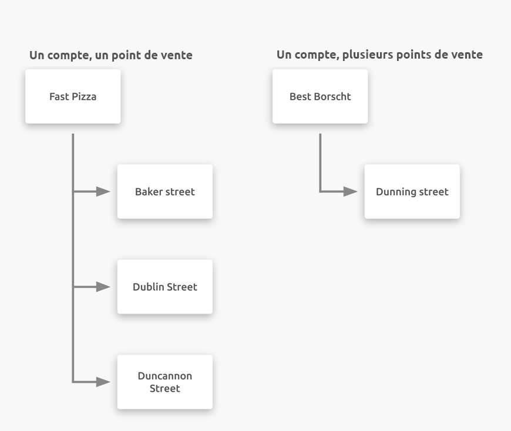
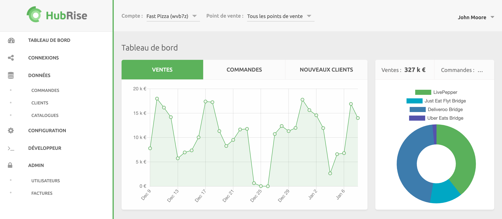

Vous pouvez accéder à HubRise depuis un navigateur web sur n'importe quel appareil : votre ordinateur de bureau, tablette ou smartphone.

## Créer un profil utilisateur

Pour commencer à utiliser HubRise, vous devez créer un profil utilisateur. L'inscription est gratuite et ne prend qu'une minute. Vous avez seulement besoin de fournir un nom, une adresse e-mail et un mot de passe. Pour créer un profil utilisateur, allez sur la [page d'inscription à HubRise](https://manager.hubrise.com/signup?locale=fr-FR).

---

**FAQ associée** : Comment créer un profil utilisateur pour [quelqu'un d'autre](/docs/faqs/creer-profil-utilisateur-pour-une-autre-personne/) ou pour une [autre entreprise ?](/docs/faqs/creer-compte-pour-une-autre-entreprise/)

---

## Créer un compte

Lorsque vous vous connectez à HubRise pour la première fois, vous êtes invité à créer un compte et un point de vente. Un compte HubRise identifie votre marque, tandis qu'un point de vente fait référence au lieu de vente de cette marque, c'est-à-dire généralement le lieu commercial physique.

- Le **nom du compte** correspond au nom de votre entreprise ou de votre marque, par exemple `Pizza Express`.
- Le **nom du point de vente** identifie votre lieu de commercialisation physique, qui peut être la ville, le quartier ou le nom de la rue. Si, par exemple, le point de vente est unique dans Paris, il peut être nommé `Paris`. Si vous exploitez plusieurs points de vente à Paris, vous pouvez nommer ceux-ci d'après leur adresse, par exemple `Montmartre`, `Montparnasse` et `Le Marais`.

---

**REMARQUE IMPORTANTE** : assurez-vous de spécifier la **devise** correcte dans le menu déroulant, car vous ne pourrez plus la modifier par la suite.

---

Une petite entreprise aura un compte avec un seul point de vente, tandis qu'une grande entreprise possédera un compte avec plusieurs points de vente. Pour plus d'informations, voir les rubriques [Comptes](/docs/comptes/) et [Points de vente](/docs/points-de-vente/).

Un profil utilisateur peut avoir accès à plusieurs comptes. Par ailleurs, différents profils d'utilisateurs peuvent avoir accès au même compte avec des niveaux de permissions distincts. Pour plus d'informations, voir la rubrique [Permissions](/docs/permissions/).

## Choisir la langue

Vous pouvez choisir la langue de votre session HubRise en cliquant sur la flèche vers le bas <InlineImage width="28" height="21"></InlineImage> située en regard de votre nom dans le coin supérieur droit, puis en sélectionnant la langue de votre choix. HubRise est disponible en anglais et en français.

## Découvrir l'interface

L'interface HubRise est organisée selon les sections suivantes :

- **TABLEAU DE BORD** : obtenez une vue d'ensemble des ventes, des commandes et des nouveaux clients de votre organisation.
- **CONNEXIONS** : connectez de nouvelles applications à votre compte HubRise et gérez vos connexions existantes.
- **DONNÉES** : visualisez les commandes, les catalogues, les clients et les logs correspondants sur l'ensemble de vos points de vente.
- **CONFIGURATION** : ajoutez de nouveaux points de vente, gérez l'accès et les rôles des employés, consultez l'utilisation de la plateforme, et vérifiez l'historique ou les modes de paiement.
- **DÉVELOPPEUR** : accès destiné aux développeurs, afin de leur permettre d'intégrer de nouvelles applications à HubRise.

Si vous souhaitez obtenir une vue d'ensemble des performances d'un compte, sélectionnez **Tous les points de vente**. Si vous souhaitez restreindre les résultats à un seul point de vente dans un compte, sélectionnez ce compte, puis le point de vente correspondant.

- Pour les utilisateurs ayant accès à plusieurs comptes, cliquez sur la flèche vers le bas <InlineImage width="28" height="21"></InlineImage> en regard de l'option **Compte**, puis sélectionnez le compte à afficher.
- Pour afficher les données relatives à tous les points de vente ou à un point de vente spécifique, cliquez sur la flèche vers le bas <InlineImage width="28" height="21"></InlineImage> en regard de l'option **Point de vente**, puis sélectionnez **Tous les points de vente** ou le point de vente spécifique.

## Connexion

Pour vous connecter à HubRise, consultez la [page de connexion à HubRise](https://manager.hubrise.com/login?locale=fr-FR) ou la [page d'accueil de HubRise](https://www.hubrise.com/fr/). Saisissez votre adresse e-mail et votre mot de passe, puis cliquez sur **Connexion**.

---

**FAQ associée** : [Comment vérifier si j'ai déjà un profil d'utilisateur dans HubRise ?](/docs/faqs/verifier-si-j-ai-deja-un-profil-utilisateur-dans-hubrise/)

---

## Déconnexion

Pour vous déconnecter de HubRise, cliquez sur la flèche vers le bas <InlineImage width="28" height="21"></InlineImage> en regard de votre nom dans le coin supérieur droit, puis sélectionnez **Déconnexion**.

Par défaut, vous serez automatiquement déconnecté de votre session au bout de six mois d'inactivité.
