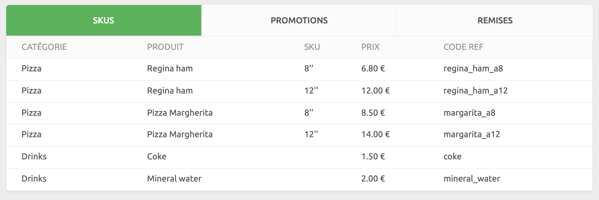

La section Données fournit des enregistrements concernant les commandes, les clients et les catalogues. Vous pouvez à tout moment sélectionner le compte et les points de vente à afficher.

## Commandes

La page **COMMANDES** affiche vos commandes récentes par ordre de date décroissant. Pour chaque commande contenue dans la liste, les attributs suivants s'affichent :

- **Date, heure et identifiant unique** : la date, l'heure et l'identifiant unique de la commande.
- **Point de vente** : si vous sélectionnez l'option **Tous les points de vente**, cette colonne indique le site qui a réceptionné la commande.
- **Client** : client qui a passé la commande.
- **Montant** : montant total de la commande.
- **Statut** : statut actuel de la commande. Pour une vue d'ensemble des statuts possibles, voir la section [Statut de la commande](/developers/api/order-management/#order-status) sur la page Gestion des commandes de l'API HubRise.
- **Origine** : application à partir de laquelle la commande a été générée.

Pour filtrer les commandes par dates de début et de fin, procédez comme suit :

1. Sélectionnez les champs **De** et **À** et définissez les plages de dates à filtrer.
1. Sélectionnez l'icône de recherche <InlineImage width="17" height="17"></InlineImage> pour filtrer les enregistrements d'après ces dates.
1. Pour effacer les filtres de date, supprimez les dates contenues dans les champs **De** et **À**, puis sélectionnez l'icône de recherche <InlineImage width="17" height="17"></InlineImage>.

Cliquez sur la date de la commande pour afficher les détails complets. Pour afficher les détails complets de la requête, cliquez sur la date et l'heure dans la section **Journaux**. Pour plus d'informations, voir [Journaux](/docs/donnee#journaux/).

---

**Questions fréquentes associées** : <Link to="/docs/faqs/verifier-connexion-entre-mon-systeme-et-hubrise/">Comment vérifier que la connexion entre mon système et HubRise fonctionne correctement ?</Link>

---

## Clients

La page **CLIENTS** affiche les listes de clients définis pour le compte sélectionné. Les clients sont classés par ordre inverse de leur date de création.

Les enregistrements contenus sur cette page affichent les attributs suivants :

- **Nom** : nom du client, suivi de son identifiant unique.
- **Commandes** : nombre de commandes passées par le client depuis son inscription.
- **Dépenses** : montant dépensé par le client sur l'ensemble des commandes passées avec le compte.
- **depuis** : date de la première commande du client.

Pour filtrer les clients par leur nom ou leur adresse e-mail, procédez comme suit :

1. S'il existe plusieurs listes de clients associées au compte ou au point de vente, sélectionnez la liste déroulante en regard de l'option **Clients**, puis sélectionnez la liste de clients à afficher.
1. Cliquez sur le champ **Rechercher par nom ou par adresse e-mail** et saisissez le texte à rechercher.
1. Sélectionnez l'icône de recherche pour filtrer les enregistrements de client.
1. Pour effacer le fichier client, supprimez tout le texte contenu dans le champ **Rechercher par nom ou par adresse e-mail**, puis sélectionnez l'icône de recherche <InlineImage width="17" height="17"></InlineImage>.

Pour afficher les détails complets d'un client, cliquez sur le nom de celui-ci. Pour voir le détail complet des fichiers journaux de toutes les requêtes concernant les clients, cliquez sur **Afficher les journaux**. Pour plus d'informations, voir [Journaux](/docs/donnee#journaux/).

Pour créer, modifier ou supprimer une liste de clients, voir [Listes de clients](/docs/clients/).

## Catalogues

La page **CATALOGUES** affiche les produits inclus dans le catalogue sélectionné.

Les applications connectées qui ont accès à votre catalogue HubRise peuvent en extraire la liste de produits ou y insérer de nouveaux produits. Une solution d'encaissement connectée peut par exemple insérer son catalogue de produits dans HubRise afin qu'un site internet d'e-commerce puisse l'utiliser.

À partir de la page Catalogues, vous pouvez afficher les catalogues insérés dans HubRise et les journaux des requêtes qui ont effectué des modifications dans le catalogue.

### Afficher le catalogue

Les comptes et les points de vente peuvent contenir plusieurs catalogues. Pour afficher un catalogue spécifique, sélectionnez-le dans la liste déroulante à côté du titre **Catalogues**.

Les catalogues sont présentés dans trois onglets :

- **RÉFÉRENCES** : articles que vous vendez aux clients.
- **PROMOTIONS** : offres spéciales disponibles dans le catalogue. Une promotion permet de bénéficier d'une remise tarifaire sur des combinaisons de produits achetés ensemble. La promotion **Un article acheté, un gratuit**, par exemple, est une offre spéciale qui s'applique à deux produits. Elle prévoit une réduction de prix égale au prix du produit le moins cher.
- **REMISES** : rabais disponibles dans le catalogue. Les codes de remise s'appliquent non pas à des produits spécifiques, mais à l'ensemble de la commande. Le code **FREEDELIVERY**, par exemple, peut supprimer les frais de livraison pour l'ensemble de la commande, tandis que le code **FRIYAY** peut offrir une remise de 10 % sur l'ensemble de la commande le vendredi.

Pour les références des articles, les attributs suivants s'affichent :

- **CATÉGORIE** : catégorie à laquelle appartient le produit, par exemple : _Bottes_.
- **PRODUIT** : nom affiché visible par le client. Les noms des produits ne doivent pas nécessairement être uniques. Vous pouvez par exemple vendre des bottes de pointures différentes, mais sous le même nom de produit intitulé _Bottes imperméables_.
- **RÉFÉRENCE** : référence unique d'article ou taille du produit. Dans le cas des _Bottes imperméables_, par exemple, vous pouvez vendre une référence de pointure 28 et de coloris noir, et une autre référence de pointure 32 et de coloris marron.
- **PRIX** : le prix du produit, ainsi que la devise utilisée.
- **CODE RÉF** : identifiant unique du produit provenant du système de gestion du produit source. Ce code permet d'identifier l'article dans toutes les applications. Les identifiants sont constitués de caractères alphanumériques et de caractères spéciaux. L'identifiant `bottes_imperméables_pointure_28_noir`, par exemple, peut faire référence à une paire de bottes de pointure 28 et de coloris noir.

Pour les promotions et les remises, les attributs suivants s'affichent :

- **NOM** : intitulé de la promotion ou de la remise.
- **CODE RÉF** : identifiant unique de la promotion ou de la remise provenant du système de gestion du produit source.

Pour voir les journaux complets de toutes les requêtes qui apportent des modifications aux catalogues, cliquez sur **Afficher les journaux**. Pour plus d'informations, voir [Journaux](/docs/donnee#journaux/).

Pour créer, modifier ou supprimer un catalogue, voir [Catalogues](/docs/catalogues/).

## Journaux

Chaque page de la section **DONNÉES** fournit des informations complémentaires par le biais de sa page de journal.

Les journaux consignent les requêtes de connexion adressées à HubRise par une application. Chaque requête constitue une transaction entre une application et HubRise, telle qu'une commande, l'inscription d'un nouveau client ou une mise à jour du catalogue.

La page du journal affiche une liste récapitulative des requêtes par ordre chronologique inverse. Lorsque vous ouvrez une commande dans la page **COMMANDES**, ou que vous sélectionnez l'option **Afficher les journaux** sur les pages **CLIENTS** ou **CATALOGUES**, les informations suivantes s'affichent :

- **HEURE (UTC)** : date et heure de la requête au format UTC.
- **ORIGINE** : application à partir de laquelle la requête a été créée.
- **POINT FINAL** : point de terminaison de la requête, y compris la méthode HTTP et le chemin d'accès URL.
- **RÉPONSE** : code de réponse HTTP.

D'autres détails du journal sont disponibles à l'intention des utilisateurs avancés et des développeurs afin de leur permettre de visualiser les communications des applications et de résoudre les problèmes. Pour afficher les détails d'une entrée de journal, procédez comme suit :

1. Cliquez sur la ligne à afficher. La liste complète des détails relatifs à la requête et à la réponse s'affiche.
1. Pour télécharger la requête ou la réponse, sélectionnez l'icône de téléchargement <InlineImage width="15" height="14"></InlineImage>. La requête ou la réponse sélectionnée sera délivrée sous forme de fichier JSON.

Pour plus d'informations, voir la rubrique [Interprétation des journaux dans HubRise](/docs/hubrise-logs). Pour une référence complète sur l'API HubRise, voir la [page de référence de l'API HubRise](/developers/api/general-concepts) (en anglais).
