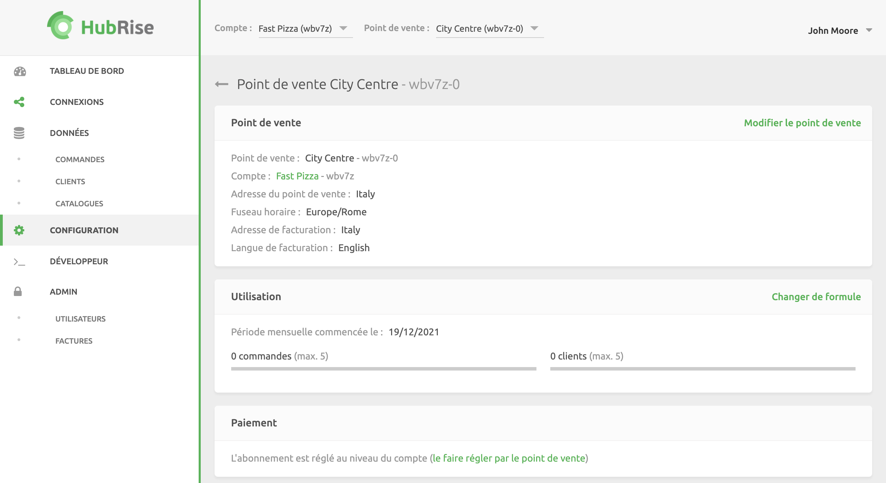
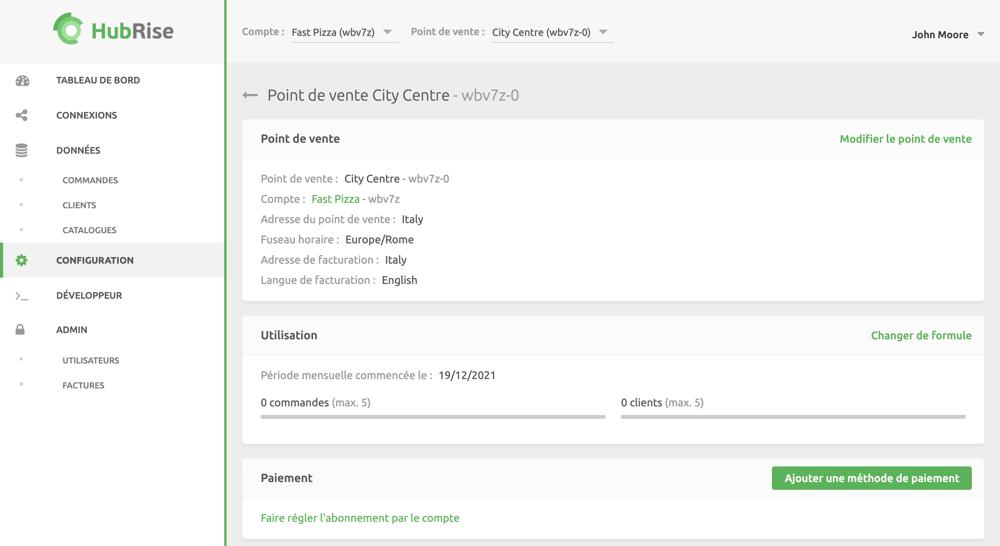
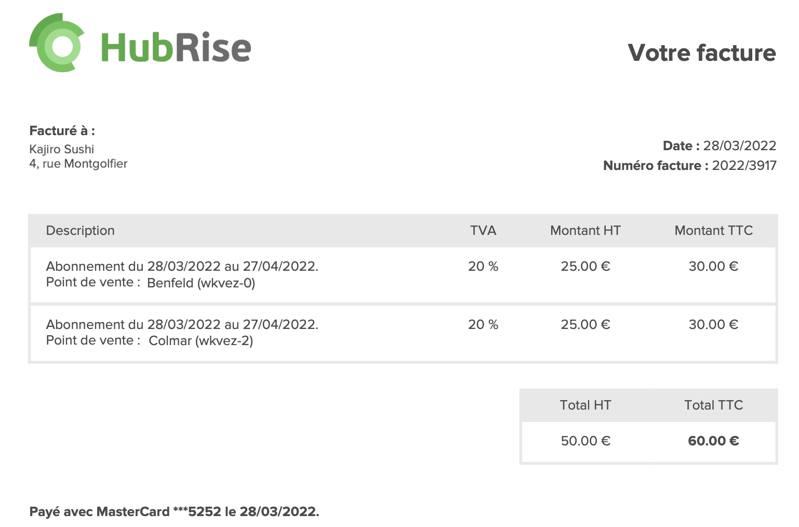

Les comptes et les points de vente configurés avec une formule payante font l'objet d'un paiement mensuel à HubRise lorsqu'ils dépassent la limite d'[utilisation](/docs/utilisation-formule#plans-d-utilisation) gratuite. Pour obtenir des informations complètes sur les prix, consultez la [page de tarifs de HubRise](/tarifs/).

Vous pouvez configurer votre méthode de paiement dans la section **CONFIGURATION** > **Paiement**. Pour automatiser les paiements, vous devez disposer d'une carte de crédit. Les prélèvements SEPA ne sont pas possibles. Le virement bancaire est accepté en cas d'engagement sur 12 mois minimum.

Le paiement d'un abonnement s'effectue toujours en euros, quelle que soit la devise du compte.

## Paiements au niveau du compte ou du point de vente

Vous pouvez payer votre abonnement à HubRise au niveau du compte ou du point de vente.

Les paiements au niveau du compte sont le choix par défaut et le plus courant. Si vous exploitez plusieurs points de vente, vous pouvez mettre en place une méthode de paiement unique et gérer une seule facture pour tous vos points de vente.

Si, au contraire, vous avez des exigences spécifiques en matière de facturation ou d'autres besoins commerciaux, vous pouvez configurer une méthode de paiement différente au niveau du point de vente.

### Passage en paiement au niveau du point de vente

Pour configurer le paiement au niveau d'un point de vente spécifique, procédez comme suit :

1. Si vous avez accès à plusieurs comptes, sélectionnez le **compte** associé au point de vente spécifique.
1. Sélectionnez une entrée dans la liste déroulante **Point de vente**.
1. Rendez-vous dans **CONFIGURATION**.
1. Dans la section **Paiement**, cliquez sur **Le faire régler par le point de vente**. 

### Passage en paiement au niveau du compte

Pour configurer le paiement au niveau du compte pour un point de vente spécifique, procédez comme suit :

1. Si vous avez accès à plusieurs comptes, sélectionnez le **compte** associé au point de vente spécifique.
1. Sélectionnez une entrée dans la liste déroulante **Point de vente**.
1. Rendez-vous dans **CONFIGURATION**.
1. Dans la section **Paiement**, cliquez sur **Faire régler l'abonnement par le compte**. 

Le cycle de facturation du point de vente correspondra au cycle de facturation du compte. Si la date de facturation actuelle du point de vente diffère de celle du compte, les situations suivantes peuvent se produire :

- Si la prochaine date de facturation du point de vente est antérieure à la prochaine date de facturation du compte, vous sera immédiatement facturé au prorata temporis afin d'aligner la prochaine date de facturation du point de vente sur celle du compte.
- Si la prochaine date de facturation du point de vente est postérieure à la prochaine date de facturation du compte, rien ne changera jusqu'à la prochaine date de facturation du compte. Vous serez alors facturé au prorata temporis et la prochaine date de facturation de Location s'alignera sur celle du compte.

## Cycles de facturation

Les cycles de facturation ont une durée d'un mois et débutent le jour même de la création du compte. La date de début du cycle de facturation ne peut pas être modifiée.

Ainsi, si vous ouvrez votre compte HubRise le 17 mars, vous serez facturé le 17 de chaque mois. Le cycle de facturation de chaque point de vente sera configuré en conséquence.

## Modifier les informations de facturation

Les informations de facturation incluses dans les factures peuvent être configurées au niveau du compte et du point de vente.

1. Rendez-vous dans **CONFIGURATION**.
1. Dans la liste déroulante **Point de vente**, sélectionnez le point de vente que vous souhaitez modifier, ou sélectionnez **Tous les points de vente** pour modifier les informations de facturation de votre compte.
1. Cliquez sur **Modifier le compte** ou **Modifier le point de vente**.
1. Renseignez les informations requises à la section **Détails de facturation**.
1. Cliquez sur **Mettre à jour**.

## Ajouter une méthode de paiement

Pour ajouter ou mettre à jour une méthode de paiement au niveau du compte, procédez comme suit :

1. Rendez-vous dans **CONFIGURATION**.
1. Si vous avez accès à plusieurs comptes, sélectionnez le **compte** concerné, puis faites défiler la page jusqu'à la section **Paiement**. 
1. Si aucune méthode de paiement n'existe actuellement, cliquez sur **Ajouter une méthode de paiement**. Si une méthode de paiement est déjà définie, cliquez sur **Modifier votre méthode de paiement**.
1. Saisissez les informations relatives à votre carte de crédit. Les cartes de crédit doivent être valides pour être acceptées.
1. Une fois que vous avez terminé, cliquez sur **Enregistrer**.

Pour ajouter ou mettre à jour une méthode de paiement au niveau du point de vente, procédez comme suit :

1. Rendez-vous dans **CONFIGURATION**.
1. Si vous avez accès à plusieurs comptes, sélectionnez le **compte** associé au point de vente spécifique.
1. Sélectionnez une entrée dans la liste déroulante **Point de vente**, puis faites défiler la page jusqu'à la section **Paiement**. 
1. Si aucune méthode de paiement n'existe actuellement, cliquez sur **Ajouter une méthode de paiement**. Si une méthode de paiement est déjà définie, cliquez sur **Modifier votre méthode de paiement**.
1. Saisissez les informations relatives à votre carte de crédit. Les cartes de crédit doivent être valides pour être acceptées.
1. Une fois que vous avez terminé, cliquez sur **Enregistrer**.

## Supprimer une méthode de paiement

Pour supprimer une méthode de paiement, procédez comme suit :

1. Connectez-vous à votre compte HubRise.
1. Si vous avez accès à plusieurs comptes, sélectionnez le compte concerné.
1. Rendez-vous dans **CONFIGURATION**.
1. Pour vérifier le paiement défini au niveau du compte, assurez-vous que l'option **Tous les points de vente** est sélectionnée. Pour vérifier le paiement défini au niveau du pointe de vente, sélectionnez celui-ci dans la liste déroulante des points de vente.
1. À la section Paiement, cliquez sur **Supprimer**, puis sur **Confirmer** dans la boîte de dialogue.

---

**Questions fréquentes associées** : [Comment cesser le paiement de mon abonnement ?](/docs/faqs/arreter-de-payer-abonnement/)

---

## Traiter les devis en attente

Lorsque vous changez de formule tarifaire, le paiement doit être autorisé avant que la carte de crédit ne puisse être débitée. Les utilisateurs de niveau administrateur recevront des notifications leur rappelant d'achever le processus de paiement. Pour plus d'informations sur les notifications, voir la rubrique [Notifications sur les formules](/docs/utilisation-formule#notifications-sur-les-formules/).

Pour traiter un paiement à partir de la notification, procédez comme suit :

1. Connectez-vous à votre back-office HubRise.
1. Assurez-vous qu'une carte de crédit est enregistrée sur votre compte ou votre point de vente. Si tel n'est pas le cas, consultez les instructions indiquées à la rubrique [Ajouter une méthode de paiement](#ajouter-un-mode-de-paiement).
1. Cliquez sur **Afficher le devis le plus ancien**, puis sur **Payer**. Pour consulter tous les devis non payés, cliquez sur **Vérifier votre compte** à partir de la notification.

---

**Questions fréquentes associées** : [Que se passe-t-il en cas de dépassement de quota de ma formule gratuite ?](/docs/faqs/formule-gratuite-quota-depasse-ce-qui-se-passe/), [Comment payer ma première facture ?](/docs/faqs/payer-la-premiere-facture/), [Ma formule peut-elle être interrompue durant les phases de configuration et de test ?](/docs/faqs/formule-interrompue-pendant-les-phases-de-configuration-et-de-test/)

---

## Historique de paiement

Les utilisateurs de niveau administrateur reçoivent les notifications de paiement et les factures par e-mail. Les factures peuvent également être téléchargées depuis le back-office de HubRise.

Pour afficher l'historique de vos paiements, procédez comme suit :

1. Rendez-vous dans **CONFIGURATION**.
1. Si vous avez accès à plusieurs comptes, sélectionnez le **Compte** qui vous intéresse.
1. Si le paiement est effectué au niveau du compte, assurez-vous que l'option **Tous les points de vente** est sélectionnée. Si le paiement est effectué au niveau du pointe de vente, sélectionnez celui-ci dans la liste déroulante **Point de vente**.
1. À la section **Paiement**, cliquez sur **Historique de paiements**. Les paiements sont classés par ordre historique inverse, les plus récents étant affichés en premier.

L'historique de paiement relatif aux comptes regroupe les paiements au niveau du point de vente pour la date concernée.

La première fois que vous effectuez un paiement, celui-ci est indiqué en tant que **Changement de formule**. Par la suite, les paiements seront répertoriés selon la date de la [période de facturation](docs/payment#billing-cycles). Une fois que vous avez enregistré une méthode de paiement valide, les paiements sont automatisés.

Le détail de chaque facture est consultable directement sur le back-office de HubRise en cliquant sur la date. Pour chaque paiement, les informations suivantes sont indiquées :

- **Date** : la date du paiement.
- **Montant hors TVA** : montant du paiement hors taxe sur la valeur ajoutée (TVA). HubRise ayant son siège en France, la TVA s'applique uniquement aux entreprises implantées en France et à Monaco.
- **Description** : période et points de vente couverts par le paiement.
- **Méthode de paiement** : mode de paiement utilisé.

Les factures peuvent également être sauvegardées au format de fichier PDF en sélectionnant l'icône de téléchargement <InlineImage width="15" height="14"></InlineImage>.

