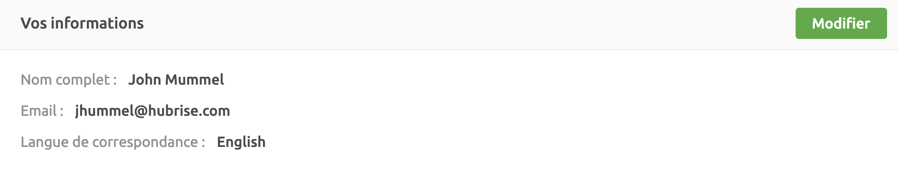
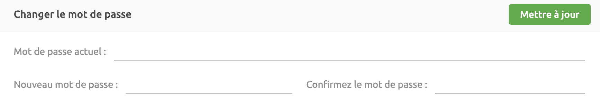
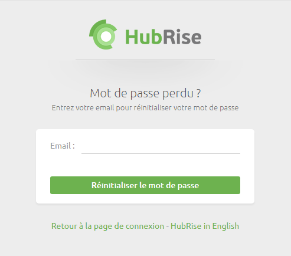

La page Profil de HubRise affiche les informations relatives à votre profil utilisateur et vous permet de les mettre à jour ou de changer votre mot de passe.

## Modifier le profil

Pour mettre à jour votre profil utilisateur, procédez comme suit :

1. Cliquez sur votre nom dans le coin supérieur droit du back-office de HubRise, puis cliquez sur **Profil**.
1. Cliquez sur **Modifier**.
1. Mettre à jour votre nom, votre adresse e-mail ou la langue de correspondance. La **Langue de correspondance** définit la langue qui sera employée dans toutes les communications échangées entre HubRise et vous.
1. Sélectionnez **Mettre à jour**.

---

**REMARQUE IMPORTANTE** : lorsque vous modifiez votre adresse e-mail, vérifiez que celle-ci est correcte et qu'elle peut recevoir des courriers électroniques. Sinon, les réinitialisations de mot de passe et les autres notifications ne fonctionneront pas.

---

## Mettre à jour le mot de passe

Pour mettre à jour votre mot de passe, procédez comme suit :

1. Cliquez sur votre nom dans le coin supérieur droit du back-office de HubRise, puis cliquez sur **Profil**.
1. Saisissez le mot de passe en cours dans le champ **Mot de passe actuel**.
1. Saisissez votre nouveau mot de passe dans les champs **Nouveau mot de passe** et **Confirmer le nouveau mot de passe**. Les deux champs doivent correspondre.
1. Cliquez sur **Mettre à jour**.

## Permissions des utilisateurs

La page Profil contient des informations relatives aux **permissions** de votre profil utilisateur. Celles-ci comprennent :

- Le **COMPTE** et le **POINT DE VENTE** auxquels vous avez accès.
- Le **RÔLE** qui vous a été attribué pour le compte ou le point de vente. Il peut s'agir d'un rôle de manager ou d'administrateur.

Pour supprimer votre accès à un compte ou à un point de vente, procédez comme suit :

1. Cliquez sur votre nom dans le coin supérieur droit du back-office de HubRise, puis cliquez sur **Profil**.
1. Recherchez la permission accordée dans la section **Permissions**, puis cliquez sur l'icône de corbeille <InlineImage width="15" height="16"></InlineImage>

---

**REMARQUE IMPORTANTE** : vous ne pouvez pas vous supprimer vous-même d'un compte si vous en êtes le seul administrateur. Si vous tentez de le faire, un message d'erreur s'affichera. Si vous devez vous supprimer vous-même en tant que dernier administrateur d'un compte, créez d'abord un autre utilisateur avec le rôle d'administrateur pour ce compte, puis enlevez-vous comme administrateur.

---

Pour plus d'informations, voir la rubrique [Permissions](/docs/permissions).

## Créer un compte

Pour créer un nouveau compte, procédez comme suit :

1. Cliquez sur votre nom dans le coin supérieur droit du back-office de HubRise, puis cliquez sur **Profil**.
1. Dans la section **Permissions**, cliquez sur **Créer un compte**. Pour plus d'informations, voir la rubrique [Créer un compte](/docs/account#create-account).

## Réinitialiser le mot de passe

Si vous êtes un utilisateur enregistré mais que vous avez perdu ou oublié votre mot de passe, rendez-vous sur la [page de réinitialisation du mot de passe de HubRise](https://manager.hubrise.com/reset_password/new?locale=fr-FR). Saisissez l'adresse e-mail associée à votre profil HubRise, puis cliquez sur **Réinitialiser le mot de passe**. Vous recevrez un e-mail contenant des instructions de réinitialisation de votre mot de passe. Une fois cette opération terminée, vous pourrez vous reconnecter.

---

**REMARQUE IMPORTANTE** : si vous n'avez pas reçu les instructions de réinitialisation du mot de passe par email au bout de quelques minutes, actualisez votre boîte de réception et vérifiez vos dossiers courrier indésirable ou corbeille.

---

